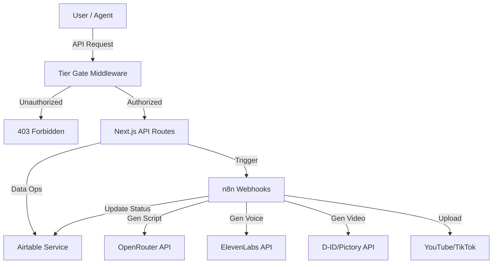

# Phase 9-12: Automation & Enterprise Gating Implementation

This plan covers the backend automation infrastructure, data persistence, and enterprise-grade security gating for the Sophia AI Video Factory.

## Phases

- [x] **Phase 9: Tier Gating & API Security**
  - Implement middleware for tier-based access control
  - Create API endpoints for access validation
  - Secure existing routes

- [x] **Phase 10: Airtable Integration**
  - Connect to Airtable as the primary CMS/database
  - Implement CRUD operations for Scripts, Videos, and Affiliates
  - Type-safe Airtable client wrapper

- [x] **Phase 11: n8n Workflow Definitions**
  - Define automation workflows for content generation
  - `script-generator`, `voice-generator`, `video-generator`, `publish-workflow`
  - Integration with external APIs (OpenRouter, ElevenLabs, D-ID)

- [x] **Phase 12: OpenClaw Skill Integration**
  - Create Agent skill definitions
  - Expose factory capabilities to AI agents via commands

## Architecture Overview

## Dependencies
- `airtable` npm package
- Existing `src/config/tiers.ts` and `src/lib/features.ts`
- Environment variables for API keys

## Risk Assessment
- **n8n Complexity**: Workflow JSONs are complex manually; will implement structured skeletons.
- **API Limits**: Airtable has rate limits (5 req/sec); implement backoff if needed (out of scope for MVP, but noted).
- **Security**: Ensuring tier checks are robust on server-side actions.
