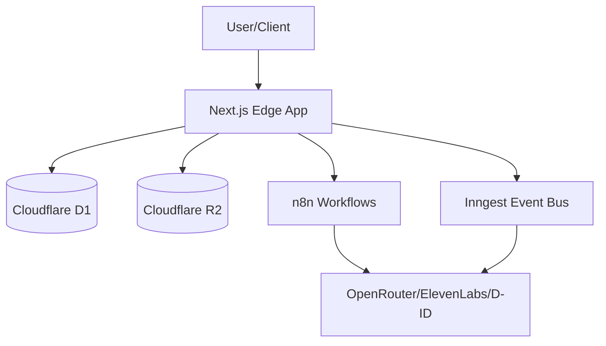

# Sophia AI Factory: Architecture Audit & Decoupling Report

## 1. System Boundaries & Component Overview
Sophia AI Factory utilizes a **4-Layer Mekong Architecture** (`land` → `forest` → `tree` → `seed`) enforcing strict one-way downward dependencies (enforced via ESLint).
- **Frontend/API Boundary:** Next.js 16/15.5 app running on Cloudflare Workers Edge (via OpenNextjs). Web interface and REST APIs act as gateways.
- **Persistence Boundary:** D1 (primary relational data, auth, quotas, logs) and R2 (media cache, video uploads, assets).
- **Background & Async processing:** n8n (visual workflow orchestrator) and Inngest (event-driven job execution).
- **External boundaries:** Telegram bot interface, payment gateways (NOWPayments/PayOS), and media/LLM APIs.

## 2. Next.js 16 Edge Runtime Analysis
- **Edge Architecture:** Deploying to Cloudflare Workers via `@opennextjs/cloudflare` keeps the system global, stateless, and low-latency.
- **Runtime Constraints:** No standard Node.js filesystem (`fs`) access in production. Post-build hooks (`inject-scheduled-handler.mjs`) are required to patch the Workers default export to support cron scheduling.
- **Mitigation:** Use Web Crypto APIs for encryption (AES-GCM-256 for BYOK credentials) and service bindings for internal API dispatch without HTTP overhead.

## 3. D1/R2 Storage Layer Analysis
- **D1 Database (SQLite):**
  - **No RLS:** SQLite lacks Row-Level Security. Isolation is enforced at the query level using `resolveOrgId()` / `getTenantContext()` filters.
  - **Quota Concurrency (TOCTOU):** The billing enforcer suffers from Time-of-Check to Time-of-Use race conditions during concurrent quota check and increment calls.
- **R2 Storage:**
  - Used for large media assets and Static Generation caches (with 30-day lifecycle auto-cleanup).
  - Decouples public exposure by serving files through authenticated API endpoints rather than direct presigned links.

## 4. Inngest / n8n Integration Analysis
- **n8n:** Visual workflows (script generation, video render) provide low-code editability. However, they rely on a hybrid Airtable CMS, creating a runtime bottleneck capped by Airtable's 5 req/sec rate limit.
- **Inngest:** Handles multi-step, asynchronous video generation (Wan 2.1 + Fish Speech). Type-safety is enforced using centralized schemas in `src/forest/inngest/client.ts`. Failures are managed with retry policies and credit refund triggers.

## 5. Decoupling & Architectural Improvements
1. **Durable Job Queue for n8n Webhooks:**
   - *Problem:* Webhooks to n8n are triggered synchronously from Next.js endpoints. n8n downtimes block operations.
   - *Solution:* Move to a queue-first pattern. Write execution requests to D1 outbox table (`job_outbox`) and dispatch to n8n asynchronously via an Inngest retry worker.
2. **Consolidate CMS from Airtable to D1:**
   - *Problem:* Syncing script/video states between D1, Supabase, and Airtable introduces write latency and rate-limiting.
   - *Solution:* Eliminate Airtable. Store CMS content inside D1 and expose read/write endpoints for n8n.
3. **Invert Inngest-to-Billing Dependencies:**
   - *Problem:* Some forest/inngest functions directly import and call `land/` billing services, breaching layer boundaries.
   - *Solution:* Decouple layers by having Inngest emit general signals (`PAYOUT_READY`) to the D1 `signals_events` table, prompting `land/` crons to execute billing/commission routines.
4. **Atomic Quota Increments:**
   - *Problem:* Two-step read-then-write quota check is vulnerable to race conditions under heavy load.
   - *Solution:* Execute updates atomically: `UPDATE video_usage_monthly SET count = count + 1 WHERE user_id = ? AND count < limit RETURNING count`.
