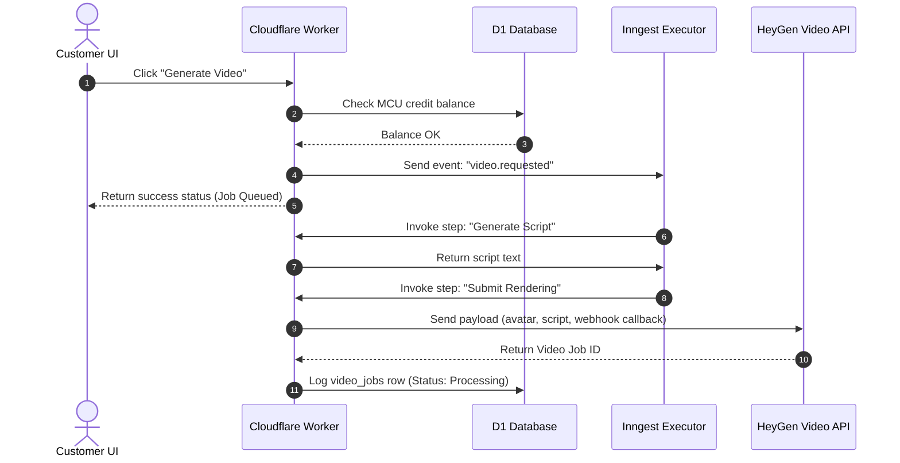

# System Design

This document details the components, runtime constraints, background job architecture, and execution flows of the Sophia AI Factory platform.

---

## 1. System Components

The platform is designed to run entirely serverless at the edge using Cloudflare resources:

* **Next.js 16 Web Tier**: Serving frontend assets and executing API handlers. Built using OpenNext to run inside Cloudflare Workers isolates.
* **Cloudflare D1**: SQL-compliant edge database engine built on SQLite. Replicas are kept synchronized across Cloudflare's network.
* **Cloudflare R2**: Object storage compatible with AWS S3, used for caching static assets and storing rendered video output files.
* **Inngest Workflow Engine**: Manages event-driven background tasks, choreographing multi-step AI video rendering pipelines.

---

## 2. Runtime Constraints: Edge vs. Local

### Edge Runtime Limitations
Running inside Cloudflare Workers introduces specific V8 isolate limits:
* **Memory Limits**: 128MB maximum memory limit per execution instance.
* **CPU Execution Limit**: 50ms of active CPU time per request on basic plans, or up to 30 seconds of total wall-clock time.
* **Database Size Constraints**: Cloudflare D1 databases are limited to 10GB per instance. Large transaction archives are regularly zipped and shipped to R2 storage for archival.
* **Execution Duration**: Tasks exceeding 30 seconds are rejected. Therefore, video compilation is offloaded to Inngest and sidecar rendering services.

### Local Development Emulation
* Database: Emulated locally via a file-based SQLite database.
* AI Services: Substituted with local mock adapters to simulate audio generation and avatar video rendering without consuming external API credits.

---

## 3. Asynchronous Job Architecture (Inngest)

Because video generation and AI scripting take minutes to complete, they cannot run directly inside a Cloudflare Workers HTTP request. Sophia uses Inngest to run long-running step functions:

```
[User Request]
       │
       ▼
[Trigger Event] ──> [Inngest Cloud Service] 
                          │
                          ▼ (Executes Webhook HTTP Post)
                    [Cloudflare Worker Endpoint (/api/inngest)]
                          │
                          ├─► Step 1: Script Writing (OpenRouter)
                          ├─► Step 2: Voice Generation (ElevenLabs)
                          └─► Step 3: Avatar Rendering (HeyGen)
```

Each step registers its state independently on Inngest, allowing the workflow to resume if a step fails or times out.

---

## 4. System Flow Diagrams

### Request Routing (ASCII Diagram)
```
[Client Browser]
       │
       ▼ (HTTPS Request)
[Cloudflare Edge Routing]
       │
       ▼
[middleware.ts (Security, CSP, Tenant Auth Verification)]
       │
       ├─► Static Content ──► [Cloudflare Cache / Assets]
       └─► API Endpoints  ──► [Next.js Route Handlers]
                                   │
                                   ▼
                             [D1 Database Query with org_id]
```

### Video Generation Sequence (Mermaid Diagram)

