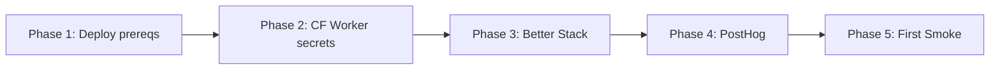

# Sophia Activation Runbook — Post-Deploy Provisioning

**Audience:** Sophia founder (non-tech CEO)
**Purpose:** Activate deploy/version proof, observability, signals, and C-Level agents after CF-direct deploy
**Time:** ~35 minutes total (split into 6 sequential phases)
**Production URL:** https://sophia.agencyos.network

---

## Historical Production State Smoke Test (verified 2026-04-17 08:29 ICT)

This table is historical activation evidence. Before go-live, rerun the smoke checks after `npm run deploy:full` and verify `/api/version` reports the deployed SHA.

| Layer | Endpoint | Status | Note |
|-------|----------|--------|------|
| P1 Deploy/version | `/api/version` | ✅ HTTP 200 | `shortSha=unknown` was fixed by `scripts/deploy-with-sha.sh` secret injection |
| P1 Deploy/version | `/api/health/detail` | ✅ HTTP 401 | Auth gate working (Red Team #10) |
| P2 Observability | `/api/metrics` | ✅ HTTP 401 | CRON_SECRET gate (Red Team #3) |
| P3 Signals | `/api/signals/track` | ✅ HTTP 401 | Auth gate working |
| P3 Signals | `/api/signals/flag` | ✅ HTTP 401 | Auth gate working |
| P4 Agents | `.sophia-factory/agents/cto.md` | ✅ valid | `tools:` + `allowed-paths` + `spawn-policy` set |

**Diagnosis:** All 4 layers were deployed and auth-gated in the 2026-04-17 smoke. Current deploy verification must use the CF-direct flow in `apps/sophia-ai-factory/scripts/deploy-with-sha.sh`.

---

## Phase 1 — Confirm CF-Direct Deploy Prereqs (5 min)

[VN] GitHub Actions deploy da tat theo doctrine hien tai. Truoc khi activate, confirm local wrangler auth + clean deploy gate.
[EN] GitHub Actions deploy is disabled by current doctrine. Before activation, confirm local wrangler auth and clean deploy gates.

```bash
cd apps/sophia-ai-factory
npx wrangler whoami
git status --short
git log origin/main..HEAD --oneline
```

Expected:
- `wrangler whoami` shows the Cloudflare account.
- `git status --short` is clean before deploy.
- `git log origin/main..HEAD` is empty before deploy, unless emergency `ALLOW_UNPUSHED_DEPLOY=1` is explicitly approved.

Optional GitHub secrets are needed only for auxiliary workflows such as manual canary rollback or cron smoke, not for the canonical production deploy.

| Optional GH Secret | Used by | Value Source |
|---|---|
| `CLOUDFLARE_API_TOKEN` | `.github/workflows/canary-rollback.yml` | Cloudflare "Edit Workers" token |
| `CLOUDFLARE_ACCOUNT_ID` | `.github/workflows/canary-rollback.yml` | Founder's Cloudflare account ID |
| `CRON_SECRET` | `.github/workflows/cron-smoke-one-time.yml` | Same value as Worker secret if that workflow is used |
| `TELEGRAM_BOT_TOKEN` | `.github/workflows/canary-rollback.yml` alert | From @BotFather |
| `TELEGRAM_CHAT_ID` | `.github/workflows/canary-rollback.yml` alert | Existing ops chat ID |

**Verify:** canonical deploy still happens via `npm run deploy:full`, not GitHub Actions.

---

## Phase 2 — Provision CF Worker Secrets (5 min)

[VN] Run trên M1 Max terminal (đã `wrangler login`):
[EN] Run from M1 Max terminal (after `wrangler login`):

```bash
cd apps/sophia-ai-factory
npx wrangler secret put INTROSPECT_TOKEN
npx wrangler secret put CRON_SECRET
npx wrangler secret put TELEGRAM_BOT_TOKEN
npx wrangler secret put TELEGRAM_CHAT_ID
npx wrangler secret put ADMIN_TELEGRAM_CHAT_ID
```

Then platform-specific tokens (sign up first):
```bash
# Better Stack — https://betterstack.com signup
npx wrangler secret put BETTER_STACK_LOGS_TOKEN
npx wrangler secret put BETTER_STACK_HEARTBEAT_URL

# PostHog — https://app.posthog.com signup
npx wrangler secret put POSTHOG_PROJECT_KEY
npx wrangler secret put POSTHOG_PERSONAL_API_KEY

# Founder email for digest
npx wrangler secret put FOUNDER_EMAIL
```

Do not set `COMMIT_SHA`, `DEPLOYED_AT`, or `DEPLOY_BRANCH` manually during normal deploys. `npm run deploy:full` injects those Worker secrets from git.

**Verify:** `curl -H "Authorization: Bearer <CRON_SECRET>" https://sophia.agencyos.network/api/metrics` → 200 OK.

---

## Phase 3 — Better Stack Configuration (5 min)

1. Sign up: https://betterstack.com/users/sign-up
2. **Logs** project → "Sophia AI Factory":
   - Source: "Cloudflare Worker"
   - Copy `logs token` → use as `BETTER_STACK_LOGS_TOKEN`
3. **Uptime** project → add 7 heartbeat monitors:
   - sophia-uptime-check, sophia-error-digest, sophia-heartbeat, sophia-usage-export, sophia-dunning, sophia-reminders, sophia-email-drip
   - Each gives a heartbeat URL → use first one as `BETTER_STACK_HEARTBEAT_URL`
   - Before relying on `sophia-error-digest` or `sophia-heartbeat`, verify `scripts/inject-scheduled-handler.mjs` maps their cron patterns; the 2026-05-21 docs pass found those patterns present in `wrangler.toml` but not mapped.
4. **Alert rule** for emergency rollback:
   - Trigger: error rate > 1% over 5 min
   - Canonical action: page the operator to run direct `wrangler rollback` from `apps/sophia-ai-factory`
   - Optional auxiliary action: trigger `.github/workflows/canary-rollback.yml` if GitHub Actions secrets are provisioned
   - Note: 10/90 canary split was dropped 2026-04-17 (YAGNI pre-launch).
     Rollback is direct to the previous Worker version.

---

## Phase 4 — PostHog Configuration (5 min)

1. Sign up: https://app.posthog.com/signup (free tier 1M events/month)
2. New project → "Sophia AI Factory"
3. **Settings → Project → Authorized URLs:** add `https://sophia.agencyos.network` (Red Team #11 — funnel poisoning protection)
4. Copy **Project API Key** → `POSTHOG_PROJECT_KEY` and `NEXT_PUBLIC_POSTHOG_KEY`
5. Settings → Personal API Keys → create read-only → `POSTHOG_PERSONAL_API_KEY`
6. Re-deploy: `cd apps/sophia-ai-factory && npm run deploy:full`

---

## Phase 5 — First Smoke (5 min)

1. Verify deployed version:
```bash
curl -s https://sophia.agencyos.network/api/version
```
Expected: `shortSha` matches `git rev-parse --short HEAD` from the commit deployed by `npm run deploy:full`.

2. **Smoke test C-Level agent** (P4):
```bash
cd /Users/macbook/projects/sophia-ai-factory
mekong --agent .sophia-factory/agents/cto.md "audit security headers in middleware.ts" --bare
```
Expected: agent reads middleware.ts, reports CSP/HSTS/X-Frame-Options state. If you see "tools: Read,Edit,Bash,Grep,Glob" loaded + analysis → P4 working.

3. **Smoke test PostHog signal** (P3):
```bash
curl -X POST https://sophia.agencyos.network/api/signals/track \
  -H "Authorization: Bearer <CRON_SECRET>" \
  -H "Content-Type: application/json" \
  -d '{"event":"smoke_test","distinctId":"founder","properties":{}}'
```
Expected: 200 OK + event visible in PostHog dashboard within 60s.

---

## Activation Order (DO IN ORDER)



**Why this order:** runtime secrets must exist before smoke checks can prove current production.

---

## Troubleshooting

| Symptom | Diagnosis | Fix |
|---------|-----------|-----|
| `/api/version` returns `shortSha:unknown` | Deploy wrapper did not inject build metadata | Re-run `cd apps/sophia-ai-factory && npm run deploy:full`; do not manually drift the secret except emergency |
| `/api/metrics` returns 401 with correct token | CRON_SECRET mismatch or Worker secret not active | Re-set Worker `CRON_SECRET`, then retry |
| Better Stack shows no logs after 10 min | Logger not flushing OR wrong token | Check Worker logs `wrangler tail` |
| PostHog shows no events | NEXT_PUBLIC_POSTHOG_KEY missing OR Authorized URLs not set | Re-deploy + check PostHog Settings |
| Canary rollback never fires | Optional GitHub workflow or Better Stack webhook not configured | Use direct `wrangler rollback`; then re-check optional workflow secrets |
| C-Level agent says "tools:" empty | Agent file frontmatter parse error | Check `.sophia-factory/agents/<name>.md` line 8 |

---

## Phase 6 — Ops Telemetry Activation (NEW, 2026-04-17)

Ops telemetry uplift shipped 2026-04-17 (6 commits, D1 signals + feature-flags canary + BYOK timeout).
To activate D1 signals digest + Telegram alerts, set Worker secrets first:

| Secret Name | Source |
|---|---|
| `OPENROUTER_API_KEY` | https://openrouter.ai/keys (platform fallback; customers can use BYOK) |
| `TELEGRAM_BOT_TOKEN` | From @BotFather (existing — already in Phase 2) |
| `TELEGRAM_CHAT_ID` | Ops/digest chat |

```bash
cd apps/sophia-ai-factory
npx wrangler secret put OPENROUTER_API_KEY
npx wrangler secret put TELEGRAM_BOT_TOKEN
npx wrangler secret put TELEGRAM_CHAT_ID
npm run deploy:full
```

Next scheduled weekly digest (Monday 06:00 UTC per `wrangler.toml` + scheduled handler map) will post to Telegram when secrets are present. GH Issue posting is optional auxiliary automation and needs a separate PAT if re-enabled.

---

## What's NEXT (deferred)

Per audit `plans/reports/audit-...-mekong-vs-claudekit-gap.md`:
- **PostHog client-side JS in landing pages** — wire `<PostHogProvider>` to `app/[locale]/layout.tsx` for marketing pages (currently only protected pages instrumented)
- **First A/B experiment** — test pricing page variant via `EXPERIMENT_KV` framework (feature-flags canary framework now live)
- **Vertical templates** — domain-specific Sophia presets (sophia-finance, sophia-edu, sophia-marketing) for Mekong CLI vertical AI strategy
- **Benevolent neglect loop** — agent reads own journal weekly, suggests prompt improvements

---

## Cost (after activation)

- **Better Stack:** $0 free tier (500GB/month logs, 10 heartbeats — Sophia uses 7) — sufficient for ≤500 users
- **PostHog Cloud:** $0 free tier (1M events/month) — sufficient for ≤500 users × ~100 events/user
- **Cloudflare Workers Paid:** $5/month (existing) — covers all crons + new endpoints
- **Total NEW cost:** $0/month through 500 paying users

---

---

## Local Mode (Phase F — mekongd Tunnel)

[VN] Bật Local Mode để Sophia chạy AI trên máy M1 Max của bạn — cắt chi phí API 4–10×.
Hướng dẫn đã được lưu trữ: `docs/archive/sophia-local-mode-runbook.md` (feature archived 2026-05-20).

[EN] Enable Local Mode to run AI on your M1 Max — cut API costs 4–10×.
Guide archived: `docs/archive/sophia-local-mode-runbook.md` (feature archived 2026-05-20).

**Quick steps / Các bước nhanh:**
1. Cài mekongd theo `docs/archive/sophia-local-mode-installer.md` (Phase D — archived)
2. Chạy `bash scripts/sophia-local-mode-install.sh`
3. Setup Wizard → tab **Local Mode** → xác nhận badge ✅ Connected

**Health cron:** Sophia tự kiểm tra tunnel mỗi 15 phút. Sau 3 lần thất bại liên tiếp (45 phút), hệ thống tự tắt Local Mode và chuyển về cloud API.
Secrets cần thêm: `LOCAL_MODE_DEK` (32-byte base64 random key) vào CF Worker secrets.

---

**Last verified:** 2026-04-17 08:29 ICT (historical smoke); docs backfilled 2026-05-21
**Author:** Sophia Factory bootstrap session
**Related:** `plans/260416-2328-sophia-factory-raas-solo-platform/plan.md`
