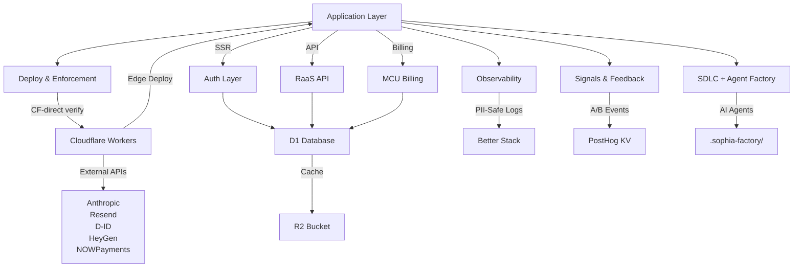

# System Architecture / Kien Truc He Thong

> Sophia AI Factory — RaaS (Reasoning-as-a-Service) Platform with AI-Native CI/CD, Observability, & Signals

**Last Updated:** 2026-05-20 (docs harness alignment — reflects shipped state 2026-05-17; CF-direct deploy doctrine, ASVS-L2 94%, doctrine ceiling 87.5/100)
**Production:** https://sophia.agencyos.network (SHA 5b1f711f)
**Production Dashboard:** https://sophia.agencyos.network/dashboard
**Status Page:** https://sophia.agencyos.network/status (90-day uptime tracking)

### Recent Shipments (2026-04-30 Final)
- **Phase 14 Launch Hardening (2026-04-30):** FTC `#ad` overlay (FFmpeg drawtext, last 3s). Caption prefix in publisher adapters. GDPR `/api/account/export` + `/api/account/delete` endpoints. Runbook (10 incidents tracked, recovery procedures). Polar.sh removed from rate-limiter (single source of truth: NOWPayments only). CI workaround documented.
- **Phase 13 Revenue Split (2026-04-30):** `commission_ledger` D1 table tracks affiliate clicks with 14-day clawback window. `payout_batches` orchestrates NOWPayments USDT mass-payout (TRC20 preferred, ERC20 fallback). Daily reconciliation cron. Real affiliate network payouts live.
- **Phase 12 OpenClaw (2026-04-30):** 10-primitive orchestrator (spawnAgentFleet, withTenant, onEvent, activateSkill, scheduleAgent, memory, mcp, enqueue, audit, rateLimitGate) on Claude SDK. Qwen 3 32B router for inference. Circuit breaker for fault tolerance.
- **Phase 11 Tenant Isolation (2026-04-30):** D1 Kysely tenant-scope plugin auto-injects `tenant_id`. Tier quota enforcer (free/pro/enterprise). Storage tracker cron (org_id scoped).
- **Phase 10 Publishers (2026-04-30):** TikTok Shop, YouTube Data v3, Instagram Graph adapters. Token encryption (AES-GCM). Per-channel quota + scheduler cron.
- **Phase 9 Affiliate (2026-04-30):** 5 networks (TikTok Shop, AccessTrade, ClickBank, Awin, Amazon). HMAC-verified webhooks. Click recorder (ip_hash). Commission attribution + tracking.
- **Phase 8 Visual (2026-04-30):** 2-path router (template via MoviePy + cinematic via HunyuanVideo on Runpod). FFmpeg composer + subtitle generator.
- **Phase 7 TTS (2026-04-30):** Coqui XTTS v2 service blueprint (Fly.io Docker). `/api/internal/tts` proxy. Voice CRUD.
- **Phase 6 Video (2026-04-30):** FSM + Inngest functions (scripting/tts/visual/compose/upload/publish). `video_jobs` D1 table. `/api/videos` endpoints.

### Earlier Shipments (2026-04-18)
Rounds 4 + 5 + 6 + 7 + 8: 20+ major features shipped (LLM observability + async ops + signals + BYOK integration + user admin):
- **Round 8 - R8 Hygiene + User-Facing BYOK Admin (2026-04-18):** Phase 8A errorClass split in workflow-stepper + weekly-signals-digest + error-digest BYOK resolver symmetry + Phase 8C new `/api/user/byok` endpoint (GET/POST/DELETE key management) + `/dashboard/byok` SSR page with bilingual component + `BYOK_KEY_SET/BYOK_KEY_CLEARED` signal events = 11 new tests, user-facing BYOK admin ready
- **Round 7 - R7 BYOK Wiring Completion (2026-04-18):** Phase 7A OpenRouter degrade-to-mock in workflow-stepper + Phase 7B script-generator BYOK resolver wire + Phase 7C niche-enhancer BYOK resolver wire = 6 new tests, all OpenRouter callers BYOK-integrated
- **Round 6 - R6 Refinement Pack (2026-04-18):** Phase 4F.3 tier normalization (DB_TIER_MAPPING canonical safety) + Phase 4N-POLISH SSE reader cleanup + parse_error event + Phase 4E.2-TUNING cache index widening + PII gate + Phase 4G-WIRE per-user key integration into cron/LLM callers = 9 new tests, BYOK fully wired
- **Round 5 - Round 4.5 Refinement (2026-04-18):** Phase 4N SSE parser extraction (7-event union, tool-use streaming) + Phase 4E.2 semantic cache fallback (Workers AI embeddings, dark-launched) + Phase 4F.2 tenant context helper (single-JOIN, YAGNI) + Phase 4G-BYOK per-user API key foundations (AES-GCM crypto + D1 store, env fallback) = 62 new tests, 4 new modules
- **Round 4 - Trace Aggregation & Anthropic (2026-04-18):** Phase 4M aggregateTraceStats extraction + Phase 4J Anthropic API adapter + Phase 4K admin monitoring LLM trace embed + Phase 4L Anthropic streaming/tool-use library prep = 8 new tests, callAnthropicFull/callAnthropicStream available
- **Round 3 - Real LLM & Ops Endpoints (2026-04-18):** Phase 4G dark-launched real LLM + Phase 4H cache stats API + Phase 4I trace stats API + Phase 4G-FIX telemetry honesty = 9 new tests, ops monitoring endpoints live
- **Round 2 - Cache Lifecycle (2026-04-18):** Phase 4E LLM cache MVP + Phase 4E H-1 org scoping + Phase 4E.3 purge cron + Phase 4F cache wiring + Phase 4F.1 resolveOrgId unification = 6+25+4+4+5=44 new tests
- **Round 1 - Foundations (2026-04-17):** Phase 4D Langfuse secondary sink + Phase 4C smart LLM router + Phase 4B provisioning + Phase 4A signals digest
- **RaaS P1–P4:** CI/CD + observability + signals + SDLC agents
- **Local Mode D–F:** Auto-installer + setup wizard + health monitoring

**ARCHITECTURE CONSOLIDATION (2026-04-15):** Unified auth (Better Auth D1), single DB client, consolidated tier logic, modularized 15→56+ focused modules (all < 200 LOC). E2E smoke tests validate critical journeys.

**AUTHENTICATION MIGRATION (2026-04-14):** Better Auth v1.6.2 with D1 Kysely adapter. Email/password + magic link + organization plugin.

**PAYMENT PROVIDER MIGRATION (2026-04-10):** NOWPayments (primary) + PayOS (Vietnam backup).

---

## Architecture Layers (7 Total)



---

## Layer 1: Deploy Pipeline

**Doctrine ceiling: 87.5/100** (no-tech doctrine v1.28.1 — operator manages platform code only, no third-party creds required).

### Deploy Pipeline (CF-direct doctrine, effective 2026-05-03)

GitHub Actions is **DISABLED by design** since 2026-05-03 (account free-tier exhausted; team adopted CF-direct as permanent path). Workflow archived at `.github/workflows/test.yml.disabled`.

**Canonical deploy sequence:**

```
git push origin main
  ↓
cd apps/sophia-ai-factory && npm run deploy:full
  (= next build + inject COMMIT_SHA/DEPLOYED_AT secrets + wrangler deploy)
  ↓
bash scripts/apply-migrations.sh  (if migrations/ changed)
  ↓
curl -s https://sophia.agencyos.network/api/version | jq .shortSha
  (must match git rev-parse HEAD | cut -c1-8)
  ↓
curl -sI https://sophia.agencyos.network | head -1  (must be 200)
```

Push-before-deploy guard: `deploy-with-sha.sh` exits 2 if `git log origin/main..HEAD` is non-empty (prevents prod/git SHA divergence). Override: `ALLOW_UNPUSHED_DEPLOY=1`.

**Rollback:** `npx wrangler rollback --name sophia-ai-factory` or redeploy a specific git SHA.

**Pre-push quality gates (local enforcement):**
- `npm run type-check` — TypeScript gate
- `npm run build` — production build
- `npm run ci:test` — current-count Vitest run
- `npm run lint` — ESLint

### Cron Authentication

All `/api/cron/*` routes require Bearer auth:
```
Authorization: Bearer ${CRON_SECRET}
```
`CRON_SECRET` is a 32-byte random value set via `wrangler secret put CRON_SECRET`. Requests without valid Bearer return HTTP 401. See `src/seed/security/cron-auth.ts`.

### Health Endpoints
- `/api/version` — public: `{shortSha, deployedAt, opennextVersion}`. Primary deploy verify signal.
- `/api/health` — service health (auth required for full detail)

---

## Pre-Flight Health Gates (2026-05-02)

**HeyGen Health Check for One-Time Bundles**

Pricing page gates One-Time Bundle CTA when HeyGen is down to prevent customer paying for broken upstream.

| Component | Details |
|-----------|---------|
| **Endpoint** | `/api/health/heygen` — GET, no auth required |
| **Probe** | Calls HeyGen `/v2/voices` with 5s timeout |
| **Cache** | EXPERIMENT_KV, 60s TTL (cost optimization) |
| **Rate Limit** | 60 req/min per IP (fair-use burst) |
| **Graceful Degradation** | Never 500s — returns `{ ok: false }` on timeout/error |
| **Server-Side Helper** | `seed/health/heygen-health-check.ts` (direct KV-cached, RSC-optimized) |
| **Page Gating** | `/app/[locale]/pricing/page.tsx` calls `isHeyGenHealthy()` → passes prop to `OneTimeBundleCard` |
| **UX** | Disabled CTA + error toast (bilingual Vi/En) on checkout failure (401/400/429/500/503) |
| **Case 401** | Shows login link (unauthenticated) |

---

## Layer 2: Observability (2026-04-17)

**Better Stack Structured Logging** for production monitoring

| Feature | Implementation | Details |
|---------|---|---|
| **PII-Safe Logging** | Tokenized payloads | No API keys, emails, or tokens in logs |
| **Heartbeats** | Every 5 minutes | Uptime signal from edge |
| **Error Digest** | Daily cron | Aggregated error report email |
| **Request Tracing** | Per-request ID | Trace user journeys across services |
| **Custom Metrics** | MCU, tier, org_id | Business metrics tracked |
| **Telegram FSM Metric** | `telegram_fsm_invalid_state` | Emitted when FSM reads D1 state value failing `isBotState()` guard; reasons: schema drift, migration bug |

**Integration:** `src/lib/telemetry/*` modules for event capture, batching, delivery.

---

## Layer 3: Signals & Feedback (2026-04-17)

**PostHog Event Tracking** for product analytics & A/B testing

| Feature | Implementation | Details |
|---------|---|---|
| **Event Capture** | Lightweight SDK | Page views, feature usage, custom events |
| **A/B Framework** | EXPERIMENT_KV binding | Define experiments in D1, track variants |
| **Weekly Digest** | Cron job (Sunday 9am UTC) | Email summary of top features, funnel metrics |
| **Funnel Analysis** | Native PostHog UI | Track user journeys (signup → upgrade → mission) |

**Configuration:** `src/lib/signals/*` modules handle event batching, variant assignment, result logging.

---

## Layer 4: SDLC & Agent Factory (2026-04-17)

**4 C-Level AI Agents** sandboxed in `.sophia-factory/`

| Agent | Role | Allowed Paths | Tools |
|-------|------|---|---|
| **CTO** | Code quality + security | `src/**`, `tests/**`, `.github/**` | Read, Edit, Bash, Grep |
| **CMO** | Content + marketing | `src/app/(marketing)/**`, `messages/**`, `docs/**` | Read, Edit, Grep |
| **CSO** | Sales + pricing | `pricing/**`, `messages/**`, `docs/sales/**` | Read, Edit, Grep |
| **COO** | Operations + support | `docs/operations/**`, `.sophia-factory/journal/**` | Read, Edit |

**Artifacts:**
- Agent definitions: `.sophia-factory/agents/{cto,cmo,cso,coo}.md`
- SDLC lifecycle: `.sophia-factory/CLAUDE.{specification,design,code,deploy}.md`
- Audit trail: `.sophia-factory/journal/` (committed to repo)

**Cost:** ~$27/month total (Sonnet pricing, Opus for critical decisions only).

---

## Tech Stack

| Layer | Technology | Notes |
|-------|-----------|-------|
| **Runtime** | Cloudflare Workers | Edge compute, global |
| **Framework** | Next.js 16 + React 19 | App Router, SSR |
| **Adapter** | `@opennextjs/cloudflare` | Next.js → CF Workers |
| **Database** | Cloudflare D1 | SQLite-based, `sophia-raas-db` |
| **Cache** | Cloudflare R2 | `sophia-ai-factory-opennext-cache` |
| **LLM Cache** | D1 (Org-Scoped) | Exact-match SHA-256 (Phase 4E) + optional semantic-similarity fallback via Workers AI embeddings (Phase 4E.2, `LLM_CACHE_SEMANTIC_ENABLED`, dark-launched; Phase 4E.2-TUNING: index widened to full 4 columns `(org_id, embedding_model, provider, model, created_at)` for range freshness queries); per-tenant isolation via `resolveOrgId()` + `getTenantContext()` helpers (Phase 4E H-1 → 4F.1 → 4F.2); `LLM_CACHE_STORE_PROMPT_TEXT=1` PII/GDPR gate (vectors always stored, text optional); `callWithCache()` wrapper wired into script-generator (Phase 4F); daily purge cron (Phase 4E.3); real LLM in workflow-stepper (Phase 4G, `WORKFLOW_REAL_LLM_ENABLED`); stats endpoints `/api/admin/llm-cache-stats` (Phase 4H) + `/api/admin/llm-trace-stats` (Phase 4I) |
| **AI Streaming** | Anthropic SSE + Tool-Use | `parseAnthropicSse()` async generator + `AnthropicStreamEvent` discriminated union (Phase 4N); `callAnthropicStreamEvents` yields 7 event types (message_start, content_block_start/stop, text_delta, input_json_delta, message_delta, message_stop; Phase 4N-POLISH: added `parse_error` variant + try/finally reader cleanup for robust error handling); `callAnthropicStream` backward-compat text-only filter; `callAnthropicFull` for tool-use flows |
| **Per-User API Keys (LLM/Media)** | D1 + AES-GCM Crypto | BYOK foundations (Phase 4G-BYOK): `user_api_keys` D1 table, AES-GCM-256 encryption (`byok-crypto.ts`), D1 store (`user-api-key-store.ts`), resolver with envFallback (`resolve-user-api-key.ts`); opt-in via `BYOK_ENABLED=1` + `BYOK_MASTER_KEY` (base64 32 bytes); Phase 4G-WIRE: fully integrated into workflow-stepper cron via `resolveOrgOwnerUserId()` helper for cron context bridge; per-user key resolution before Anthropic/OpenRouter live calls; env fallback when BYOK disabled |
| **Per-User Provider Credentials (BYOK)** | D1 `user_provider_credentials` + AES-GCM | Full BYOK for fulfillment providers (2026-05-02): customers supply own HeyGen/Resend/NOWPayments keys via Setup Wizard. Encryption/repo/lookup live under `tree/credentials/*` (`encryption.ts`, `user-credentials-repo.ts`, `get-provider-key.ts`). Fulfillment paths: `one-time-fulfillment.ts` + `fulfillment-retry` cron → `getHeyGenKey({userId, fallbackToPlatform:false})`. Platform key retained for: health check, synthetic monitor, onboarding video. API routes: `/api/setup-wizard/{save-credentials,test-heygen,test-resend,list-credentials}`. Pricing gate: unauthenticated or unconfigured users see "Configure HeyGen" prompt instead of One-Time Bundle CTA. |
| **AI Providers** | Anthropic + OpenRouter | Anthropic API adapter (Phase 4J) routes via `fetchFromAnthropicAPI()` when `ANTHROPIC_API_KEY` set; OpenRouter fallback via router (Phase 4C); cache reuse across both via `callWithCache()` |
| **Auth** | Better Auth v1.6.2 (D1) | Email/password + magic link, org plugin, no RLS |
| **Billing** | NOWPayments (primary) + PayOS (backup) | MCU credit system, webhooks |
| **Email** | Resend | Magic link, notifications |
| **AI** | Anthropic | Proposal generation |
| **Video** | HeyGen | Auto onboarding video (ENTERPRISE+) + on-demand generation |
| **Domain** | sophia.agencyos.network | CF Workers Custom Domains |

---

## Data Flow

### Current Verified Runtime Model (2026-05-22)

| Subsystem | Entry Points | Flow | State | External Integrations | Confidence |
|-----------|--------------|------|-------|-----------------------|------------|
| Middleware/security | `src/middleware.ts`, `src/middleware-api-handler.ts` | Static/public bypass -> API gate or page auth -> Better Auth session -> CSRF/rate/tenant/usage checks -> route | Session cookie, D1 user/org/tier lookup | Better Auth, D1, usage metering | High |
| Auth | `src/app/api/auth/[...all]/route.ts`, `src/seed/auth/better-auth-server.ts` | Better Auth handler -> D1 adapter -> email/password or magic link -> cookie -> `getCurrentUser()` | Better Auth D1 tables plus organization bootstrap rows | Resend | High |
| Billing | `src/app/api/checkout/route.ts`, `src/app/api/webhooks/nowpayments/route.ts`, `src/land/billing/nowpayments-ipn-*.ts` | Checkout creates/records pending order -> NOWPayments invoice -> signed IPN -> idempotency -> subscription or one-time fulfillment branch | `pending_orders`, `subscriptions`, `org_balances`, `user_purchases`, audit rows | NOWPayments, Resend, HeyGen, Telegram/handover | High |
| Mission engine | `src/app/api/v1/missions/route.ts`, `src/forest/missions/dispatcher.ts`, `src/land/missions/auto-video-mission.ts` | Bearer/session auth -> quota check -> `engine_missions` insert -> async dispatch -> result/status update | `engine_missions`, result tables, videos | HeyGen/BYOK, SEO/affiliate helpers, D1 | High |
| Video generation | Canonical: `video:create` mission and `/api/missions/auto-video`. Deprecated: `/api/videos/generate` | Canonical flow writes mission/video state and relies on HeyGen webhook. Deprecated endpoint returns HTTP 410 per ADR 0007. | `videos`, `video_onboarding_events`, mission state | HeyGen, R2, Resend | High |
| Background jobs | `src/app/api/inngest/route.ts` | Only functions listed in the `serve({ functions: [...] })` array are active. Folder exports alone are not runtime registration. | Inngest event state + D1 side effects | Inngest | High |
| Scheduled jobs | `wrangler.toml`, `scripts/inject-scheduled-handler.mjs`, `src/app/api/cron/**` | Cloudflare schedule -> injected Worker `scheduled()` -> service binding fetch with `CRON_SECRET` -> cron route | `cron_run_log`, job-specific tables | Cloudflare Workers/D1/R2, external APIs per route | High |
| Feature flags/signals | `src/lib/signals/*`, `src/lib/feature-flags/*` | Resolve variant/flag -> append D1/KV signal -> optional digest/PostHog flush | D1, `EXPERIMENT_KV` | PostHog, email/GitHub issues for digests | Medium |

Confirmed hidden coupling:
- `apps/sophia-ai-factory/wrangler.toml` has cron patterns not mapped by `CRON_ROUTES` in `scripts/inject-scheduled-handler.mjs`: `0 5`, `*/10`, `0 7`, `10 *`, `0 */4`. The routes likely intended by those patterns (`error-digest`, `heartbeat`, `llm-cache-purge`, `wallet-rebuild`, `affiliate-scout`) need verification before anyone claims cron coverage.
- `src/forest/inngest/functions/index.ts` exports legacy video functions, but `src/app/api/inngest/route.ts` does not register the Phase 06 video chain. Runtime registration is the route file, not the export list.
- Core imports are now `@/seed/auth/*`, `@/seed/db/*`, and `@/seed/config/tiers`; historical `@/lib/*` references are legacy compatibility or stale docs.

### Auth Flow (Better Auth with D1)
```
User → /signup or /login
  ↓
POST /api/auth/[...all] (Better Auth endpoint)
  ↓
D1 (Kysely): Create/verify user (PBKDF2 password hash)
  ↓
Email verification or password verification
  ↓
Better Auth generates session token (cookie-based)
  ↓
Set auth session cookie (HttpOnly, secure, sameSite)
  ↓
Middleware validates session & extracts user context
  ↓
Server Components use getCurrentUser() from Better Auth client
  ↓
App layer enforces user_id/org_id ownership (no RLS needed)
```

### Magic Link Flow
```
User enters email → POST /api/auth/signIn/magicLink
  ↓
D1: Store verification link in better_auth_verifications
  ↓
Resend: Send magic link to email
  ↓
User clicks link → /api/auth/callback?token=XXX
  ↓
Better Auth verifies token & creates session
  ↓
Redirect to dashboard with session established
```

### Mission Pipeline
```
User creates mission (Dashboard or API)
  ↓
POST /api/v1/missions
  ↓
D1: Create mission record (status: queued)
  ↓
MCU balance checked + deducted
  ↓
Mission processing:
  queued → planning → executing → verifying → completed
  ↓
D1: Store results in mission_results table
  ↓
User retrieves via GET /api/v1/missions/[id]/result
```

### Billing Flow
```
User selects tier → /pricing
  ↓
POST /api/checkout → NOWPayments invoice URL or PayOS checkout session
  ↓
User pays via NOWPayments (USDT/crypto) or PayOS (VietQR/bank transfer)
  ↓
POST /api/webhooks/nowpayments or /api/webhooks/payos (signature verified)
  ↓
D1: Update billing state, pending order, and active tier
D1: Credit MCU to org_balances
  ↓
/billing/success confirmation
```

### Video Onboarding Pipeline (ENTERPRISE/MASTER Auto Handoff)
```
User completes NOWPayments purchase (ENTERPRISE/MASTER tier)
  ↓
POST /api/webhooks/nowpayments (signed IPN callback)
  ↓
D1: Activate subscription + check tier eligibility
  ↓
ONBOARDING_TIERS check → createOnboardingVideo()
  ↓
D1: Insert video_onboarding_events row before upstream work
  ↓
HeyGen: create avatar video directly through platform key
  ↓
HeyGen webhook: POST /api/webhooks/heygen (video.completed)
  ↓
Check videos.is_onboarding=1 → update video_onboarding_events
  ↓
Resend: sendOnboardingVideoEmail() → email delivery status logged
  ↓
Dashboard: /dashboard/videos shows onboarding videos in gallery
```

### One-Time Package Purchase Pipeline (2026-05-02) + Fulfillment Hardening (260502-0604)

#### One-Time Purchase Flow (Phases Q2-P15)
```
User selects STARTER_BUNDLE → /billing/checkout
  ↓
POST /api/webhooks/nowpayments (signed IPN callback from NOWPayments)
  ↓
Dispatcher branches by invoice/SKU mapping:
  Known one-time invoice → one-time handler
  Tier invoice → subscription handler
  ↓
One-Time Handler:
  D1: Insert user_purchases record (video_credits=10, ttl_end=now+365d)
  D1: Update videos.purchase_id FK (backfill user's bundle videos)
  Idempotency: UNIQUE(user_id, user_purchase_id) prevents duplicates
  ↓
Resend: sendOneTimeBundleReadyEmail() / related bundle emails (bilingual Vi/En templates)
  Email includes: credit balance, video gallery link, cross-sell CTA
  ↓
Dashboard: /dashboard/videos surfaces bundle videos + remaining credits
```

#### Fulfillment Hardening (Phase 260502-0604 — Zero-Fail Delivery)

**3-Phase Hardening Strategy:**
1. **Queue-First Persistence** — `videos.status='queued'` inserted BEFORE HeyGen API call (prevents lost state)
2. **Retry-Cron with Backoff** — `/api/cron/fulfillment-retry` runs every 2min, exponential backoff (30s→1m→5m→15m→1h), max 5 attempts
3. **Permanent Failure Path** — After 5 retries exhausted: bilingual failed email + atomic +1 credit compensation via `billing_events` table (UNIQUE index prevents double-grants)

**State Machine** — videos.status transitions:
```
queued → processing → completed | failed_permanent
  ↑         ↓              ↓
  └─── retry-cron ←─────┘
       (2min, exp backoff)
```

**Supporting Infrastructure:**
- **HeyGen Webhook Callback** — POST `/api/webhooks/heygen` updates status instantly (safety net: cron stays for async coverage)
- **Synthetic Monitor Cron** — `/api/cron/synthetic-monitor` every 15min alerts on failures via Sentry + email
- **Daily Reconciliation** — 6am UTC reconciliation scan (`/api/cron/fulfillment-reconcile`) validates completion counts vs billing records
- **R2 Access Control** — Streaming route requires auth-gate (no presigning needed; video access revoked on refund)

**DB Changes:**
- Migration 0040: `videos.fulfillment_state` (queued|processing|completed|failed_permanent)
- Migration 0041: `videos.access_revoked` boolean (R2 streaming gate)
- Migration 0042: `users.id='synthetic-test-user'` for smoke tests
- Migration 0043: Relax `videos.created_at` constraint (allow future dates for testing)
- Migration 0044: `billing_events(user_id, event_type, unique index)` compensation atomic insert

**Deferred (F9):** HeyGen circuit breaker + D-ID fallback pending D-ID account provisioning (Phase not shipped)

### On-Demand Video Pipeline (Current vs Deprecated)
```
Current:
User/API creates mission with command `video:create`
  ↓
POST /api/v1/missions or POST /api/missions/auto-video
  ↓
forest/missions/dispatcher.ts routes to mission handler
  ↓
HeyGen mission flow → HeyGen webhook → videos table
  ↓
Video stored in D1 + R2, accessible via dashboard

Deprecated:
POST /api/videos/generate
  ↓
Auth preserved; authenticated callers receive HTTP 410 Gone
  ↓
Replacement hint: use the HeyGen mission flow (`video:create`)
```

---

## Database Schema (D1)

**Database:** `sophia-raas-db` (ID: `78bd1961-b62d-43bb-b551-0c5d7d389506`)

### Core Tables
```
users           — id, email, password_hash, full_name, role
organizations   — id, name, slug, email
org_members     — org_id, user_id, role (owner/member)
org_balances    — org_id, balance, reserved, lifetime_credits/debits
api_keys        — id, org_id, key_hash, name, is_active, expires_at, rate_limit_per_minute (Phase 4 D1 canonical)
```

### Feature Tables
```
missions        — id, org_id, template_id, status, mcu_cost
mission_results — id, mission_id, output (JSON)
usage_logs      — id, org_id, feature, mcu_used
rate_limits     — identifier (PK), current_count, window_start, window_seconds (Phase 4 D1 atomic)
export_jobs     — id, org_id, license_nonce, export_format, period_start/end, record_count, success, error_message (Phase 4 D1 cron)
```

### Billing Tables
```
subscriptions     — org_id, plan, status, current_period_start/end
pending_orders    — order_id (PK), amount, tier_slug, user_id (FK), provider, status, created_at, expires_at
payment_events    — id, org_id, provider, amount, currency, status, metadata (NOWPayments IPN)
payos_events      — event_id (PK), webhook_id, tier_slug, order_id (FK), status, created_at (NEW — 2026-05-03, PayOS webhook log)
```

### Video Tables
```
videos                   — id, org_id, user_id, title, r2_key, status, is_onboarding, purchase_id (FK), created_at
video_onboarding_events  — id, org_id, video_id, user_email, tier, delivery_status, created_at
user_purchases           — id, user_id, sku (STARTER_BUNDLE), video_credits (10), ttl_end (365d), created_at (NEW — 2026-05-02)
```

### Operations Tables (NEW — 2026-05-03, Go-Live)
```
email_outbox             — id (PK), recipient, subject, body_html, status (queued/sent/failed), attempts, last_error, created_at, sent_at (durable email queue)
raas_user_api_keys       — id (PK), user_id (FK), key_name, key_value_encrypted (AES-GCM), created_at (RaaS API key storage)
user_onboarding_state    — user_id (PK), current_step (INT), mission_id (FK nullable), completed_at (nullable, resumable onboarding)
status_incidents         — id (PK), timestamp, severity, description, resolved_at (incident tracking)
status_rollup            — date (DATE PK), uptime_percent (REAL), incident_count (INT, daily aggregates for /status page)
```

### Growth Tables
```
referral_codes    — id, user_id, code, commission_rate (20%), earned_mcu
affiliates        — id, org_id, program_name, commission_rate
affiliate_content — id, org_id, type, title, content, status
```

---

## API Routes

### Public (No Auth)
| Route | Method | Purpose |
|-------|--------|---------|
| `/api/health` | GET | Health check |
| `/api/version` | GET | Deployed SHA + build info |
| `/api/status.json` | GET | Status JSON (uptime, incidents) (NEW 2026-05-03) |
| `/api/health/heygen` | GET | HeyGen health check (gates One-Time CTA) (NEW 2026-05-03) |
| `/[locale]/status` | GET | Public 90-day uptime status page (NEW 2026-05-03) |
| `/[locale]/pricing` | GET | Public pricing page with monthly+yearly toggle (NEW 2026-05-03) |
| `/[locale]/onboarding` | GET | Resumable 3-step onboarding (auth-required, NEW 2026-05-03) |
| `/api/v1/demo` | POST | Quick demo preview (rate limited) |
| `/api/v1/demo-requests` | POST | Demo booking |
| `/api/auth/[...all]` | GET/POST | Better Auth registration, login, magic link, callback, and session endpoints |
| `/api/checkout` | GET/POST | Self-serve checkout redirect + invoice creation |
| `/api/webhooks/nowpayments` | POST | NOWPayments IPN (subscription activation + onboarding trigger) |
| `/api/webhooks/payos` | POST | PayOS webhook (VN payment events) (NEW 2026-05-03) |
| `/api/webhooks/heygen` | POST | HeyGen video completion callback (email delivery trigger) |

### Protected (Auth Required)
| Route | Method | Purpose |
|-------|--------|---------|
| `/api/org` | GET | Current org info |
| `/api/billing/usage-summary` | GET | Usage + billing summary |
| `/api/checkout` | POST | NOWPayments invoice or PayOS checkout session |
| `/api/checkout/status` | GET | Pending checkout / order status polling |
| `/api/user/cancel-subscription` | POST | User-initiated subscription cancel |
| `/api/v1/api-keys` | GET/POST/DELETE | RaaS API key management (NEW 2026-05-03) |
| `/api/raas/missions` | GET/POST | Mission CRUD |
| `/api/raas/keys` | GET/POST | API key management |
| `/api/raas/usage` | GET | MCU usage stats |
| `/api/proposals/generate` | POST | AI proposal (MCU billable) |
| `/api/videos/generate` | POST | Deprecated legacy video endpoint; authenticated callers receive HTTP 410 per ADR 0007 |
| `/api/videos` | GET/POST | Video CRUD + Inngest status (Phase 6) |
| `/api/affiliates/dashboard` | GET | Affiliate earnings + commission tracking (Phase 9) |
| `/api/affiliates/networks` | GET | Available networks (TikTok Shop, Awin, ClickBank, AccessTrade, Amazon) (Phase 9) |
| `/api/publishers/channels` | GET/POST | Social channel management (TikTok, YouTube, Instagram) (Phase 10) |
| `/api/publishers/schedule` | POST | Schedule post across channels (Phase 10) |
| `/api/account/export` | POST | GDPR data export (Phase 14) |
| `/api/account/delete` | POST | GDPR account deletion (Phase 14) |
| `/api/user/byok` | GET/POST/DELETE | User BYOK API key management (Phase 4-8) |

### RaaS External API (Bearer Token)
| Route | Method | Purpose |
|-------|--------|---------|
| `/api/v1/missions` | GET/POST | List/create missions |
| `/api/v1/missions/[id]` | GET | Mission detail |
| `/api/v1/missions/[id]/result` | GET | Mission output |
| `/api/v1/missions/[id]/stream` | GET | SSE real-time progress |

### Local Mode Setup (Auth Required, Phases D-F)
| Route | Method | Purpose |
|-------|--------|---------|
| `/api/setup/local-mode/provision` | POST | Activate local mekongd mode + CF Tunnel |
| `/api/setup/local-mode/status` | GET | Check local mode provisioning status |
| `/api/cron/local-mode-health` | GET | Health check for local mekongd connection |

### Admin Monitoring (CRON_SECRET, Phases 4H-4K)
| Route | Method | Purpose |
|-------|--------|---------|
| `/admin/monitoring` | GET | Server-rendered admin dashboard (D1 aggregates + LLM trace cards, Phase 4.7 + 4K) |
| `/api/admin/llm-cache-stats` | GET | JSON cache statistics (24h aggregates, Phase 4H) |
| `/api/admin/llm-trace-stats` | GET | JSON LLM trace statistics (24h aggregates by provider/model, Phase 4I) |

---

## Autonomous Operations & Cron Jobs (2026-04-30)

**Cloudflare Workers Cron Triggers:** Scheduled workflows are defined in `wrangler.toml`, but the active route map is the post-build `CRON_ROUTES` object in `scripts/inject-scheduled-handler.mjs`.

**Inngest Event-Driven Pipelines (Phases 6-14):** 
- **Registered Functions Only:** Runtime functions are the explicit array in `src/app/api/inngest/route.ts`; exports from `src/forest/inngest/functions/index.ts` are not active unless listed there.
- **Deprecated Video Chain:** The Phase 06 `video_jobs` Inngest chain is no longer registered per ADR 0007. Canonical on-demand video generation is the HeyGen mission flow (`video:create`).
- **Onboarding Video:** NOWPayments IPN (ENTERPRISE/MASTER) → direct HeyGen onboarding video creation → HeyGen webhook → email delivery → dashboard gallery
- **Affiliate Payouts (Phase 13):** Click events → Commission calc → 14-day clawback window → NOWPayments USDT batch → Reconciliation cron

**Publisher Schedulers (Phase 10-14):**
- **TikTok Shop:** Auto-publish with product sync + hashtag injection + FTC caption
- **YouTube Data v3:** Playlist management + analytics + scheduled premieres
- **Instagram Graph:** Caption + media + scheduled post + story archival

| Trigger | Frequency | Purpose | Implementation |
|---------|-----------|---------|---|
| Email Drip | Day 1, 3, 7 | Welcome + nurture sequence | `lib/crons/email-drip.ts` |
| Renewal Reminder | 7 days pre-expiry | Subscription renewal notifications | `lib/crons/renewal-reminder.ts` |
| Dunning State Advance | Daily | Failed payment retry logic (24h/7d/30d) | `lib/billing/dunning/state-machine.ts` |
| Scheduled Campaigns | Hourly | Time-based content distribution | `lib/campaigns/scheduled-cron.ts` |
| System Health Check | 5 minutes | Uptime monitoring (Telegram alerts) | `lib/crons/health-check.ts` |
| Quota Evaluation | 1 hour | MCU limit warnings (email + Telegram) | `lib/alerts/quota/scheduler.ts` |
| Usage Aggregation | 30 minutes | MCU rollup + balance updates | `lib/usage-metering/rollup.ts` |
| **Video Pipeline** | Event-driven | 6-step: script → tts → visual → compose → upload → publish | `lib/inngest/functions/video-*.ts` |
| **Onboarding Video** | IPN trigger | ENTERPRISE/MASTER purchase → auto video → email → dashboard | `lib/video/onboarding-video.ts` |
| **Affiliate Payouts** | Daily | Commission aggregate → 14-day hold → batch payout to USDT | `lib/payouts/payout-batch-cron.ts` |
| **Publisher Sync** | Hourly | Queue scheduled posts across 5 networks | `lib/publishers/scheduler-cron.ts` |

### Cron Infrastructure (2026-05-02)

**Scheduled Handler Injection (Critical Fix)**
Post-build hook injects Cloudflare Workers `scheduled()` export, fixing issue where opennextjs-cloudflare shipped no native scheduled support. Script `scripts/inject-scheduled-handler.mjs` runs after opennext-build, patching `.open-next/worker.js` with the active cron pattern-to-route map.

**Architecture:**
- **Cron patterns** in `apps/sophia-ai-factory/wrangler.toml`, with the live route map verified by `scripts/inject-scheduled-handler.mjs` at build time.
- **Dispatch:** Scheduled handler invokes internal routes via `env.WORKER_SELF_REFERENCE.fetch(req)` (service binding, no external HTTP)
- **State Tracking:** `cron_run_log` D1 table records last execution timestamp per cron pattern (idempotency gate)
- **Auth (260502-0756 CRITICAL UPDATE):** 
  - **Old (260502-0604):** Internal CF triggers included `x-cf-cron: true` header (SECURITY BYPASS)
  - **New (260502-0756):** Removed x-cf-cron bypass; dispatch now uses `Authorization: Bearer <CRON_SECRET>` only (env var, required)
  - **Migration:** Operator runs `bash scripts/set-cron-secret.sh` to generate 32-byte secret + set via `wrangler secret put`
  - **Verification:** After deploy, cron fires within 1 minute (confirmed in cron_run_log fulfillment-retry increment)

**Build-Time Injection Details:**
- **Idempotent:** marker comments prevent duplicate exports if script runs twice
- **Preserves existing handlers:** transparent patch
- **No runtime overhead:** scheduled() export resolved at build, not startup
- **CF Workers Modules Format (260502-0756 CRITICAL FIX):** 
  - **Old (failed):** `export async function scheduled(...)` (named export) — CF didn't recognize as entry point
  - **New (working):** `export default { scheduled }` (method on default export) — CF correctly routes cron events
  - **Why it matters:** CF Workers Modules format requires entry point as method on default export, not named function

**Cron Routes Supported by the injection script (verified 2026-05-22):**
- `*/5 * * * *` → `/api/cron/uptime-check`, `/api/cron/video-status-sync`, `/api/cron/sop-scheduler`
- `5 * * * *` → `/api/cron/usage-export`
- `0 1 * * *` → `/api/cron/dunning-advance`
- `0 2 * * *` → `/api/cron/subscription-reminders`
- `0 3 * * *` → `/api/cron/scheduled-campaigns`
- `0 4 * * *` → `/api/cron/email-drip`
- `0 6 * * 1` → `/api/cron/weekly-signals-digest`
- `*/2 * * * *` → `/api/cron/fulfillment-retry`, `/api/cron/email-outbox-flush`
- `*/15 * * * *` → `/api/cron/smoke-one-time`
- `0 6 * * *` → `/api/cron/fulfillment-reconcile`
- `0 0 1 * *` → `/api/cron/mcu-monthly-reset`
- `0 0 * * *` → `/api/cron/clearance-promote`, `/api/cron/promo-trial-expiry`
- `7 * * * *` → `/api/cron/handover-status-sync`

**Needs verification:** `wrangler.toml` also declares `0 5 * * *`, `*/10 * * * *`, `0 7 * * *`, `10 * * * *`, and `0 */4 * * *`, but these are not present in `CRON_ROUTES`. Do not claim `error-digest`, `heartbeat`, `llm-cache-purge`, `wallet-rebuild`, or `affiliate-scout` are scheduled until this is reconciled.

**Monitoring:**
- `cron_run_log` prevents duplicate execution (last_run_at check)
- Sentry integration logs execution errors (auto-escalation on repeated failures)
- Dashboard admin panel surfaces cron health (execution lag, error rate, last run)

**Configuration:** `wrangler.toml` defines triggers; each cron handler orchestrates async operations.

**Benefits:**
- Zero human intervention for billing, notifications, campaigns
- Customers self-serve via bot + dashboard (no support team needed)
- Autonomous error recovery (dunning retries, health alerts)

---

## Error Tracking & Client-Side Monitoring (2026-04-15)

**Sentry Integration:**
- **Client SDK:** Error tracking for frontend (React error boundaries)
- **Server SDK:** Exception capturing on Server Components and Server Actions
- **Edge Functions:** Cloudflare Workers error reporting
- **Source Maps:** Uploaded with each deployment for stack trace accuracy

**Contextual Error Pages:**
- **Auth Expiry:** 401 → "Session expired. [Re-login]" CTA
- **Network Failures:** Timeout → "Connection lost. [Retry]" CTA
- **Database Errors:** 503 → "Service temporarily unavailable. [Report]" CTA
- **Generic Errors:** 500 → "Something went wrong. [Contact Support]" CTA

**ErrorReporter Utility:**
- Client-side error logging with user context
- Aggregates errors before reporting (batching)
- Filters out known warnings (console spam)

---

## Middleware

**File:** `middleware.ts`

1. **Static/internal bypass:** internal Next assets and static files skip middleware.
2. **CORS preflight:** `OPTIONS` handled before auth.
3. **Per-request CSP nonce:** generated and forwarded to Server Components through `x-csp-nonce`.
4. **CSRF protection:** mutating requests use double-submit cookie validation.
5. **API gate:** `/api/*` routes pass through `middleware-api-handler.ts` for tenant isolation, webhook version pinning, rate limits, RaaS gate, and usage events.
6. **Configured gate:** if platform is not configured, dashboard/admin paths redirect to `/dashboard/onboarding`.
7. **Admin gate:** `/admin` and dashboard admin paths require admin/basic auth and MASTER tier checks.
8. **Dashboard auth:** Better Auth session required; pending MFA redirects to `/auth/mfa-challenge`.
9. **i18n routing:** next-intl middleware applies locale redirects/cookies after app-specific gates.
10. **Security headers:** CSP, HSTS, X-Frame-Options, X-Content-Type-Options, Permissions-Policy.

---

## MCU Billing System & Tier Enforcement (2026-04-15)

### Subscription Tiers

| Tier | Price | MCU/month | Discount | Special Features |
|------|-------|-----------|----------|---|
| BASIC / Starter | $199/mo | 1,000 | — | 10 campaigns, 1 team member, no API access |
| PREMIUM / Growth | $399/mo | 5,000 | — | 50 campaigns, 5 team members, API + webhooks |
| ENTERPRISE / Premium | $799/mo | 20,000 | — | Unlimited-style campaigns/team, custom integrations |
| MASTER / Master | $4,999 lifetime | 100,000 | — | Lifetime (2099), white-label, all integrations |

### Tier Enforcement Gates (2026-04-15)

**Tier Normalization (Phase 4F.3):**
- `normalizePlanToTier(plan: string)` canonical helper uses `DB_TIER_MAPPING` for safe enum coercion
- Maps: "starter"→BASIC, "pro"→PREMIUM, "enterprise"→ENTERPRISE, "master"→MASTER + error fallback
- Replaces unsafe `.toUpperCase()` casts on D1 text columns (database text to TypeScript enum safety)

**MASTER Tier Special Handling:**
- **IPN Webhook:** Sets expiry to 2099-12-31 (lifetime subscription)
- **Middleware Bypass:** MCU balance check disabled for this tier
- **Feature Access:** All enterprise features available without MCU deduction
- **White-Label:** Restricted to MASTER tier only (config-enforced)

**Higher-Tier Features:**
- **Auto Video Onboarding:** ENTERPRISE/MASTER purchase → HeyGen onboarding video auto-generated + email delivery
- **Custom Integrations:** `/api/user/integrations` endpoint gated to ENTERPRISE+ tiers
- **API Access:** RaaS endpoints require PREMIUM+ tier
- **Expanded Resources:** BASIC/PREMIUM/ENTERPRISE/MASTER map to 1k/5k/20k/100k monthly MCU; MASTER is lifetime billing.

**Tier Gate Application:**
- Campaign creation: DB check before insert (tier-based limits)
- Team member invites: Count enforcement (1/5/∞/∞)
- API key provisioning: Tier verification (via `normalizePlanToTier` safety wrapper)
- Integration endpoints: ENTERPRISE+ gate enforcement

### Feature Costs

| Feature | MCU | Tier Gate |
|---------|-----|---|
| `proposal:text:basic` | 10 | Starter+ |
| `proposal:text:advanced` | 25 | Growth+ |
| `proposal:text:enterprise` | 50 | Premium+ |
| `video:intro` | 100 | Premium+ |
| `video:section` | 250 | Premium+ |
| `video:full_proposal` | 500 | Premium+ |
| `affiliate:blog` | 50 | Growth+ |
| `affiliate:social` | 10 | Starter+ |
| `email:send` | 1 | Starter+ |
| `api:call` | 1 | Premium+ |

---

## Deployment

### Cloudflare Workers Config (`wrangler.toml`)
```toml
name = "sophia-ai-factory"
main = ".open-next/worker.js"
compatibility_date = "2026-03-17"
compatibility_flags = ["nodejs_compat", "global_fetch_strictly_public"]

[assets]
directory = ".open-next/assets"
binding = "ASSETS"

[[d1_databases]]
binding = "DB"
database_name = "sophia-raas-db"
database_id = "78bd1961-b62d-43bb-b551-0c5d7d389506"

[[r2_buckets]]
binding = "NEXT_INC_CACHE_R2_BUCKET"
bucket_name = "sophia-ai-factory-opennext-cache"

[triggers]
crons = ["*/5 * * * *"]
```

### Environment Variables (CF Worker Secrets)

| Variable | Service |
|----------|---------|
| `JWT_SECRET` | Auth token signing |
| `ANTHROPIC_API_KEY` | AI proposal generation |
| `OPENROUTER_API_KEY` | Multi-model AI + video scripting |
| `HEYGEN_API_KEY` | Video generation (onboarding + on-demand) |
| `RESEND_API_KEY` | Email delivery |
| `NOWPAYMENTS_API_KEY` | Payment processing |
| `NOWPAYMENTS_IPN_SECRET` | NOWPayments webhook verification |
| `PAYOS_CLIENT_ID` | Vietnam domestic payments |
| `PAYOS_API_KEY` | Vietnam domestic payments |
| `PAYOS_CHECKSUM_KEY` | PayOS webhook/checksum verification |

### Deploy & Verification
- **Canonical deploy:** `git push origin main`, then `cd apps/sophia-ai-factory && npm run deploy:full`
- **Build:** `npm run build` (Turbopack) + OpenNext Cloudflare build + scheduled handler injection
- **Deploy proof:** `/api/version` short SHA must match local `git rev-parse HEAD | cut -c1-8`; HTTP 200 alone is insufficient.
- **GitHub Actions:** deploy workflow archived as `.github/workflows/test.yml.disabled`; do not use `gh run list` as production proof.

### Known Workarounds
- **Index route bug:** opennextjs-cloudflare returns 500 for `/`. Fixed via middleware rewrite `/` → `/landing`
- **Peer deps:** `npm install --legacy-peer-deps` required (wrangler v3 vs @opennextjs/cloudflare)

---

## Security & Monitoring (2026-03-26 Audit)

### Authentication & Authorization
- **Better Auth:** v1.6.2 with D1 Kysely adapter, PBKDF2 password hashing, session-based cookies
- **Plugins:** emailAndPassword + magicLink + organization
- **No RLS:** Cloudflare D1 has no Row Level Security — app layer enforces ownership via `user_id` filters in all queries
- **Tenant Isolation:** All API routes verify session org_id from Better Auth context, no header-based org switching
- **Admin Enforcement:** Provision endpoints verify `role === 'admin'` before allowing changes
- **Protected Routes:** Middleware enforces authentication on all protected APIs and Server Components
- **Magic Link:** Resend integration for passwordless email login

### XSS Prevention
- **DOMPurify:** Sanitizes proposal content before rendering to prevent DOM injection
- **React Auto-escape:** Template literals and user content auto-escaped by default
- **Content Security Policy:** CSP header restricts inline scripts and external sources

### Infrastructure Security
- **HSTS Header:** Enforces HTTPS, max-age 1 year, includeSubDomains
- **Security Headers:** X-Frame-Options: DENY, X-Content-Type-Options: nosniff
- **Rate Limiting:** `/api/v1/demo` limited to 10 req/minute per IP
- **Secrets Management:** All keys stored in CF Worker secrets (encrypted at rest), never in code

### Monitoring & Observability
- **Sentry SDK:** Error tracking for frontend, server, and edge functions
- **Structured Logging:** JSON logger for all events (`lib/logger.ts`); `logger.error()` supports `{error?, ...metadata}` object form for backward compatibility
- **Rate Limiter Metrics:** Fail-open branches emit `[metric] telegram_ratelimit_fail_open` with `reason: rpc_error|exception` — downstream log aggregator alerts on sustained spikes
- **Uptime Check:** Cron job runs `/api/health` every 5 minutes for liveness monitoring
- **D1 Backup:** `/api/cron/d1-backup` dumps D1 to the `sophia-backups` R2 bucket; triggered by external scheduler because GitHub Actions is disabled for deploy.

### Compliance
- **Data Protection:** D1 backups encrypted by Cloudflare
- **Audit Trail:** All MCU transactions logged with user/org context
- **Branch Protection:** `main` requires code review, no force push allowed

---

## Code Organization (2026-04-14 Consolidation)

### Auth Consolidation
- **Single Source:** Better Auth v1.6.2 with D1 Kysely adapter (no multiple auth systems)
- **Deleted Files:** `lib/auth.ts`, `lib/subscription.ts`, `lib/db/auth-verify.ts`, `lib/clients/supabase-client.ts`
- **Exceptions:** OAuth callbacks remain on Supabase (external provider requirement), admin invite uses Supabase
- **Server Client:** All authenticated endpoints use `createServerClient()` from `@/seed/db/client` for D1 queries

### DB Client Consolidation
- **Migration Complete:** 112 files migrated from Supabase admin/server to D1 client
- **Entry Point:** `@/seed/db/client` exports `createServerClient()` for D1 access
- **Pattern:** All lib/ and app/api/ files use `createServerClient()` instead of Supabase clients

### Tier Logic Unification
- **Single Source:** `seed/config/tiers/tier-configs.ts` + `seed/config/tiers/unified-limits.ts`
- **Deleted Files:** `lib/tier-gate.ts`, `lib/unified-tier-config.ts`
- **Pattern:** Tier checks import from config, not dispersed utility files

### File Modularization (15 Giant Files → 56+ Modules)
| Original File | New Location | Module Count | Purpose |
|---|---|---|---|
| `resend-email-service.ts` | `lib/billing/email/*` | 4 | delivery, templates, tracking, types |
| `dunning-workflow.ts` | `lib/billing/dunning/*` | 3 | actions, state-machine, admin-ops |
| `quota-alert-service.ts` | `lib/alerts/quota/*` | 3 | evaluator, scheduler, delivery |
| `aggregator.ts` | `lib/usage-metering/*` | 3 | tracker, rollup, integration |
| `raas-audit.ts` | `lib/raas/*` | 4 | audit-logging, query-service, invoice, permissions |
| **10 additional large files** | **lib/*** | **+35 modules** | **2026-04-15 modularization (commit 43213f6)** |
| **Video Onboarding (new)** | `lib/video/onboarding-video.ts` | 1 | NOWPayments IPN → HeyGen video trigger |
| **Email Delivery (new)** | `lib/email/onboarding-emails.ts` | 1 | Resend notification on video complete |
| — | — | — | All individual modules < 200 LOC |

### Shared Utilities
- **Campaign Creation:** `lib/campaigns/create-campaign-core.ts` — unified creation logic for dashboard and API routes

## Migration Status (2026-04-14)

### Completed
- **Architecture Consolidation:** Auth unified, D1 client centralized, tier logic consolidated
- **File Modularization:** Large services split into focused modules under `seed/`, `tree/`, `forest/`, `land/`, and `lib/`
- **Better Auth Framework:** v1.6.2 installed with D1 Kysely adapter
- **Dashboard Server Components:** Migrated to Better Auth session helpers
- **Server Actions:** Mutations use authenticated session context
- **Database:** 120 SQL migration files present under `apps/sophia-ai-factory/migrations/`

### Current Verification Rule
- Do not use the historical 859/863 or 863/863 counts as current evidence.
- Current status must come from fresh `npm run build`, `npm run ci:test`, and targeted Playwright output.

### Why No RLS in D1
- Cloudflare D1 (SQLite) does not support Row Level Security (RLS) policies
- **Mitigation:** App layer enforces ownership via explicit `WHERE user_id = ?` filters in all D1 queries
- This is acceptable for multi-tenant SaaS (all users are authenticated, Better Auth session is verified)

---

## Doctrine Ceiling & Score

**Honest 10-layer score: 87.5/100** (no-tech doctrine v1.28.1, locked 2026-05-17).

| Layer | Score | Notes |
|-------|------:|-------|
| L1 Database | 7/10 | D1 + R2 lifecycle backup; no external cron |
| L2 Server | 9/10 | tagCache wired, all bindings live |
| L3 Networking | 9/10 | DMARC `p=none`; `p=quarantine` discretionary |
| L4 Cloud | 9.5/10 | Cross-layer exemptions documented |
| L5 CI/CD | 10/10 | Pre-push fail-mode + deploy guard active |
| L6 Security | 9/10 | 0 HIGH vulns, ASVS-L2 29/31 (94%) |
| L7 Monitoring | 8/10 | Sentry captures errors; sourcemaps optional |
| L8 Containers | 10/10 | Serverless — N/A by audit framework |
| L9 CDN | 9/10 | revalidateTag/Path live via tagCache D1 |
| L10 Backup | 7/10 | Route + bucket + 30d lifecycle; no external cron |

Raising above 87.5/100 requires months of DR drills + restore tests — not code changes. See `apps/sophia-ai-factory/.claude/rules/sophia-no-tech-doctrine.md`.
