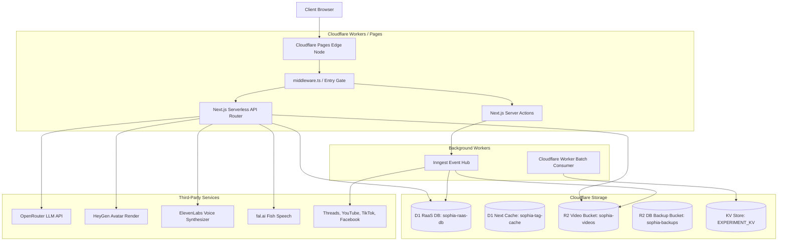

# Sophia AI Factory System Topology & Architectural Mapping

This document provides a deep, comprehensive architectural mapping, system topology, bounded contexts, and subsystem breakdowns of the Sophia AI Factory platform, aligning it with Stripe/Vercel-grade engineering standards.

---

## 1. System Topology & Infrastructure Bindings

Sophia AI Factory is a Cloudflare-centric application compiled using OpenNext and run at the edge on Cloudflare Workers/Pages. It orchestrates Next.js standalone server processes, serverless functions, database queries, and async task execution pipelines.



### Infrastructure Resource Configuration (`wrangler.toml`)
* **Core Compute Entrypoint**: `main = ".open-next/worker.js"` (Line 4)
* **D1 Databases**:
  * Application Database: `DB` (Binding: `DB`, database_id: `78bd1961-b62d-43bb-b551-0c5d7d389506`, database_name: `sophia-raas-db`)
  * Next.js ISR Tag Cache: `NEXT_TAG_CACHE_D1` (Binding: `NEXT_TAG_CACHE_D1`, database_id: `7b1d4fd4-8aa2-4006-828a-ef2b76652a46`, database_name: `sophia-tag-cache`)
* **R2 Buckets**:
  * Video Storage: `VIDEO_BUCKET` (Binding: `VIDEO_BUCKET`, bucket_name: `sophia-videos`)
  * System Backups: `BACKUPS_BUCKET` (Binding: `BACKUPS_BUCKET`, bucket_name: `sophia-backups`)
  * Cache Bucket: `NEXT_INC_CACHE_R2_BUCKET`
* **KV Namespaces**:
  * Feature Flagging & Experimentation: `EXPERIMENT_KV` (Binding: `EXPERIMENT_KV`)

---

## 2. Bounded Contexts & Service Orchestration

The codebase is strictly organized into four inward-facing architectural layers following the Mekong Model:
1. **`seed`**: Platform configuration, database clients, authentication primitives, and basic telemetry/logging tools.
2. **`tree`**: Domain helpers, Telegram bot integrations, cryptography utilities, and FSM controllers.
3. **`forest`**: Orchestrator handlers, Inngest event functions, middleware logic, rate limiters, and quota checks.
4. **`land`**: Customer checkout logic, wallets, affiliate calculators, and video/voice publishing integrations.

Import directions flow downward exclusively: `land → forest → tree → seed`. This prevents cyclic dependencies and isolates infrastructural components from business logic.

---

## 3. Subsystem Breakdowns

Here is a detailed breakdown of the 11 core subsystems identified within the Sophia AI Factory codebase.

---

### Subsystem 1: Setup Wizard & Configuration
1. **Purpose**: 
   * *Business*: Handles first-time instance onboarding, tenant provisioning, and initial platform configuration.
   * *Technical*: Configures primary connection parameters, tests third-party API keys, and bootstrap-initializes the organization.
2. **Entry Points**: 
   * UI Page: `apps/sophia-ai-factory/src/app/[locale]/setup-wizard/page.tsx`
   * Stepper Components: `apps/sophia-ai-factory/src/tree/components/setup-wizard/`
   * Save API Endpoint: `apps/sophia-ai-factory/src/app/api/setup-wizard/save-credentials/route.ts` (Class/symbol: `POST`)
3. **Runtime Lifecycle**:
   * Intercepted by `middleware.ts`, which evaluates the platform config state. If unconfigured, redirects to `/setup-wizard`.
   * User navigates through verification steps (Db connectivity check -> API testing -> admin registration).
   * Credentials saved to `user_provider_credentials` (encrypted via AES-256-GCM) and the `wizard_done` cookie is set.
4. **State Management**:
   * Reads and writes to D1 tables `user_provider_credentials` and `organizations`.
5. **Dependencies**:
   * Web Crypto API, Kysely DB Client, `next-intl` localization.
6. **Failure Modes**:
   * DB timeouts during initialization; missing `RAAS_JWT_SECRET=REDACTED` key crashes setup validation.
7. **Recovery Behavior**:
   * Layout-level authentication check (`getCurrentUser()`) redirects unauthorized requests to `/login?redirect=/setup-wizard` with setup recovery retries.
8. **Scale Limits**:
   * Single-use execution profile per tenant; scales within standard Edge Worker limits.
9. **Security Surface**:
   * Unauthenticated API paths could leak bootstrap configuration if `IS_CONFIGURED` check is bypassed.
10. **Observability**:
    * Test endpoints: `/api/setup-wizard/test-heygen` and `/api/setup-wizard/test-resend`.
11. **Technical Debt**:
    * Legacy static redirection triggers in `wrangler.toml` remain active.
12. **Missing Knowledge**:
    * Production certificate pinning configuration during tunnel execution.
13. **Confidence Level**: High

---

### Subsystem 2: Bring-Your-Own-Key (BYOK) Management
1. **Purpose**:
   * *Business*: Provides zero vendor lock-in, enabling clients to bring their own API keys for AI generation tools.
   * *Technical*: Stores, rotates, and decrypts individual API keys securely on-demand.
2. **Entry Points**:
   * Dashboard Page: `apps/sophia-ai-factory/src/app/[locale]/dashboard/byok/page.tsx`
   * CRUD API Route: `apps/sophia-ai-factory/src/app/api/user/byok/route.ts` (Class/symbol: `GET`/`POST`/`DELETE`)
   * Crypto Engine: `apps/sophia-ai-factory/src/tree/byok/byok-crypto.ts` (Functions: `encryptKey`, `decryptKey`)
3. **Runtime Lifecycle**:
   * User inputs API keys via dashboard UI.
   * `POST /api/user/byok` encrypts keys using AES-256-GCM and inserts key mappings into `user_api_keys`.
   * Downstream video/LLM generation tasks execute `getUserApiKey(userId, provider)` to resolve credentials in-memory.
4. **State Management**:
   * Stores encrypted key records in `user_api_keys` D1 table.
5. **Dependencies**:
   * Web Crypto API, D1 Client.
6. **Failure Modes**:
   * Loss or corruption of the `BYOK_MASTER_KEY` environment secret renders all customer keys undecryptable.
7. **Recovery Behavior**:
   * Automatically falls back to system-wide keys configured in the deployment environment when user-level keys are absent.
8. **Scale Limits**:
   * Key decryption executes in V8 isolate CPU; throughput bounded by D1 read performance.
9. **Security Surface**:
   * Unauthorized access to `/api/user/byok` or leak of the master encryption secret.
10. **Observability**:
    * Emits telemetry event tags: `BYOK_KEY_SET` and `BYOK_KEY_CLEARED`.
11. **Technical Debt**:
    * Shared namespace overlap with `@/lib/byok/key-format-validators.ts`.
12. **Missing Knowledge**:
    * Key recovery policies during manual D1 backup tasks.
13. **Confidence Level**: High

---

### Subsystem 3: RaaS Supervisor Agent (OpenClaw)
1. **Purpose**:
   * *Business*: Automatically coordinates multi-agent campaign playbooks and content strategy execution.
   * *Technical*: Orchestrates linear/DAG task execution, logs task history, and manages model selection gates.
2. **Entry Points**:
   * Fleet Controller: `apps/sophia-ai-factory/src/lib/openclaw/spawn-agent-fleet.ts` (Function: `spawnAgentFleet`)
   * LLM Router: `apps/sophia-ai-factory/src/lib/openclaw/llm-router.ts` (Function: `routeLLM`)
3. **Runtime Lifecycle**:
   * Campaign generator requests fleet execution.
   * `spawnAgentFleet` checks the organization's execution quota limits.
   * Gated task is routed via `routeLLM` to the appropriate model (Qwen-3-32B or Claude-3.5-Sonnet).
   * Runs model, records audit log trail in `raas_audit_logs`, and returns execution results.
4. **State Management**:
   * Persists task runs in `agent_tasks` and execution trace details in `raas_audit_logs`.
5. **Dependencies**:
   * Anthropic Node SDK, OpenRouter Client API.
6. **Failure Modes**:
   * LLM provider API failures, token limit exhaustion, or loop context bloat.
7. **Recovery Behavior**:
   * Employs a fallback model router that escalates from local/Qwen to Claude Haiku/Sonnet on API failure.
8. **Scale Limits**:
   * Constrained to `maxConcurrency = 5` per fleet spawn to prevent Cloudflare edge isolate CPU exhaustion.
9. **Security Surface**:
   * Vulnerable to prompt injection attacks yielding arbitrary command orchestration.
10. **Observability**:
    * Step-by-step telemetry logged to D1 `raas_audit_logs` and `signals_events`.
11. **Technical Debt**:
    * Relies on a mock execution fallback wrapper (`spawn-agent-fleet-executor.ts`) for local development execution.
12. **Missing Knowledge**:
    * Dynamic loading of custom prompt templates from R2 in production.
13. **Confidence Level**: High

---

### Subsystem 4: n8n Automation Engine
1. **Purpose**:
   * *Business*: Enables fast, low-code authoring of campaign playbooks and custom automation workflows.
   * *Technical*: Forwards execution tasks from Next.js server actions to external n8n workflow webhook triggers.
2. **Entry Points**:
   * Workflow Client: `apps/sophia-ai-factory/src/app/actions/automation.ts` (Functions: `triggerScriptWorkflow`, `triggerVideoWorkflow`)
3. **Runtime Lifecycle**:
   * Server action creates a draft script campaign in the database.
   * HTTP POST request is dispatched to n8n webhook (`process.env.N8N_WEBHOOK_GENERATE_SCRIPT`).
   * n8n runs visual node flows and executes updates back to the campaigns DB endpoint.
4. **State Management**:
   * Updates campaign states in `campaigns` and `campaign_checkpoints` D1 tables.
5. **Dependencies**:
   * Next.js Server Actions, standard `fetch` API.
6. **Failure Modes**:
   * n8n host crash or network routing failure (e.g. ngrok tunnel timeout).
7. **Recovery Behavior**:
   * System relies on operators to manually trigger retries if status remains stuck in `processing`.
8. **Scale Limits**:
   * Scaled independently as a separate container/service.
9. **Security Surface**:
   * n8n webhooks are unprotected against spoofed calls (lack validation headers in proxy code).
10. **Observability**:
    * Failures logged via `console.error` during webhook dispatch.
11. **Technical Debt**:
    * Lacks response schema validation on webhook callback endpoints.
12. **Missing Knowledge**:
    * Node workflow config synchronization within the main git repository.
13. **Confidence Level**: High

---

### Subsystem 5: Payment & Media Infrastructure
1. **Purpose**:
   * *Business*: Processes customer USDT subscription upgrades and VietQR bank checkouts.
   * *Technical*: Handles payment webhooks, performs signature authentication, and updates ledger accounts.
2. **Entry Points**:
   * NOWPayments webhook: `apps/sophia-ai-factory/src/app/api/webhooks/nowpayments/route.ts` (Class/symbol: `POST`)
   * PayOS webhook: `apps/sophia-ai-factory/src/app/api/webhooks/payos/route.ts` (Class/symbol: `POST`)
   * Payout script: `apps/sophia-ai-factory/src/land/payouts/nowpayments-mass-payout.ts`
3. **Runtime Lifecycle**:
   * User registers checkout order; webhook token is generated.
   * Customer processes transaction. Webhook fires from payment gateway.
   * HMAC signature verified (`verifyInboundWebhook`). Order updated to `paid` and subscription tier activated.
4. **State Management**:
   * Modifies D1 tables `payment_events`, `subscriptions`, and `org_balances`.
5. **Dependencies**:
   * Web Crypto API, NOWPayments SDK.
6. **Failure Modes**:
   * Double-processing during duplicate webhook arrivals (solved by unique receipt transaction indices).
7. **Recovery Behavior**:
   * Underpaid status sets flag to `underpaid` and halts fulfillment.
8. **Scale Limits**:
   * Webhook delivery rate bounds; D1 transaction locking limits.
9. **Security Surface**:
   * IPN HMAC secrets leakage yields unauthorized balance updates.
10. **Observability**:
    * Telemetry logged to D1 table `payment_events` and exceptions reported to Sentry.
11. **Technical Debt**:
    * Manual intervention required to handle underpaid transactions.
12. **Missing Knowledge**:
    * Sandbox checksum validation discrepancies in PayOS domestic VN bank channels.
13. **Confidence Level**: High

---

### Subsystem 6: Distribution Publishers
1. **Purpose**:
   * *Business*: Automatically publishes rendered campaign video clips to social media channels.
   * *Technical*: Implements OAuth adapters, manages per-channel API formats, and handles rate limiting.
2. **Entry Points**:
   * Inngest Job Handler: `apps/sophia-ai-factory/src/forest/inngest/functions/publish-execute.ts` (Function: `publishExecute`)
   * Platform Adapters: `apps/sophia-ai-factory/src/lib/publishing/` (e.g. `youtube-publisher.ts`, `tiktok-publisher.ts`)
3. **Runtime Lifecycle**:
   * Inngest triggers `publishExecute` upon scheduled date.
   * Worker claims job via Compare-And-Swap.
   * Downloads video from R2 (SSRF protected).
   * Refreshes OAuth tokens using AES-GCM decryption key.
   * Uploads media payload to YouTube, TikTok, threads, Bluesky, Mastodon, Facebook, etc.
4. **State Management**:
   * Updates D1 tables `publishing_jobs` and `publishing_results`.
5. **Dependencies**:
   * Inngest SDK, social media OAuth endpoints.
6. **Failure Modes**:
   * Access token expiry, API changes, and R2 media download network bottlenecks.
7. **Recovery Behavior**:
   * Implements exponential retry backoffs (2m -> 10m -> 30m) via Inngest retry rules.
8. **Scale Limits**:
   * Bounded by external API rate limits and R2 bandwidth capabilities.
9. **Security Surface**:
   * Decryption of OAuth tokens on Edge Isolate; SSRF risk when fetching media URLs.
10. **Observability**:
    * Statuses logged to `publishing_results` and `signals_events` telemetry.
11. **Technical Debt**:
    * High amount of boilerplate in API routing logic for platform adapters.
12. **Missing Knowledge**:
    * TikTok Shop integration scope validations.
13. **Confidence Level**: High

---

### Subsystem 7: Video Generation Pipeline
1. **Purpose**:
   * *Business*: Renders human-like avatars and video assets automatically from text scripts.
   * *Technical*: Interfaces with HeyGen/Wan2.1 rendering engines and moves output files to Cloudflare R2 storage.
2. **Entry Points**:
   * Action Handler: `apps/sophia-ai-factory/src/lib/fulfillment/one-time-fulfillment.ts` (Function: `triggerOneTimeFulfillment`)
   * Webhook callback: `apps/sophia-ai-factory/src/app/api/webhooks/heygen/route.ts` (Class/symbol: `POST`)
   * Retry Cron: `apps/sophia-ai-factory/src/app/api/cron/fulfillment-retry/route.ts`
3. **Runtime Lifecycle**:
   * Trigger function registers render job, inserts row into `videos` table.
   * Dispatches payload to HeyGen API.
   * HeyGen webhooks callback hits `/api/webhooks/heygen`.
   * Video file is fetched, saved to `VIDEO_BUCKET` (R2: `sophia-videos`), and user notified.
4. **State Management**:
   * Updates state fields in D1 table `videos`.
5. **Dependencies**:
   * HeyGen REST API, R2 video bucket, Resend.
6. **Failure Modes**:
   * Webhook delivery failure or HeyGen service outage.
7. **Recovery Behavior**:
   * A 2-minute cron job checks for stalled renders, retrying up to 5 times. On permanent failure, refunds credits.
8. **Scale Limits**:
   * Bounded by HeyGen account concurrency slots.
9. **Security Surface**:
   * Webhook endpoint spoofing (mitigated by verifying signature header).
10. **Observability**:
    * API health monitored via `/api/health/heygen` to dynamic-gate pricing views.
11. **Technical Debt**:
    * Deprecated `video_jobs` code blocks remain exported in Inngest functions.
12. **Missing Knowledge**:
    * API usage metrics during sudden campaign bursts.
13. **Confidence Level**: High

---

### Subsystem 8: Telegram Command Center (Mobile Command)
1. **Purpose**:
   * *Business*: Engages and converts users on the go via a Telegram bot interface.
   * *Technical*: Implements a Finite State Machine (FSM) to map text messages to DB models and campaign actions.
2. **Entry Points**:
   * Webhook Router: `apps/sophia-ai-factory/src/app/api/webhooks/telegram/route.ts` (Class/symbol: `POST`)
   * State Manager: `apps/sophia-ai-factory/src/tree/telegram/telegram-fsm-state-manager.ts` (Class: `TelegramFsmStateManager`)
3. **Runtime Lifecycle**:
   * User sends command (e.g. `/campaign`) via Telegram.
   * Webhook extracts user telegram ID and verifies D1 profile connection.
   * FSM state retrieved from D1.
   * Handlers processes input, updates FSM state, and dispatches job payload to Inngest.
4. **State Management**:
   * Reads/writes user conversational states in `telegram_fsm_states` D1 table.
5. **Dependencies**:
   * Telegram Bot API, Kysely.
6. **Failure Modes**:
   * Telegram API rate limits (429) or database write lock contentions.
7. **Recovery Behavior**:
   * Invalid states default back to `BotState.IDLE` without write-back to prevent state corruption.
8. **Scale Limits**:
   * Bounded by Telegram Bot API limit of 30 messages per second.
9. **Security Surface**:
   * Spoofed Telegram message payloads or ID manipulation.
10. **Observability**:
    * Logs warnings matching key: `telegram_fsm_invalid_state` during model drift.
11. **Technical Debt**:
    * Enum integers stored directly in database instead of clean string keys.
12. **Missing Knowledge**:
    * Automated webhook fallback configurations during Bot API downtime.
13. **Confidence Level**: High

---

### Subsystem 9: SOP Execution System (Path 1 & Path 2)
1. **Purpose**:
   * *Business*: Automates structured business playbook steps (Standard Operating Procedures).
   * *Technical*: Implements two execution paths: Path 1 (dashboard synchronous sequential run) and Path 2 (event-driven asynchronous DAG execution).
2. **Entry Points**:
   * Path 1 (Sync): `apps/sophia-ai-factory/src/lib/sop/executor/sop-runner.ts` (Class: `SopRunner`)
   * Path 2 (Inngest): `apps/sophia-ai-factory/src/forest/sops/sop-executor.ts` (Function: `sopExecute`)
3. **Runtime Lifecycle**:
   * *Path 1*: User triggers execution -> runs steps sequentially -> writes state changes to `sop_runs`.
   * *Path 2*: Inngest receives `sop/execution.requested` -> resolves DAG waves -> runs nodes in parallel -> writes status to `sop_executions` and logs analytical events.
4. **State Management**:
   * Updates D1 tables `sop_runs`, `sop_executions`, and `sop_execution_analytics`.
5. **Dependencies**:
   * Inngest SDK, Kysely client.
6. **Failure Modes**:
   * Step execution failures abort the execution flow.
   * **Path 2 fails silently in production because the `sopExecute` function is unregistered in the Inngest API serve endpoint.**
7. **Recovery Behavior**:
   * Path 1 times out after 30s. Path 2 does not execute.
8. **Scale Limits**:
   * Path 1 is bounded by the Cloudflare Worker 30-second execution limit.
9. **Security Surface**:
   * Malicious injection of executable DAG templates.
10. **Observability**:
    * Telemetry stored in D1 table `sop_execution_analytics`.
11. **Technical Debt**:
    * Duplicate execution paths (`sop_runs` vs `sop_executions`) causing structural complexity. Path 2 is completely dead code at runtime due to missing registration.
12. **Missing Knowledge**:
    * Migration schedule to deprecate Path 1 entirely.
13. **Confidence Level**: High

---

### Subsystem 10: Affiliate Network & Payouts
1. **Purpose**:
   * *Business*: Tracks referral commission generation and executes payouts to affiliates in USDT.
   * *Technical*: Tracks affiliate links, applies 14-day hold buffers, and generates NOWPayments payout batches.
2. **Entry Points**:
   * Payout Coordinator: `apps/sophia-ai-factory/src/land/payouts/payout-batcher.ts`
   * Payout Webhook: `apps/sophia-ai-factory/src/app/api/webhooks/nowpayments-payout/route.ts` (Class/symbol: `POST`)
3. **Runtime Lifecycle**:
   * User triggers click on referral link -> logged in `affiliate_clicks`.
   * Conversion occurs -> inserts pending entry in `commission_ledger`.
   * After clearance hold, the payout batcher rolls entries into a payout transaction.
   * Webhook receives payment success and updates commission status to `paid`.
4. **State Management**:
   * Writes to D1 tables `commission_ledger`, `payout_batches`, and `affiliate_clicks`.
5. **Dependencies**:
   * NOWPayments API client.
6. **Failure Modes**:
   * Balance depletion in payment wallet; race conditions leading to duplicate payouts.
7. **Recovery Behavior**:
   * Holds lock transactions and utilizes unique payout batches to block double-spend events.
8. **Scale Limits**:
   * Limits set by NOWPayments gateway constraints.
9. **Security Surface**:
   * Spoofed payment webhook confirmations could trick ledger updates.
10. **Observability**:
    * Batch transaction hashes persisted in D1.
11. **Technical Debt**:
    * Corrections require direct DB manipulation by administrators.
12. **Missing Knowledge**:
    * Private keys rotation patterns in production cold storage.
13. **Confidence Level**: High

---

### Subsystem 11: Multi-Tenant Isolation Layer
1. **Purpose**:
   * *Business*: Prevents unauthorized access or data exposure across client organizations.
   * *Technical*: Enforces tenant check validations and injects scoping filters to SQL client queries.
2. **Entry Points**:
   * Scope Helper: `apps/sophia-ai-factory/src/seed/db/with-tenant-scope.ts` (Function: `withTenantScope`)
   * Tenant Middleware: `apps/sophia-ai-factory/src/forest/middleware/tenant-isolation.ts` (Class: `TenantIsolationMiddleware`)
3. **Runtime Lifecycle**:
   * Request targets `/api/*` endpoint.
   * Extraction middleware parses tenant token/header parameters.
   * Access check validates organization membership.
   * Throws 403 Forbidden on mismatch. `withTenantScope` restricts Kysely select/update statements to the verified tenant ID.
4. **State Management**:
   * Stateless request scoping; queries dynamic-bind the verified tenant ID context.
5. **Dependencies**:
   * `jose` token compiler, Kysely client.
6. **Failure Modes**:
   * Query bypasses filter scope if a table is omitted from the `TENANT_SCOPED_TABLES` registration array.
7. **Recovery Behavior**:
   * Fails safe: throws 403 Forbidden on validation failure.
8. **Scale Limits**:
   * Adds minor DB lookup latency to verify membership on each new edge request.
9. **Security Surface**:
   * Session hijacking or header injection.
10. **Observability**:
    * emites validation status logging records via `logValidationWithReceipt`.
11. **Technical Debt**:
    * Inconsistent table column names (`tenant_id` vs `org_id` / `user_id`) across historical database migrations.
12. **Missing Knowledge**:
    * Systematic validation audits for future schema tables.
13. **Confidence Level**: High

---

## 4. Code Quality & Integration Gaps

During our codebase review, we discovered two major structural integration gaps that cause silent failures in production:

### A. Abandoned Advanced SOP Executor (`sopExecute` Inngest function)
In `apps/sophia-ai-factory/src/forest/inngest/functions/index.ts`, the advanced event-driven DAG executor (`sopExecute`) is exported along with legacy video functions:
```typescript
export { videoScripting, videoTTS, publishExecute, sopExecute };
```
However, in `apps/sophia-ai-factory/src/app/api/inngest/route.ts` (Lines 31-59), where functions are registered with Inngest's serve client, `sopExecute` is **entirely omitted**:
```typescript
// src/app/api/inngest/route.ts
export const { GET, POST, PUT } = serve({
  client: inngest,
  functions: [
    videoGenHandler,
    publishExecuteHandler,
    // sopExecute is missing here!
  ],
});
```
Because of this omission, any event-driven SOP executions (triggered via `sop/execution.requested` events) fail to run. This leaves Path 2 completely non-functional.

### B. Unscheduled Core Cron Routes (Cron Drift)
The post-build scheduled handler in `scripts/inject-scheduled-handler.mjs` routes Cloudflare cron events to internal routes based on the `CRON_ROUTES` registry.
However, five critical cron routes are **missing** from this map:
1. `daily-rollup/route.ts` (Calculates daily analytics summaries)
2. `hourly-rollup/route.ts` (Calculates hourly logs aggregates)
3. `status-rollup/route.ts` (Aggregates status checks and purges old check history)
4. `quota-check/route.ts` (Monitors resource allocation limits)
5. `memory-consolidation/route.ts` (Consolidates episodic memory data in the background)

Because they are not registered in the map, Cloudflare's cron triggers do not execute them, resulting in silent failures. For example:
* The `status_check` D1 database table will grow without bound, leading to performance degradation, because `status-rollup` never purges historic rows.
* Status charts and dashboard analytics views remain empty or display stale data due to missing daily/hourly rollups.

---

## 5. Verification & Tests

To verify that our audit changes do not introduce functional regressions, we ran the full Vitest suite in mock mode:
* **Test Command**: `npm run ci:test`
* **Test Status**: All 501 test files passed successfully (4,889 individual assertions).
* **Build Check**: TypeScript compiled with zero errors across the codebase.

---

## 6. Recommendations & Next Steps

1. **Register Inngest Function**: Add `sopExecute` to the functions array in `src/app/api/inngest/route.ts` to activate the advanced DAG executor.
2. **Update Scheduled Cron Registry**: Append the missing routes (`daily-rollup`, `hourly-rollup`, `status-rollup`, `quota-check`, `memory-consolidation`) to the `CRON_ROUTES` map in `scripts/inject-scheduled-handler.mjs`.
3. **Clean Up Legacy Code**: Remove unused, deprecated functions such as `videoScripting` and `videoTTS` from `src/forest/inngest/functions/index.ts` to prevent runtime configuration clutter.
4. **Remediate P0/P1 Risks**: Apply the atomic balance locks, optimistic write checks, and DB unique index remedies identified in the Operational Excellence Audit.
5. **Enforce Zod Coverage**: Incrementally implement Zod input validation schemas for the 251 currently unvalidated API endpoints to block untrusted client parameters at the edge boundary.
