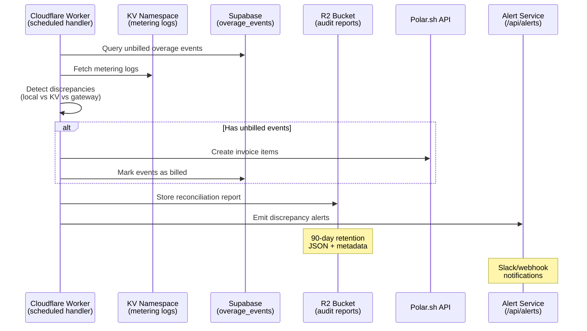

# Phase 6: Automated Billing Reconciliation & Alerting

## Overview

| Attribute | Value |
|-----------|-------|
| **Priority** | P1 (Critical billing infrastructure) |
| **Status** | pending |
| **Timeline** | 8 hours |
| **Owner** | fullstack-developer agent |
| **Dependencies** | Phase 1-5 complete, Cloudflare Workers deployed |

## Architecture



## Phase Breakdown

### Phase 1: R2 Storage Setup (1h)

**Goal:** Configure R2 bucket for reconciliation report storage

**Files to Create:**
- `src/worker/lib/r2-report-storage.ts` - R2 read/write utilities
- `src/lib/billing/reconciliation-types.ts` - Extended types for Phase 6

**Files to Update:**
- `wrangler.toml` - Add R2 bucket binding
- `worker-configuration.d.ts` - Add R2_BUCKET to Env interface

**Commands:**
```bash
wrangler r2 bucket create sophia-audit-reports --location=wnam
```

**Success Criteria:**
- R2 bucket created and bound to worker
- TypeScript types for R2 operations defined
- Zero `: any` types in all new files

---

### Phase 2: Scheduled Reconciliation Runner (2h)

**Goal:** Implement scheduled handler for daily billing reconciliation

**Files to Create:**
- `src/worker/lib/reconciliation-runner.ts` - Scheduled reconciliation handler

**Files to Update:**
- `src/worker/index.ts` - Update scheduled handler to call reconciliation
- `wrangler.toml` - Add daily midnight cron (`0 0 * * *`)

**Implementation:**
```typescript
// In worker/index.ts scheduled handler
async scheduled(event: ScheduledEvent, env: Env, ctx: ExecutionContext): Promise<void> {
  // Existing alert checks
  await handleScheduledAlertCheck(config, env.KV_KV, ctx);

  // Daily reconciliation at midnight
  const cron = event.cron;
  if (cron === '0 0 * * *') {
    const report = await runBillingReconciliation(env, ctx);
    await storeReconciliationReport(report, env.R2_BUCKET);
  }
}
```

**Success Criteria:**
- Scheduled handler triggers at midnight UTC
- Reconciliation integrates with existing `overage-billing-reconciler.ts`
- Reports stored in R2 with proper metadata

---

### Phase 3: KV Discrepancy Detection (1.5h)

**Goal:** Cross-reference KV metering logs with database events

**Files to Create:**
- `src/worker/lib/kv-discrepancy-detector.ts` - Discrepancy detection logic

**Integration:**
- Read KV metering logs (`metering:{timestamp}:{eventId}`)
- Compare with `overage_events` table
- Flag discrepancies for manual review

**Discrepancy Types:**
| Type | Severity | Description |
|------|----------|-------------|
| `missing_in_kv` | warning | Event exists in DB but not KV |
| `missing_in_db` | high | Event exists in KV but not DB |
| `credit_mismatch` | critical | Credits used differ between sources |
| `gateway_discrepancy` | critical | Gateway logs don't match local records |

**Success Criteria:**
- Discrepancies detected and logged
- Severity levels assigned correctly
- Report includes discrepancy details

---

### Phase 4: Alert Emission System (1.5h)

**Goal:** Emit alerts for reconciliation discrepancies

**Files to Create:**
- `src/worker/lib/reconciliation-alert-emitter.ts` - Alert emission logic

**Files to Update:**
- `src/app/api/alerts/rules/route.ts` - Add reconciliation alert rules schema

**Alert Endpoints:**
- `POST /api/alerts` - Create new alert
- `GET /api/alerts/history` - Query alert history

**Alert Payload:**
```typescript
interface ReconciliationAlert {
  type: 'discrepancy_detected' | 'billing_failed' | 'report_generated';
  severity: 'critical' | 'high' | 'medium' | 'info';
  licenseNonce: string;
  details: {
    discrepancyType: string;
    eventId?: string;
    expectedCredits: number;
    actualCredits: number;
  };
  timestamp: number;
}
```

**Success Criteria:**
- Alerts emitted to `/api/alerts` endpoint
- Slack/webhook notifications configured
- Rate limiting for alert notifications

---

### Phase 5: Report Retrieval API (1h)

**Goal:** Admin API to list and download reconciliation reports

**Files to Update:**
- `src/app/api/admin/audit/reports/route.ts` - List reports from R2
- `src/app/api/admin/audit/reports/[id]/route.ts` - Get report metadata
- `src/app/api/admin/audit/reports/download/[id]/route.ts` - Download report content

**API Endpoints:**
```
GET /api/admin/audit/reports?type=reconciliation&limit=100
  → List reconciliation reports from R2

GET /api/admin/audit/reports/[id]
  → Get report metadata

GET /api/admin/audit/reports/download/[id]
  → Download report JSON content
```

**Success Criteria:**
- Reports listed with pagination
- Report metadata retrievable
- Download returns JSON content with proper headers

---

### Phase 6: Analytics Dashboard Integration (1h)

**Goal:** UI components for reconciliation status visualization

**Files to Create:**
- `src/components/analytics/reconciliation-status.tsx` - Status overview
- `src/components/analytics/discrepancy-chart.tsx` - Discrepancy visualization
- `src/components/analytics/revenue-tracker.tsx` - Overage revenue tracking

**Dashboard Features:**
- Reconciliation status (last run, next run, success/failure)
- Discrepancy chart by type and severity
- Revenue tracking from overage billing
- Report download links

**Success Criteria:**
- Dashboard displays reconciliation status
- Charts render discrepancy data
- Revenue metrics displayed

---

### Phase 7: Testing & Verification (1h)

**Goal:** Comprehensive test coverage and type safety

**Test Files:**
- `src/worker/lib/r2-report-storage.test.ts`
- `src/worker/lib/reconciliation-runner.test.ts`
- `src/worker/lib/kv-discrepancy-detector.test.ts`
- `src/worker/lib/reconciliation-alert-emitter.test.ts`

**Test Types:**
| Test | Type | Description |
|------|------|-------------|
| R2 storage | Unit | Write/read/delete reports |
| Reconciliation | Integration | Full reconciliation flow |
| Discrepancy | Unit | Detection logic |
| Alert emission | Integration | Alert creation + delivery |
| API endpoints | E2E | Report retrieval APIs |

**Type Safety:**
- Zero `: any` types in all new files
- Proper interfaces for all data structures
- Type-safe API responses with Zod validation

**Success Criteria:**
- 100% test pass
- Zero TypeScript errors
- Zero `: any` types

---

## File Inventory

### New Files (12)

| File | Purpose | Phase |
|------|---------|-------|
| `src/worker/lib/r2-report-storage.ts` | R2 read/write utilities | 1 |
| `src/worker/lib/reconciliation-runner.ts` | Scheduled reconciliation handler | 2 |
| `src/worker/lib/kv-discrepancy-detector.ts` | Discrepancy detection logic | 3 |
| `src/worker/lib/reconciliation-alert-emitter.ts` | Alert emission | 4 |
| `src/lib/billing/reconciliation-types.ts` | Extended types | 1 |
| `src/components/analytics/reconciliation-status.tsx` | Status component | 6 |
| `src/components/analytics/discrepancy-chart.tsx` | Discrepancy chart | 6 |
| `src/components/analytics/revenue-tracker.tsx` | Revenue tracking | 6 |
| `src/worker/lib/r2-report-storage.test.ts` | R2 tests | 7 |
| `src/worker/lib/reconciliation-runner.test.ts` | Runner tests | 7 |
| `src/worker/lib/kv-discrepancy-detector.test.ts` | Detector tests | 7 |
| `src/worker/lib/reconciliation-alert-emitter.test.ts` | Emitter tests | 7 |

### Updated Files (6)

| File | Changes | Phase |
|------|---------|-------|
| `wrangler.toml` | R2 binding + cron schedule | 1, 2 |
| `worker-configuration.d.ts` | Add R2_BUCKET to Env | 1 |
| `src/worker/index.ts` | Update scheduled handler | 2 |
| `src/app/api/admin/audit/reports/route.ts` | List R2 reports | 5 |
| `src/app/api/admin/audit/reports/[id]/route.ts` | Get report metadata | 5 |
| `src/app/api/admin/audit/reports/download/[id]/route.ts` | Download reports | 5 |

---

## Testing Strategy

### Unit Tests

```typescript
// R2 storage tests
describe('r2-report-storage', () => {
  it('stores reconciliation report in R2', async () => { ... });
  it('retrieves report by key', async () => { ... });
  it('lists reports with prefix', async () => { ... });
  it('deletes old reports (retention policy)', async () => { ... });
});

// Discrepancy detector tests
describe('kv-discrepancy-detector', () => {
  it('detects missing_in_kv discrepancy', async () => { ... });
  it('detects credit_mismatch discrepancy', async () => { ... });
  it('classifies severity correctly', async () => { ... });
});
```

### Integration Tests

```typescript
// Reconciliation runner tests
describe('reconciliation-runner', () => {
  it('runs full reconciliation flow', async () => { ... });
  it('stores report in R2 after reconciliation', async () => { ... });
  it('emits alerts for discrepancies', async () => { ... });
});
```

### Type Safety Verification

```bash
# Zero any types
grep -r ": any" src/worker/lib/reconciliation*.ts | wc -l  # = 0
grep -r ": any" src/lib/billing/reconciliation-types.ts | wc -l  # = 0

# TypeScript compilation
npx tsc --noEmit  # 0 errors
```

---

## Success Criteria

### Functional Requirements

- [ ] Scheduled reconciliation runs daily at midnight UTC (`0 0 * * *`)
- [ ] Reports stored in R2 with proper JSON format and metadata
- [ ] KV metering logs integrated for discrepancy detection
- [ ] Discrepancies detected and classified by severity
- [ ] Alerts emitted to `/api/alerts` endpoint
- [ ] Slack/webhook notifications configured
- [ ] Admin API lists reports from R2
- [ ] Admin API downloads individual reports
- [ ] Dashboard displays reconciliation status
- [ ] Dashboard visualizes discrepancies
- [ ] Dashboard tracks overage revenue

### Code Quality Requirements

- [ ] ZERO `: any` types in all new files
- [ ] Proper interfaces for all data structures
- [ ] Type-safe API responses with Zod validation
- [ ] 100% test pass rate
- [ ] All files under 200 lines (split into modules)
- [ ] kebab-case file naming
- [ ] JSDoc comments for public functions
- [ ] No `console.log` in production code

### Infrastructure Requirements

- [ ] R2 bucket created: `sophia-audit-reports`
- [ ] R2 binding in `wrangler.toml`
- [ ] Cron trigger configured for daily midnight
- [ ] 90-day retention policy for reports
- [ ] Alert rate limiting configured

---

## Risk Assessment

| Risk | Impact | Likelihood | Mitigation |
|------|--------|------------|------------|
| R2 bucket creation fails | High | Low | Use wrangler CLI, verify permissions |
| KV metering logs format mismatch | Medium | Medium | Add schema validation, graceful fallback |
| Reconciliation timeout (Worker limit) | High | Low | Use `ctx.waitUntil()` for async operations |
| Alert spam (rate limiting bypass) | Medium | Low | Strict rate limiting per user/threshold |
| Type safety violations | Low | Medium | Pre-commit hook to check for `: any` |

---

## Next Steps

1. **Run `node .claude/scripts/set-active-plan.cjs plans/260309-1845-phase6-billing-reconciliation-alerting`** to set active plan context
2. **Spawn fullstack-developer agent** with `/cook` command to implement Phase 1-7
3. **Spawn tester agent** to run test suite
4. **Spawn code-reviewer agent** for final review
5. **Update docs** in `docs/` directory if architecture changes

---

## References

- Research Report: `plans/reports/researcher-260309-1830-phase6-reconciliation-research.md`
- Existing Reconciler: `src/lib/billing/overage-billing-reconciler.ts`
- Worker Entry: `src/worker/index.ts`
- Alert Service: `src/lib/alerts/quota-alert-service.ts`
- Cloudflare R2 Docs: https://developers.cloudflare.com/r2/
- Cloudflare Cron Triggers: https://developers.cloudflare.com/workers/platform/triggers/cron-triggers/
