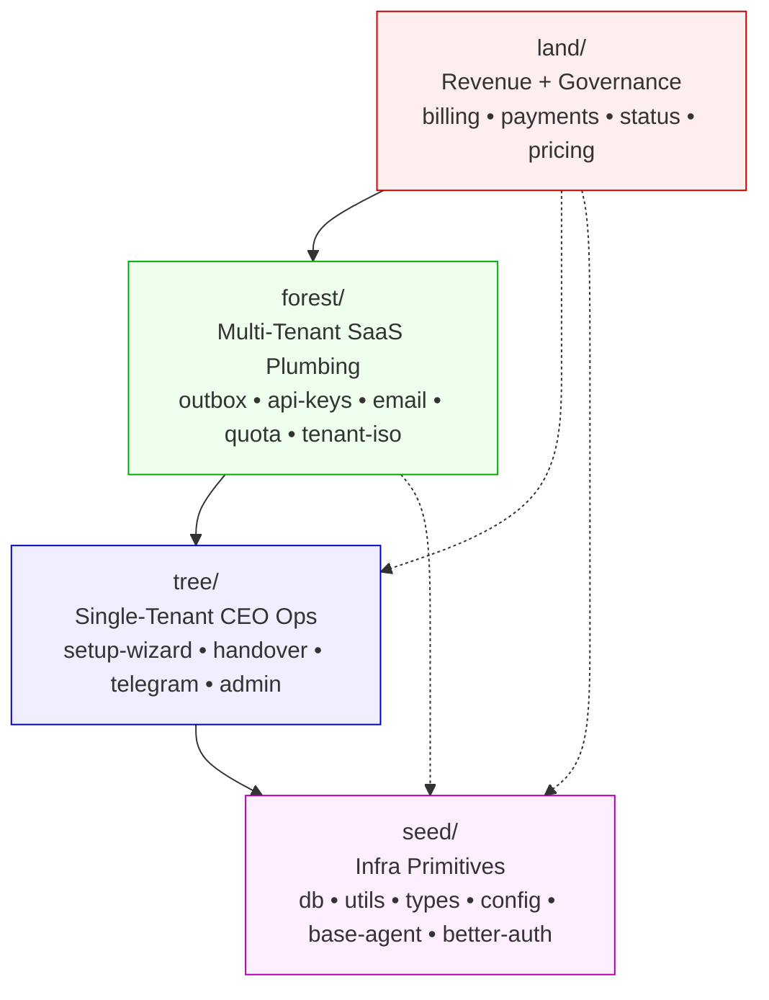

# Phase 08 — Documentation Update

## Context Links
- Plan: [plan.md](plan.md)
- Depends on: [phase-07-layer-boundary-enforcement.md](phase-07-layer-boundary-enforcement.md)
- Files: `apps/sophia-ai-factory/docs/system-architecture.md`, `docs/codebase-summary.md`

## Overview
- **Priority:** P2
- **Status:** COMPLETE (2026-05-03)
- **Effort:** 30m
- **Description:** Update bilingual VN+EN docs reflecting new directory layout, import direction, ESLint rule. Reference mekong heritage.

## Key Insights
- Sophia rule: bilingual (VN + EN) for user-facing/architectural docs.
- Diagram: simple Mermaid layered box-stack works (no need for full C4).
- Update only the 2 files most affected: system-architecture.md (canonical) + codebase-summary.md (module map). Other docs stay or get cross-link refs.

## Requirements

### Functional
- `docs/system-architecture.md` updated with:
  - New layered diagram (Mermaid)
  - Import direction rule (one-way down)
  - File location map per layer
  - Mekong reference link
- `docs/codebase-summary.md` module map reflects new `src/{seed,tree,forest,land}/` layout
- README.md mentions restructure if applicable (1-line + link)

### Non-Functional
- Bilingual VN+EN sections clearly delineated
- Mermaid diagram renders correctly (verify with `/mermaidjs-v11` skill or preview)

## Architecture (Diagram for docs)

## Related Code Files

### To modify
- `apps/sophia-ai-factory/docs/system-architecture.md`
- `apps/sophia-ai-factory/docs/codebase-summary.md`
- `apps/sophia-ai-factory/README.md` (1-line + link)

### To create (optional)
- `apps/sophia-ai-factory/docs/mekong-layer-architecture.md` — deep-dive doc dedicated to layers (if architecture.md gets too long)

## Implementation Steps

1. Edit `system-architecture.md`:
   - Add section "## Mekong 4-Layer Architecture / Kiến Trúc 4 Tầng Mekong"
   - Insert Mermaid diagram
   - Document each layer (purpose, examples, what NOT to put there) in EN
   - Mirror VN translation
   - Add "Import Direction Rule / Quy Tắc Hướng Import" section
   - Reference `eslint.config.mjs` enforcement
2. Edit `codebase-summary.md`:
   - Replace old `src/lib/*` flat module map with `src/{seed,tree,forest,land}/...` tree
   - Update file counts per layer (from scout report)
3. Edit `README.md`:
   - Add 1 line under "Architecture" section: "Codebase follows mekong 4-layer model — see docs/system-architecture.md"
4. Render check: open Mermaid preview; verify diagram displays
5. Commit: `docs(architecture): document mekong 4-layer model + import direction enforcement`

## Todo List

- [x] Update system-architecture.md with diagram + bilingual sections
- [x] Update codebase-summary.md module map
- [x] Update README 1-line
- [x] Render check Mermaid (syntax valid per Mermaid v11 graph TB with classDef)
- [x] Commit

## Success Criteria
- Both VN and EN sections present in system-architecture.md
- Mermaid renders without syntax errors
- Module map matches actual `src/` structure
- New developer can read doc and understand layer rules in <5 min

## Risk Assessment
- **L** Mermaid v11 syntax mismatch. Mitigation: use `/mermaidjs-v11` skill if available.
- **L** Stale screenshots in old docs. Mitigation: scrub for outdated dir references via grep.

## Security Considerations
- None.

## Next Steps
- **Unblocks:** Phase 09 (production deploy)
