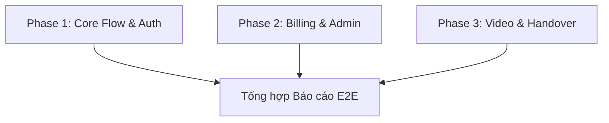

# Kế hoạch Thực thi Kiểm thử E2E Song Song — Sophia AI Factory

**Thư mục kế hoạch:** `plans/260530-0117-e2e-parallel`
**Trạng thái:** Đang chạy
**Mô tả:** Phân chia 29 bộ test Playwright E2E thành 3 phase chạy song song để kiểm tra toàn bộ hệ thống.

---

## Danh sách các Phase

1. **[Phase 1: Core Flow & Auth Tests](file:///Users/macbook/projects/sophia-ai-factory/plans/260530-0117-e2e-parallel/phase-01-core-tests.md)**
   - Các file: `auth-flow.spec.ts`, `dashboard.spec.ts`, `responsive-viewports.spec.ts`, `smoke.spec.ts`, `guide-pages.spec.ts`, `dashboard-overview.spec.ts`, `dashboard-settings.spec.ts`, `dashboard-api-keys.spec.ts`.
   - Trạng thái: Pending
2. **[Phase 2: Billing, Payment & Admin Tests](file:///Users/macbook/projects/sophia-ai-factory/plans/260530-0117-e2e-parallel/phase-02-billing-admin-tests.md)**
   - Các file: `checkout-flow.spec.ts`, `refund-flow.spec.ts`, `dunning-failed-payment.spec.ts`, `quota-upsell.spec.ts`, `dashboard-admin.spec.ts`, `admin-promo-bulk.spec.ts`, `admin-alerts-triage.spec.ts`.
   - Trạng thái: Pending
3. **[Phase 3: Video Pipeline & Handover Journey](file:///Users/macbook/projects/sophia-ai-factory/plans/260530-0117-e2e-parallel/phase-03-video-handover-tests.md)**
   - Các file: `free100-video-generation.spec.ts`, `free100-distribute-telegram.spec.ts`, `handover-journey-260519.spec.ts`, `ux-usability-260519.spec.ts`, `handover-bughunt-260519.spec.ts`, `account-self-delete.spec.ts`, `affiliate-flow.spec.ts`.
   - Trạng thái: Pending

---

## Biểu đồ Phụ thuộc (Dependency Graph)

