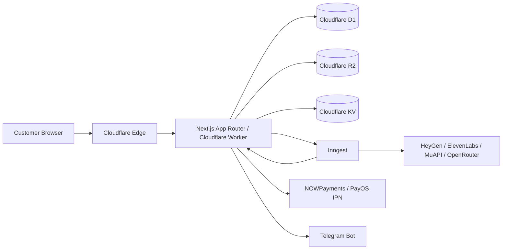

# ARCHITECTURE.md

## System Summary

Sophia AI Factory is a Next.js 16 App Router application compiled for Cloudflare Workers through OpenNext. The production app lives in `apps/sophia-ai-factory/`. It uses Cloudflare D1 as the primary data store, Cloudflare R2/KV for storage and fast cache, Better Auth for sessions, NOWPayments/PayOS for payment activation, and Inngest for long-running video and workflow orchestration.

## Runtime Topology

## Layer Model

| Layer | Role | Examples | Rule |
|---|---|---|---|
| `seed` | Foundational primitives | auth session, DB client, tier config, UI primitives, security utils | Importable by all layers |
| `tree` | Domain-specific reusable logic | BYOK, handover, audit, Telegram, credentials | Imports `seed` only |
| `forest` | Infrastructure orchestrators | Inngest jobs, RaaS gateway, usage metering, quota, worker handlers | Imports `seed`, `tree`; may call `land` for orchestration |
| `land` | Business workflows | billing, payouts, affiliates, promo, refunds, payments | Business workflow ownership; must not import `forest` back |

Canonical source: `apps/sophia-ai-factory/.claude/rules/sophia-layer-architecture.md:1-70`.

## Core Domains

### Auth

- Better Auth v1.x with D1 backend.
- `getCurrentUser()` from `@/seed/auth/better-auth-session`.
- Better Auth server setup from `@/seed/auth/better-auth-server`.
- Magic link, email/password, org plugin, MFA, admin role gates.

### Database

- Primary DB: Cloudflare D1 `sophia-raas-db`.
- `createServerClient()` from `@/seed/db/client` is synchronous and must not be awaited.
- Supabase remains only for explicit exceptions such as OAuth callbacks and legacy/shared flows.

### Payments

- NOWPayments is primary for USDT subscriptions and one-time SKUs.
- PayOS is backup for Vietnam domestic payments.
- Polar.sh and PayPal are banned for Sophia customer billing.
- IPN handlers must be idempotent, signature-verified, and DLQ-safe.

### Video and Workflow Orchestration

- Long-running video generation does not run directly in edge HTTP request path.
- Inngest functions own multi-step workflows: script → TTS → video generation → polling → download → mux → upload → mission update → usage emission.
- Existing legacy `video_jobs` Inngest chain is archived/deprecated per `docs/architecture-decisions/0007-deprecate-video-jobs-inngest-chain.md`.

### Usage Metering and Quota

- Usage events are tracked in D1 and mirrored/synced for fast quota checks.
- Quota enforcement is in `forest/quota`.
- Tier limits are sourced from `seed/config/tiers`.

### RaaS / Agent Factory

- RaaS license keys, tenant context, permissions, audit logs, and rate limiting live under `forest/raas` and related tree/land modules.
- Sophia agents are persisted in D1 tables: `agent_teams`, `agents`, `agent_tasks`, `agent_logs`.
- Agent execution is tier-gated and prompt-variant aware.

### Frontend

- Marketing and dashboard use App Router with locale segment `[locale]`.
- UI primitives live in `seed/components/ui`.
- Feature sections live in `app/components` and route-local components.
- i18n uses `next-intl` with `vi` and `en`.

## Security Boundary

- Sensitive API routes require auth and MFA where configured.
- Cron routes require `CRON_SECRET`; Cloudflare cron header alone is not trusted.
- Webhooks require provider-specific signature verification.
- BYOK secrets are customer-owned and encrypted.
- CSRF uses double-submit cookie for browser mutations except auth/webhook/cron bypasses.

## Deployment Contract

- Production deploy: `cd apps/sophia-ai-factory && npm run deploy:full`.
- GitHub Actions are not the production deploy path.
- `/api/version` live SHA must match `git rev-parse HEAD | cut -c1-8`.
- Migrations changed since the previous commit are applied by `deploy:full` or `scripts/apply-migrations.sh`.

## Known Tensions

1. `src/lib/*` still exists for compatibility/shared logic. New primitives should use `seed`, `tree`, `forest`, or `land`.
2. Docs contain historical claims about CI, Vercel, local mode, enterprise SLA, and operator-managed integrations. Current truth is CF-direct + no-tech doctrine.
3. Generated artifacts and agent run directories are noisy and should be archived/deleted separately from source.
4. `.opc/goal.md` conflicts with the current product positioning and must be refactored or archived.
