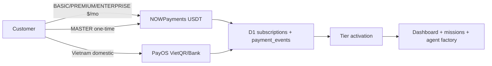
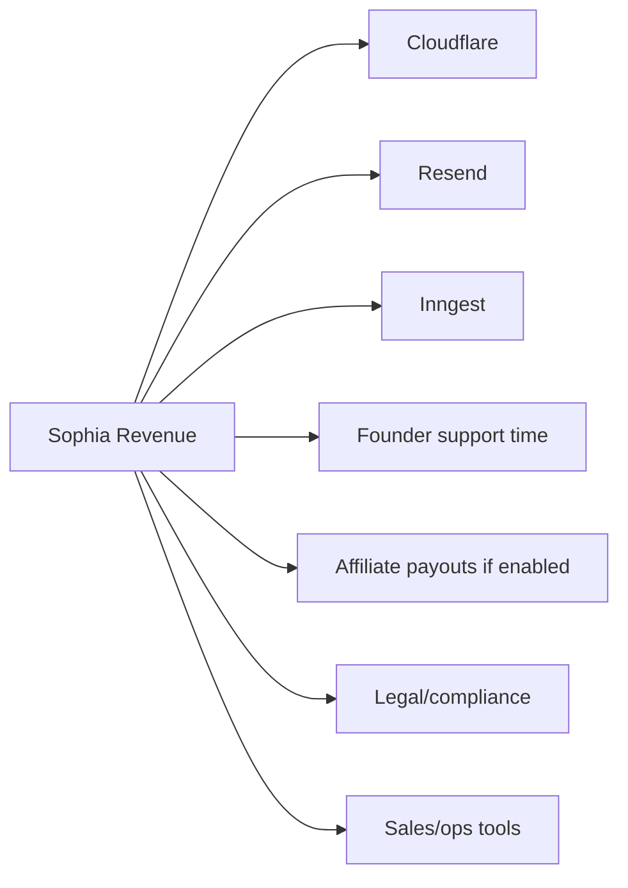
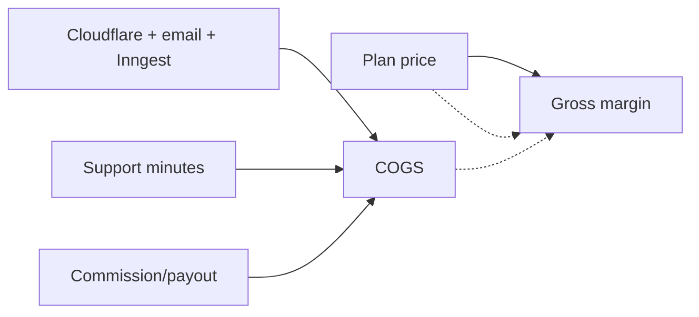

# MONEY_GRAPH.md

## Cash In

## Cash Out

## Unit Economics

## Tier Economics

| Tier | Price | Expected Buyer | Margin Driver | Main Risk |
|---|---:|---|---|---|
| BASIC | $199/mo | Small business | BYOK + low infra | Support time too high |
| PREMIUM | $399/mo | Growing team | More usage, still BYOK | Provider downtime |
| ENTERPRISE | $799/mo | Agency/automation team | Higher ARPU | Custom expectations |
| MASTER | $4,999 one-time | Source-code/white-label buyer | Large cash event | Handover/support burden |

## Money Metrics to Track

- MRR by tier.
- One-time revenue.
- Gross margin per tier.
- Support minutes per customer.
- Payment activation success rate.
- Refund/chargeback rate.
- Affiliate payout liability.
- Founder hours spent on support vs product.
- Customer API spend under BYOK.
- Revenue per generated video/campaign.

## Breakpoints

- **0 → 1 customer:** validate full paid flow.
- **1 → 10 customers:** prove onboarding can be self-serve.
- **10 → 50 customers:** prove support load does not scale linearly.
- **50+ customers:** prove affiliate payout and compliance model.

## Current Evidence

- First paying customer mission is P0 in `.mekong/tasks/01-first-paying-customer.md:1-47`.
- BASIC tier unit economics are modeled in `.mekong/tasks/05-unit-economics.md:1-43`.
- Payment source of truth is `docs/admin-ops/payment-pricing-source-of-truth.md:1-50`.
