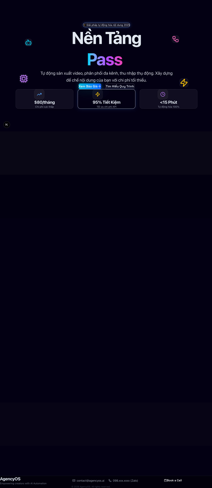

# AI Video Factory Proposal

A high-conversion proposal website for the "AI Video Factory" solution, built for client Sophia. This site demonstrates the value proposition, workflow, and pricing of an automated AI video production system.



## 🚀 Live Demo

**Production URL:** [https://sophia-proposal.vercel.app](https://sophia-proposal.vercel.app)

## ✨ Features

- **Dark Cyberpunk Theme:** Modern, high-tech aesthetic with glassmorphism and gradients.
- **Interactive ROI Calculator:** Real-time revenue estimation based on configurable inputs (views, CTR, conversion).
- **Pricing Tiers:** Detailed breakdown of Minimal, Standard, and Scale packages.
- **Visual Workflow:** Step-by-step diagram of the OpenClaw + n8n automation process.
- **Responsive Design:** Optimized for mobile and desktop viewing.
- **Framer Motion:** Smooth entrance animations and interactions.

## 🛠️ Tech Stack

- **Framework:** [Next.js 14](https://nextjs.org/) (App Router)
- **Styling:** [Tailwind CSS v4](https://tailwindcss.com/)
- **Animations:** [Framer Motion](https://www.framer.com/motion/)
- **Icons:** [Lucide React](https://lucide.dev/)
- **Deployment:** [Vercel](https://vercel.com/)

## 🏃‍♂️ Getting Started

1. **Clone the repository:**
   ```bash
   git clone <repo-url>
   cd apps/sophia-proposal
   ```

2. **Install dependencies:**
   ```bash
   npm install
   ```

3. **Run development server:**
   ```bash
   npm run dev
   ```
   Open [http://localhost:3000](http://localhost:3000) to view locally.

4. **Build for production:**
   ```bash
   npm run build
   ```

## 📂 Project Structure

```
apps/sophia-proposal/
├── app/
│   ├── components/
│   │   ├── sections/    # Page sections (Hero, Pricing, etc.)
│   │   └── ui/          # Reusable UI atoms (Button, Card, etc.)
│   ├── lib/             # Utilities
│   ├── layout.tsx       # Root layout & Metadata
│   └── page.tsx         # Main landing page composition
├── public/              # Static assets
└── ...config files
```

## 🎨 Design System

- **Fonts:** Inter (Body), Orbitron (Headings)
- **Colors:**
  - Background: `#050505`
  - Primary: `#3b82f6` (Blue)
  - Secondary: `#8b5cf6` (Purple)
  - Accent: `#f472b6` (Pink)

## 🚀 Deployment

The project is configured for seamless deployment on Vercel.

```bash
vercel --prod
```

---

© 2026 AgencyOS. All rights reserved.
