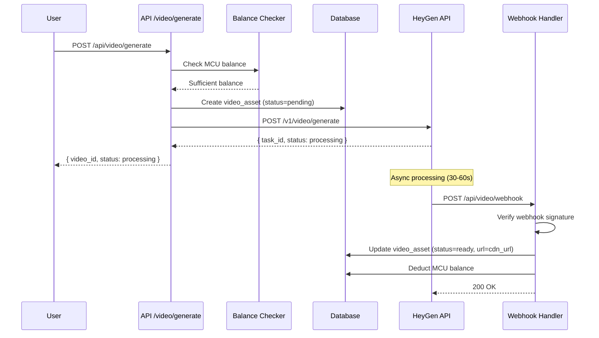
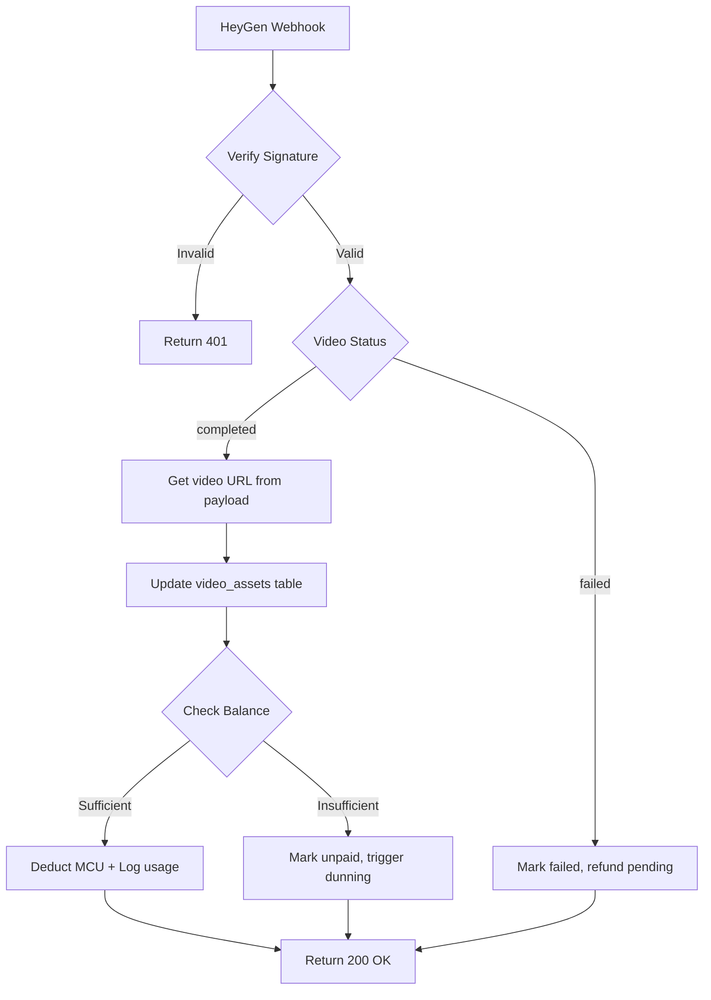

# Phase 1: Video AI Pipeline Architecture

## Context Links

- **Work Context**: `/Users/macbook/mekong-cli/apps/sophia-proposal`
- **Related Plans**: Phase 2 video integration tasks #16-#21
- **Existing Billing**: `lib/billing/mcu-pricing.ts`, `lib/supabase/migrations/004_billing_tables.sql`
- **API Pattern**: `app/api/proposals/generate/route.ts`

## Overview

- **Priority**: P2 (Medium)
- **Status**: Pending
- **Description**: Design complete video generation architecture using HeyGen API with async webhook handling and MCU cost tracking

## Key Insights

### HeyGen API Capabilities (Research Findings)

| Feature | Capability | Use Case |
|---------|-----------|----------|
| **Avatar Types** | Custom, Stock, Photo | Personalized proposals |
| **Video Length** | 15s - 10min | Intro (1min) + Sections (30s) |
| **Webhooks** | Video generation complete | Async MCU deduction |
| **Pricing** | ~$0.10-0.30/min | MCU: 100-500 per video |

### MCU Pricing Strategy

Based on existing `mcu-pricing.ts` structure:

| Video Type | Duration | MCU Cost (Starter) | MCU Cost (Master) |
|-----------|----------|-------------------|------------------|
| Short Intro | 30s | 100 MCU | 70 MCU |
| Standard Section | 60s | 250 MCU | 175 MCU |
| Full Proposal | 2-3min | 500 MCU | 350 MCU |
| Custom Avatar | +50% surcharge | +50% MCU | +50% MCU |

## Requirements

### Functional Requirements

1. Generate AI videos from proposal content via HeyGen API
2. Track video status (pending → generating → ready → failed)
3. Handle webhooks for async video completion
4. Deduct MCU only after successful generation
5. Store video URLs with expiration handling
6. Support custom avatar templates

### Non-Functional Requirements

1. **Async Processing**: Never block proposal generation
2. **Error Handling**: Graceful fallback if HeyGen unavailable
3. **Security**: API keys in environment variables only
4. **Cost Control**: Balance check BEFORE video generation
5. **RLS Protection**: Video assets org-scoped

## Architecture

### System Design

```
┌─────────────────────────────────────────────────────────────────┐
│  USER WORKFLOW                                                  │
│  1. Generate proposal → 2. Select video option → 3. Download   │
└─────────────────────────────────────────────────────────────────┘
                              │
                              ▼
┌─────────────────────────────────────────────────────────────────┐
│  API LAYER (Next.js)                                            │
│  POST /api/video/generate → Check balance → Queue HeyGen       │
│  GET  /api/video/[id] → Status + URL                           │
│  POST /api/video/webhook ← HeyGen completion event             │
└─────────────────────────────────────────────────────────────────┘
                              │
                              ▼
┌─────────────────────────────────────────────────────────────────┐
│  DATABASE LAYER (Supabase)                                      │
│  video_assets | video_templates | usage_logs | org_balances    │
└─────────────────────────────────────────────────────────────────┘
                              │
                              ▼
┌─────────────────────────────────────────────────────────────────┐
│  EXTERNAL SERVICE (HeyGen)                                      │
│  Create Video → Process Async → Webhook → CDN URL              │
└─────────────────────────────────────────────────────────────────┘
```

### Data Flow (Video Generation)



### Webhook → MCU Deduction Flow



## Related Code Files

### Files to Create

```
app/api/video/
├── generate/route.ts           # POST - Trigger video generation
├── [id]/route.ts               # GET  - Get video status/URL
├── proposal/[proposalId]/route.ts  # GET - List videos for proposal
└── webhook/route.ts            # POST - HeyGen webhook handler

lib/video/
├── heygen-client.ts            # HeyGen API client wrapper
├── video-templates.ts          # Template definitions
└── quality-check.ts            # Video quality validation

components/video/
├── video-player.tsx            # Video player component
├── video-generator.tsx         # Generator UI with options
└── video-list.tsx              # List of videos for proposal

types/
└── video.ts                    # TypeScript interfaces

lib/supabase/migrations/
└── 005_video_tables.sql        # New database schema
```

### Files to Modify

```
lib/billing/mcu-pricing.ts      # Add video MCU costs
app/api/proposals/[id]/route.ts # Include video URLs in response
```

## Implementation Steps

### Step 1: Database Schema (Migration 005)

```sql
-- ============================================================================
-- MIGRATION 005: Video Assets & Templates
-- ============================================================================
-- Creates: video_assets, video_templates
-- Enables: RLS, indexes, video-specific functions
-- ============================================================================

-- ============================================================================
-- 1. VIDEO_TEMPLATES TABLE
-- ============================================================================
create table public.video_templates (
  id uuid primary key default gen_random_uuid(),
  org_id uuid references public.organizations(id) on delete cascade,
  name text not null,
  heygen_template_id text not null,
  avatar_id text,
  voice_id text,
  duration_seconds integer,
  mcu_cost integer not null,
  is_public boolean default false,
  created_at timestamptz default now(),
  updated_at timestamptz default now()
);

create index idx_video_templates_org on public.video_templates(org_id);
create index idx_video_templates_public on public.video_templates(is_public);

-- ============================================================================
-- 2. VIDEO_ASSETS TABLE
-- ============================================================================
create table public.video_assets (
  id uuid primary key default gen_random_uuid(),
  org_id uuid not null references public.organizations(id) on delete cascade,
  proposal_id uuid references public.proposals(id) on delete cascade,
  template_id uuid references public.video_templates(id),
  heygen_video_id text,
  heygen_task_id text,
  status text not null default 'pending', -- pending, processing, ready, failed
  video_url text,
  thumbnail_url text,
  duration_seconds integer,
  mcu_cost integer,
  error_message text,
  metadata jsonb default '{}',
  created_at timestamptz default now(),
  updated_at timestamptz default now()
);

create index idx_video_assets_org on public.video_assets(org_id);
create index idx_video_assets_proposal on public.video_assets(proposal_id);
create index idx_video_assets_status on public.video_assets(status);
create index idx_video_assets_heygen on public.video_assets(heygen_video_id);

-- ============================================================================
-- 3. ROW LEVEL SECURITY (RLS) POLICIES
-- ============================================================================

alter table public.video_templates enable row level security;
alter table public.video_assets enable row level security;

-- Templates: Org members can view their org's + public templates
create policy "Org members can view templates"
  on public.video_templates
  for select
  using (
    org_id in (select org_id from public.organization_members where user_id = auth.uid())
    or is_public = true
  );

create policy "Org admins can manage templates"
  on public.video_templates
  for all
  using (
    org_id in (
      select org_id from public.organization_members
      where user_id = auth.uid() and role = 'admin'
    )
  );

-- Video Assets: Org members can view their org's videos
create policy "Org members can view video assets"
  on public.video_assets
  for select
  using (
    org_id in (select org_id from public.organization_members where user_id = auth.uid())
  );

create policy "Service role can manage video assets"
  on public.video_assets
  for all
  using (auth.jwt()->>'role' = 'service_role');

-- ============================================================================
-- 4. DATABASE FUNCTIONS
-- ============================================================================

-- Function: Create Video Asset (pending status)
create or replace function public.create_video_asset(
  p_org_id uuid,
  p_proposal_id uuid,
  p_template_id uuid,
  p_heygen_task_id text,
  p_mcu_cost integer,
  p_metadata jsonb default '{}'
)
returns uuid as $$
declare
  v_video_id uuid;
begin
  insert into public.video_assets (
    org_id, proposal_id, template_id, heygen_task_id, status, mcu_cost, metadata
  ) values (
    p_org_id, p_proposal_id, p_template_id, p_heygen_task_id, 'pending', p_mcu_cost, p_metadata
  ) returning id into v_video_id;

  return v_video_id;
end;
$$ language plpgsql security definer;

-- Function: Update Video from Webhook
create or replace function public.update_video_from_webhook(
  p_heygen_video_id text,
  p_status text,
  p_video_url text,
  p_thumbnail_url text,
  p_duration_seconds integer
)
returns void as $$
begin
  update public.video_assets
  set
    status = p_status,
    video_url = p_video_url,
    thumbnail_url = p_thumbnail_url,
    duration_seconds = p_duration_seconds,
    updated_at = now()
  where heygen_video_id = p_heygen_video_id;
end;
$$ language plpgsql security definer;
```

### Step 2: MCU Pricing Updates

```typescript
// lib/billing/mcu-pricing.ts - ADD to MCU_COSTS

export const MCU_COSTS: Record<string, number> = {
  // ... existing costs ...

  // Video Generation (HeyGen)
  'video:intro:30s': 100,      // 30-second intro video
  'video:section:60s': 250,    // 60-second section video
  'video:full:3min': 500,      // Full proposal video (2-3 min)
  'video:custom:avatar': 50,   // Custom avatar surcharge (add to base)
  'video:voice:clone': 75,     // Voice cloning surcharge
};
```

### Step 3: HeyGen Client Library

```typescript
// lib/video/heygen-client.ts

import { VideoTemplate, VideoAsset, HeyGenConfig } from '@/types/video';

const HEYGEN_BASE_URL = 'https://api.heygen.com/v1';
const HEYGEN_API_KEY = process.env.HEYGEN_API_KEY;

if (!HEYGEN_API_KEY) {
  throw new Error('HEYGEN_API_KEY environment variable is required');
}

/**
 * Create video generation task
 */
export async function createVideoTask(config: HeyGenConfig): Promise<{
  taskId: string;
  status: 'processing' | 'failed';
  error?: string;
}> {
  try {
    const response = await fetch(`${HEYGEN_BASE_URL}/video/generate`, {
      method: 'POST',
      headers: {
        'Authorization': `Bearer ${HEYGEN_API_KEY}`,
        'Content-Type': 'application/json',
      },
      body: JSON.stringify({
        template_id: config.templateId,
        avatar_id: config.avatarId,
        voice_id: config.voiceId,
        script: config.script,
        // Additional HeyGen parameters
        aspect_ratio: config.aspectRatio || '16:9',
        quality: 'high',
      }),
    });

    if (!response.ok) {
      const error = await response.json();
      return { taskId: '', status: 'failed', error: error.message };
    }

    const data = await response.json();
    return {
      taskId: data.data.task_id,
      status: 'processing',
    };
  } catch (error) {
    console.error('HeyGen API error:', error);
    return {
      taskId: '',
      status: 'failed',
      error: error instanceof Error ? error.message : 'Unknown error',
    };
  }
}

/**
 * Get video status
 */
export async function getVideoStatus(taskId: string): Promise<{
  status: 'pending' | 'processing' | 'completed' | 'failed';
  videoUrl?: string;
  thumbnailUrl?: string;
  duration?: number;
  error?: string;
}> {
  const response = await fetch(`${HEYGEN_BASE_URL}/video/status/${taskId}`, {
    headers: {
      'Authorization': `Bearer ${HEYGEN_API_KEY}`,
    },
  });

  const data = await response.json();

  return {
    status: mapHeyGenStatus(data.data.status),
    videoUrl: data.data.video_url,
    thumbnailUrl: data.data.thumbnail_url,
    duration: data.data.duration,
    error: data.data.error_message,
  };
}

/**
 * Verify webhook signature
 */
export function verifyWebhookSignature(
  payload: string,
  signature: string,
  secret: string
): boolean {
  const crypto = require('crypto');
  const expected = crypto
    .createHmac('sha256', secret)
    .update(payload)
    .digest('hex');
  return crypto.timingSafeEqual(
    Buffer.from(signature),
    Buffer.from(expected)
  );
}

function mapHeyGenStatus(heygenStatus: string): string {
  const map: Record<string, string> = {
    queued: 'pending',
    processing: 'processing',
    completed: 'ready',
    failed: 'failed',
  };
  return map[heygenStatus] || 'pending';
}
```

### Step 4: API Routes Implementation

```typescript
// app/api/video/generate/route.ts

import { NextRequest, NextResponse } from 'next/server';
import { createVideoTask } from '@/lib/video/heygen-client';
import { calculateMcuCost } from '@/lib/billing/mcu-pricing';
import { requireBalance } from '@/lib/billing/balance-checker';
import { getOrInitializeBalance } from '@/lib/billing/balance-checker';
import { createServerClient } from '@/lib/supabase/client';
import { generateVideoSchema } from '@/lib/validators/video';

export const dynamic = 'force-dynamic';

/**
 * POST /api/video/generate
 * Trigger video generation with balance check
 */
export async function POST(request: NextRequest) {
  try {
    const body = await request.json();
    const validated = generateVideoSchema.safeParse(body);

    if (!validated.success) {
      return NextResponse.json(
        { error: validated.error.errors[0]?.message },
        { status: 400 }
      );
    }

    const orgId = request.headers.get('x-org-id');
    if (!orgId) {
      return NextResponse.json(
        { error: 'Organization ID required' },
        { status: 400 }
      );
    }

    const { proposalId, templateId, customScript } = validated.data;
    const supabase = createServerClient();

    // Get template for MCU cost
    const { data: template } = await supabase
      .from('video_templates')
      .select('mcu_cost, name')
      .eq('id', templateId)
      .single();

    if (!template) {
      return NextResponse.json(
        { error: 'Template not found' },
        { status: 404 }
      );
    }

    // Check balance BEFORE generation
    const balance = await getOrInitializeBalance(orgId);
    const balanceError = requireBalance(balance, template.mcu_cost);
    if (balanceError) {
      return balanceError; // 402 Payment Required
    }

    // Create HeyGen task
    const heygenResult = await createVideoTask({
      templateId: template.heygen_template_id,
      script: customScript || '',
    });

    if (heygenResult.status === 'failed') {
      return NextResponse.json(
        { error: heygenResult.error },
        { status: 500 }
      );
    }

    // Create video asset record (status=pending)
    const { data: videoAsset } = await supabase.rpc('create_video_asset', {
      p_org_id: orgId,
      p_proposal_id: proposalId,
      p_template_id: templateId,
      p_heygen_task_id: heygenResult.taskId,
      p_mcu_cost: template.mcu_cost,
      p_metadata: { template_name: template.name },
    });

    return NextResponse.json({
      success: true,
      videoId: videoAsset,
      status: 'processing',
      estimatedTime: '30-60 seconds',
      mcuReserved: template.mcu_cost,
    });
  } catch (error) {
    console.error('Video generation error:', error);
    return NextResponse.json(
      { error: 'Failed to generate video' },
      { status: 500 }
    );
  }
}
```

```typescript
// app/api/video/webhook/route.ts

import { NextRequest, NextResponse } from 'next/server';
import { verifyWebhookSignature } from '@/lib/video/heygen-client';
import { createServerClient } from '@/lib/supabase/client';

/**
 * POST /api/video/webhook
 * HeyGen webhook handler for async completion
 */
export async function POST(request: NextRequest) {
  try {
    const payload = await request.text();
    const signature = request.headers.get('x-heygen-signature');

    // Verify webhook signature
    if (!signature || !verifyWebhookSignature(
      payload,
      signature,
      process.env.HEYGEN_WEBHOOK_SECRET!
    )) {
      return NextResponse.json(
        { error: 'Invalid signature' },
        { status: 401 }
      );
    }

    const event = JSON.parse(payload);
    const { video_id, status, video_url, thumbnail_url, duration } = event.data;

    const supabase = createServerClient();

    if (status === 'completed') {
      // Update video asset
      await supabase.rpc('update_video_from_webhook', {
        p_heygen_video_id: video_id,
        p_status: 'ready',
        p_video_url: video_url,
        p_thumbnail_url: thumbnail_url,
        p_duration_seconds: duration,
      });

      // Get video asset for MCU deduction
      const { data: video } = await supabase
        .from('video_assets')
        .select('org_id, mcu_cost, proposal_id')
        .eq('heygen_video_id', video_id)
        .single();

      if (video) {
        // Deduct MCU balance
        const success = await supabase.rpc('deduct_mcu_balance', {
          p_org_id: video.org_id,
          p_amount: video.mcu_cost,
          p_feature: 'video:generation',
          p_metadata: { video_id, proposal_id: video.proposal_id },
        });

        if (!success) {
          console.error('MCU deduction failed:', video.org_id);
          // Mark as unpaid for dunning workflow
          await supabase
            .from('video_assets')
            .update({ metadata: { unpaid: true } })
            .eq('heygen_video_id', video_id);
        }
      }
    } else if (status === 'failed') {
      // Mark video as failed
      await supabase
        .from('video_assets')
        .update({
          status: 'failed',
          error_message: event.data.error_message,
        })
        .eq('heygen_video_id', video_id);
    }

    return NextResponse.json({ received: true });
  } catch (error) {
    console.error('Webhook error:', error);
    return NextResponse.json(
      { error: 'Webhook processing failed' },
      { status: 500 }
    );
  }
}
```

## Success Criteria

- [ ] Database schema supports video_assets + video_templates
- [ ] RLS policies org-scope all video data
- [ ] MCU pricing defined for all video types
- [ ] HeyGen client handles async video creation
- [ ] Webhook handler verifies signatures
- [ ] MCU deducted only on successful generation
- [ ] Balance check prevents overdraft

## Risk Assessment

| Risk | Impact | Mitigation |
|------|--------|------------|
| HeyGen API downtime | High | Cache templates, fallback to text-only |
| Webhook failures | Medium | Retry logic + polling fallback |
| MCU deduction race | Low | DB transaction + row-level locking |
| Video URL expiration | Medium | Store + refresh logic |
| Cost overrun | Medium | Pre-check balance before generation |

## Security Considerations

1. **API Keys**: `HEYGEN_API_KEY` and `HEYGEN_WEBHOOK_SECRET` in environment only
2. **Webhook Verification**: HMAC-SHA256 signature verification mandatory
3. **RLS**: All video queries org-scoped via organization_members
4. **Service Role**: MCU deduction uses security definer functions

## Next Steps

1. **Phase 2**: Implement database migration (005_video_tables.sql)
2. **Phase 3**: Build HeyGen client library with error handling
3. **Phase 4**: Create API routes (generate, status, webhook)
4. **Phase 5**: Build video player + generator UI components
5. **Phase 6**: Test end-to-end with HeyGen sandbox
6. **Phase 7**: Deploy and verify webhook connectivity

## Unresolved Questions

1. **HeyGen Pricing**: Confirm exact per-minute pricing for 2026 (need API key to test)
2. **Video Expiration**: Do HeyGen CDN URLs expire? Need TTL handling strategy
3. **Custom Avatar**: Lead time for custom avatar creation (instant vs. batch)
4. **Rate Limits**: HeyGen API rate limits per API key (concurrent video generation)
5. **Webhook Retry**: HeyGen retry policy if webhook returns 5xx

---

_Plan created: 2026-03-20_
_Effort estimate: 4 hours (architecture + schema design)_
_Status: Ready for implementation_
