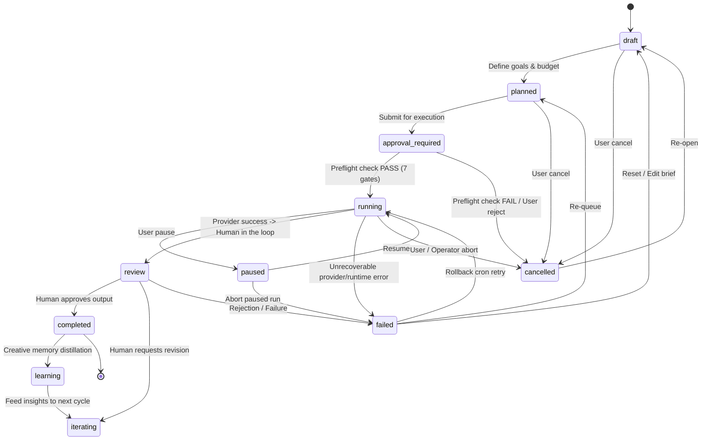

# MISSION EXECUTION & LIFECYCLE INTEGRITY AUDIT

**Target:** Sophia AI Factory Creative Mission Engine & Agent Protocol  
**Audit Standard:** Code is the authority. Tests are evidence.  
**Audit Date:** 2026-09-18  

---

## 1. Executive Summary

| Requirement | Verdict | Implementation / Code Proof |
|---|:---:|---|
| **7-Gate Preflight Enforcement** | **GREEN** | `runMissionPreflightCheck()` in `tree/mission/preflight-check.ts` (re-exported via `forest/mission/preflight-check.ts`). No `skipPreflight` bypass exists in the codebase. |
| **Provider Call Idempotency** | **GREEN** | `step.run('execute-agent')` in `agent-mission-executor.ts` prevents double-invocation and double-billing on Inngest retries. |
| **Credit Accounting (MCU)** | **GREEN** | `deductCredits(creatorId, mcuAmount)` executed upon successful agent run; 1 MCU = 10 USD cents. |
| **Terminal Failure States** | **GREEN** | `CreativeMissionStatus` updated with `'failed' | 'cancelled'`. `markMissionFailed()` transitions stuck runs cleanly. |
| **Exponential Backoff & Rollback** | **GREEN** | `agent-rollback-cron.ts` scans failed runs, retries with backoff, and cancels runs + marks missions failed on retry exhaustion. |

---

## 2. Canonical Mission Execution State Machine



---

## 3. Forensic Safeguards Against Critical Failure Modes

### 3.1 Anti-Double-Billing Invariant (Inngest Durability)
- **Failure Scenario:** An AI provider (Anthropic, OpenRouter) generates output successfully, but a subsequent D1 database insert or network glitch causes the function step to fail.
- **Safeguard:** In `src/forest/inngest/functions/agent-mission-executor.ts`:
  ```typescript
  const execution = await step.run('execute-agent', async () =>
    executeAgent(definition, context, providerRegistry)
  );
  ```
  Inngest records the execution result as a durable checkpoint. If any subsequent code fails and the step is re-evaluated, Inngest returns the cached provider result without calling the external AI API a second time, guaranteeing that customer BYOK credentials are never charged twice for the same run.

### 3.2 Terminal Failure Transition Fix
- **Pre-Audit Flaw:** The TypeScript union `CreativeMissionStatus` omitted `'failed'`, and `NEXT_STATUS` prevented any transition from `running` to `'failed'`. If an agent run failed, the mission was trapped in `'running'` forever.
- **Remediation:**
  1. Added `'failed'` and `'cancelled'` to `CreativeMissionStatus` in `src/seed/types/creative-domain.ts`.
  2. Updated `NEXT_STATUS` in `src/tree/mission/types.ts` to permit transitions to `'failed'` from `running`, `paused`, and `review`.
  3. Added `markMissionFailed(missionId)` in `agent-mission-lifecycle.ts` and called it in `agent-rollback-cron.ts` when retries are exhausted.
  4. Verified via automated test in `src/security-tests/adversarial-forensic.test.ts`.

### 3.3 MCU Credit Consumption
- **Implementation:**
  ```typescript
  const mcuAmount = Math.ceil(result.costCents / 10);
  if (mcuAmount > 0) {
    await deductCredits(mission.creatorId, mcuAmount, missionId, 'agent_mission_execution');
  }
  ```
  Every paid creative generation debits the user's MCU credit balance.
