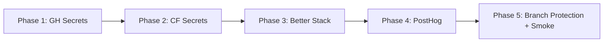

# Sophia Activation Runbook — Post-Deploy Provisioning

**Audience:** Sophia founder (non-tech CEO)
**Purpose:** Activate the 4 new layers (CI/CD, Observability, Signals, C-Level Agents) shipped 2026-04-17
**Time:** ~30 minutes total (split into 5 sequential phases)
**Production URL:** https://sophia.agencyos.network

---

## Production State Smoke Test (verified 2026-04-17 08:29 ICT)

| Layer | Endpoint | Status | Note |
|-------|----------|--------|------|
| P1 CI/CD | `/api/version` | ✅ HTTP 200 | `shortSha=unknown` → set COMMIT_SHA secret |
| P1 CI/CD | `/api/health/detail` | ✅ HTTP 401 | Auth gate working (Red Team #10) |
| P2 Observability | `/api/metrics` | ✅ HTTP 401 | CRON_SECRET gate (Red Team #3) |
| P3 Signals | `/api/signals/track` | ✅ HTTP 401 | Auth gate working |
| P3 Signals | `/api/signals/flag` | ✅ HTTP 401 | Auth gate working |
| P4 Agents | `.sophia-factory/agents/cto.md` | ✅ valid | `tools:` + `allowed-paths` + `spawn-policy` set |

**Diagnosis:** All 4 layers DEPLOYED + AUTH-GATED correctly. Need secrets to ACTIVATE.

---

## Phase 1 — Provision GH Actions Secrets (5 min)

[VN] Mở https://github.com/longtho638-jpg/sophia-ai-factory/settings/secrets/actions → **New repository secret** mỗi key dưới đây.
[EN] Open the GH Secrets page → add each secret below.

| Secret Name | Value Source |
|---|---|
| `CLOUDFLARE_API_TOKEN` | https://dash.cloudflare.com/profile/api-tokens → "Edit Workers" template |
| `CLOUDFLARE_ACCOUNT_ID` | `f691e83094f776311a1bfe3f8b126f1c` (founder's CF account) |
| `INTROSPECT_TOKEN` | Generate: `openssl rand -base64 32` |
| `WEBHOOK_SECRET` | Generate: `openssl rand -base64 32` |
| `CRON_SECRET` | Generate: `openssl rand -base64 32` |
| `TELEGRAM_BOT_TOKEN` | From @BotFather (existing) |
| `TELEGRAM_CHAT_ID` | Existing — see credentials-handover.md |

**Verify:** push a dummy commit → check Actions tab → P1 gates should now run instead of failing fast.

---

## Phase 2 — Provision CF Worker Secrets (5 min)

[VN] Run trên M1 Max terminal (đã `wrangler login`):
[EN] Run from M1 Max terminal (after `wrangler login`):

```bash
cd ~/sophia-ai-factory
# Same values as GH Secrets above (use SAME tokens for INTROSPECT_TOKEN, CRON_SECRET)
wrangler secret put COMMIT_SHA --config apps/sophia-ai-factory/wrangler.toml
wrangler secret put INTROSPECT_TOKEN --config apps/sophia-ai-factory/wrangler.toml
wrangler secret put CRON_SECRET --config apps/sophia-ai-factory/wrangler.toml
wrangler secret put WEBHOOK_SECRET --config apps/sophia-ai-factory/wrangler.toml
```

Then platform-specific tokens (sign up first):
```bash
# Better Stack — https://betterstack.com signup
wrangler secret put BETTER_STACK_LOGS_TOKEN --config apps/sophia-ai-factory/wrangler.toml
wrangler secret put BETTER_STACK_HEARTBEAT_URL --config apps/sophia-ai-factory/wrangler.toml

# PostHog — https://app.posthog.com signup
wrangler secret put POSTHOG_PROJECT_KEY --config apps/sophia-ai-factory/wrangler.toml
wrangler secret put POSTHOG_PERSONAL_API_KEY --config apps/sophia-ai-factory/wrangler.toml

# Founder email for digest
wrangler secret put FOUNDER_EMAIL --config apps/sophia-ai-factory/wrangler.toml
```

**Verify:** `curl -H "Authorization: Bearer <CRON_SECRET>" https://sophia.agencyos.network/api/metrics` → 200 OK.

---

## Phase 3 — Better Stack Configuration (5 min)

1. Sign up: https://betterstack.com/users/sign-up
2. **Logs** project → "Sophia AI Factory":
   - Source: "Cloudflare Worker"
   - Copy `logs token` → use as `BETTER_STACK_LOGS_TOKEN`
3. **Uptime** project → add 7 heartbeat monitors:
   - sophia-uptime-check, sophia-error-digest, sophia-heartbeat, sophia-usage-export, sophia-dunning, sophia-reminders, sophia-email-drip
   - Each gives a heartbeat URL → use first one as `BETTER_STACK_HEARTBEAT_URL`
4. **Alert rule** for emergency rollback (manual-trigger workflow):
   - Trigger: error rate > 1% over 5 min
   - Action: webhook POST to `https://api.github.com/repos/longtho638-jpg/sophia-ai-factory/actions/workflows/canary-rollback.yml/dispatches`
   - Header: `Authorization: Bearer <WEBHOOK_SECRET>`
   - Body: `{"ref": "main"}`
   - Note: 10/90 canary split was dropped 2026-04-17 (YAGNI pre-launch).
     This workflow now does a direct rollback to the previous version when triggered.

---

## Phase 4 — PostHog Configuration (5 min)

1. Sign up: https://app.posthog.com/signup (free tier 1M events/month)
2. New project → "Sophia AI Factory"
3. **Settings → Project → Authorized URLs:** add `https://sophia.agencyos.network` (Red Team #11 — funnel poisoning protection)
4. Copy **Project API Key** → `POSTHOG_PROJECT_KEY` and `NEXT_PUBLIC_POSTHOG_KEY`
5. Settings → Personal API Keys → create read-only → `POSTHOG_PERSONAL_API_KEY`
6. Re-deploy: `cd apps/sophia-ai-factory && npm run deploy`

---

## Phase 5 — GH Branch Protection + First Smoke (5 min)

1. https://github.com/longtho638-jpg/sophia-ai-factory/settings/branches → **Add rule** for `main`:
   - ✅ Require status checks before merging: `post-merge-tests`, `Green Gate (verify:green)`, `Gate 1 — Validation (tsc + eslint + vitest)`
   - ✅ Require linear history (no merge commits)
   - ✅ Include administrators (you're solo, applies to founder too)

2. **Smoke test C-Level agent** (P4):
```bash
cd ~/sophia-ai-factory
mekong --agent .sophia-factory/agents/cto.md "audit security headers in middleware.ts" --bare
```
Expected: agent reads middleware.ts, reports CSP/HSTS/X-Frame-Options state. If you see "tools: Read,Edit,Bash,Grep,Glob" loaded + analysis → P4 working.

3. **Smoke test PostHog signal** (P3):
```bash
curl -X POST https://sophia.agencyos.network/api/signals/track \
  -H "Authorization: Bearer <CRON_SECRET>" \
  -H "Content-Type: application/json" \
  -d '{"event":"smoke_test","distinctId":"founder","properties":{}}'
```
Expected: 200 OK + event visible in PostHog dashboard within 60s.

---

## Activation Order (DO IN ORDER)



**Why this order:** Each phase depends on tokens generated in the previous one. Skip = breakage.

---

## Troubleshooting

| Symptom | Diagnosis | Fix |
|---------|-----------|-----|
| `/api/version` returns `shortSha:unknown` | COMMIT_SHA secret missing | Run `wrangler secret put COMMIT_SHA` with current `git rev-parse HEAD` |
| `/api/metrics` returns 401 with correct token | CRON_SECRET mismatch CF vs GH | Re-set both with same value |
| Better Stack shows no logs after 10 min | Logger not flushing OR wrong token | Check Worker logs `wrangler tail` |
| PostHog shows no events | NEXT_PUBLIC_POSTHOG_KEY missing OR Authorized URLs not set | Re-deploy + check PostHog Settings |
| Canary rollback never fires | Better Stack alert rule webhook not configured | Re-do Phase 3 step 4 |
| C-Level agent says "tools:" empty | Agent file frontmatter parse error | Check `.sophia-factory/agents/<name>.md` line 8 |

---

## Phase 6 — Ops Telemetry Activation (NEW, 2026-04-17)

Ops telemetry uplift shipped 2026-04-17 (6 commits, D1 signals + feature-flags canary + BYOK timeout).
To fully activate D1 signals digest → GH Issue + Telegram alerts, add 3 secrets to GH Actions:

| Secret Name | Source |
|---|---|
| `OPENROUTER_API_KEY` | https://openrouter.ai/keys (for self-review summaries) |
| `TELEGRAM_BOT_TOKEN` | From @BotFather (existing — already in Phase 1) |
| `GITHUB_TOKEN_DIGEST` | New PAT w/ `repo` scope (for GH Issue digest posting) |

After adding these 3 secrets:
```bash
cd ~/sophia-ai-factory && git push origin $(git rev-parse --abbrev-ref HEAD)
```
Next scheduled weekly digest (Sunday 9am UTC) will auto-post to GH Issues + Telegram.

---

## What's NEXT (deferred)

Per audit `plans/reports/audit-...-mekong-vs-claudekit-gap.md`:
- **PostHog client-side JS in landing pages** — wire `<PostHogProvider>` to `app/[locale]/layout.tsx` for marketing pages (currently only protected pages instrumented)
- **First A/B experiment** — test pricing page variant via `EXPERIMENT_KV` framework (feature-flags canary framework now live)
- **Vertical templates** — domain-specific Sophia presets (sophia-finance, sophia-edu, sophia-marketing) for Mekong CLI vertical AI strategy
- **Benevolent neglect loop** — agent reads own journal weekly, suggests prompt improvements

---

## Cost (after activation)

- **Better Stack:** $0 free tier (500GB/month logs, 10 heartbeats — Sophia uses 7) — sufficient for ≤500 users
- **PostHog Cloud:** $0 free tier (1M events/month) — sufficient for ≤500 users × ~100 events/user
- **Cloudflare Workers Paid:** $5/month (existing) — covers all crons + new endpoints
- **Total NEW cost:** $0/month through 500 paying users

---

---

## Local Mode (Phase F — mekongd Tunnel)

[VN] Bật Local Mode để Sophia chạy AI trên máy M1 Max của bạn — cắt chi phí API 4–10×.
Xem hướng dẫn đầy đủ: `docs/sophia-local-mode-runbook.md`

[EN] Enable Local Mode to run AI on your M1 Max — cut API costs 4–10×.
Full guide: `docs/sophia-local-mode-runbook.md`

**Quick steps / Các bước nhanh:**
1. Cài mekongd theo `docs/sophia-local-mode-installer.md` (Phase D)
2. Chạy `bash scripts/sophia-local-mode-install.sh`
3. Setup Wizard → tab **Local Mode** → xác nhận badge ✅ Connected

**Health cron:** Sophia tự kiểm tra tunnel mỗi 15 phút. Sau 3 lần thất bại liên tiếp (45 phút), hệ thống tự tắt Local Mode và chuyển về cloud API.
Secrets cần thêm: `LOCAL_MODE_DEK` (32-byte base64 random key) vào CF Worker secrets.

---

**Last verified:** 2026-04-17 08:29 ICT
**Author:** Sophia Factory bootstrap session
**Related:** `plans/260416-2328-sophia-factory-raas-solo-platform/plan.md`
