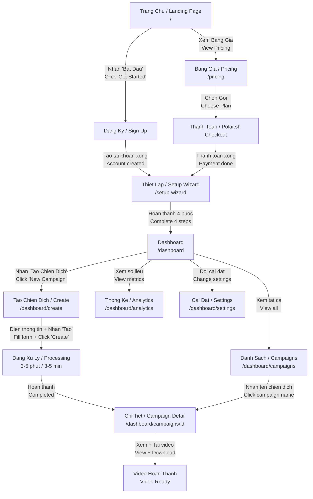
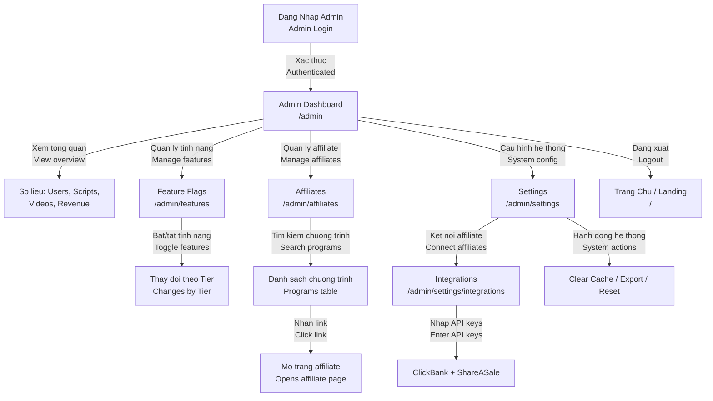
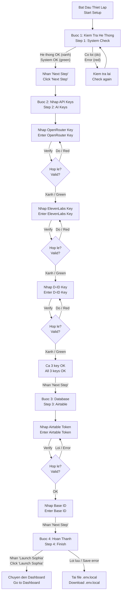
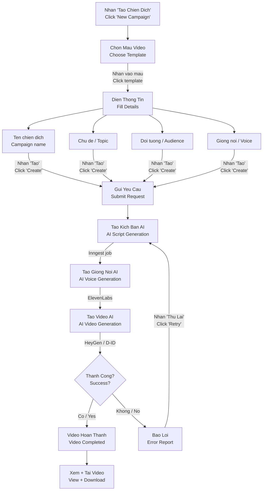
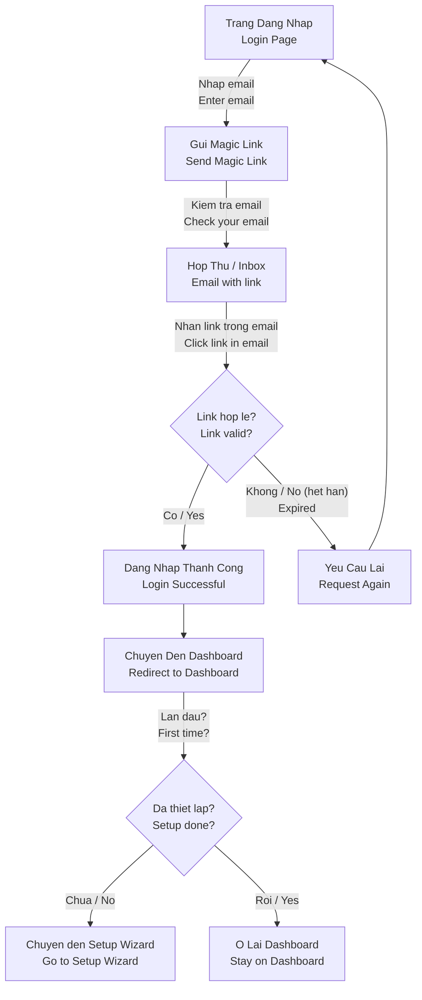
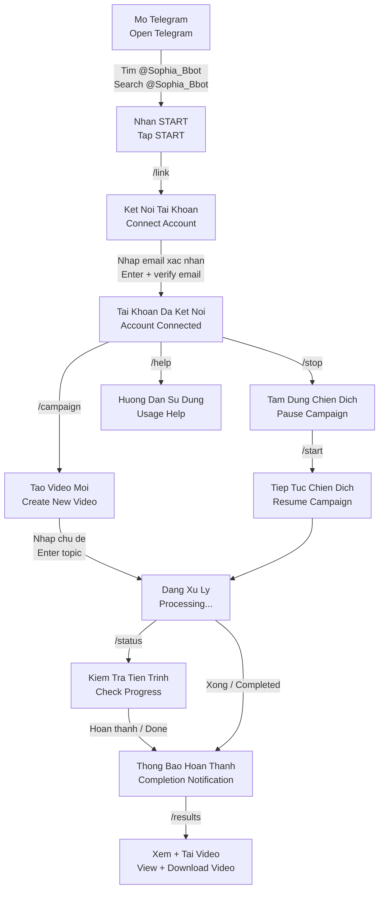
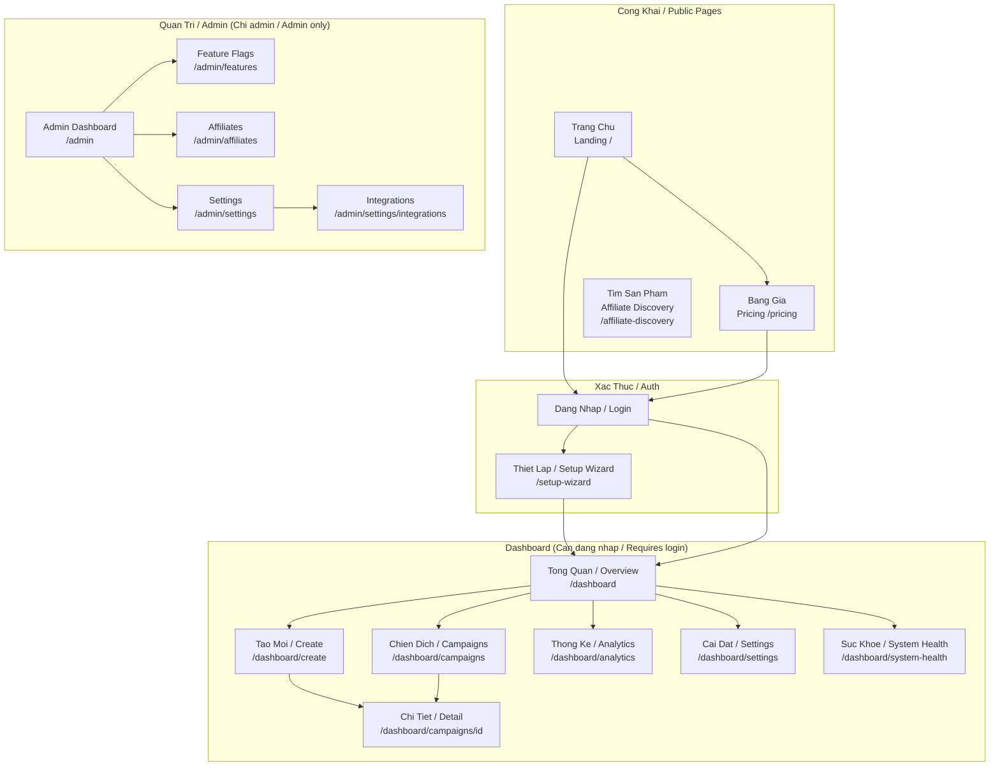

# Sophia AI Video Factory — So Do Luong / UI Flow Diagrams

> Cac so do duoi day mo ta luong di chuyen giua cac man hinh trong Sophia.
> The diagrams below describe navigation flows between screens in Sophia.

---

## 1. Hanh Trinh Nguoi Dung / User Journey Flow

Tu trang chu den video hoan thanh / From landing page to completed video:

---

## 2. Luong Quan Tri / Admin Flow

Luong lam viec cua quan tri vien / Administrator workflow:

---

## 3. Luong Thiet Lap / Setup Wizard Flow

4 buoc thiet lap ban dau / 4-step initial setup:

---

## 4. Luong Tao Chien Dich / Campaign Creation Flow

Tu y tuong den video hoan thanh / From idea to completed video:

**Thoi gian / Timeline:**

| Buoc / Step | Thoi gian / Duration |
|---|---|
| Dien thong tin / Fill form | 1-2 phut / min |
| Tao kich ban / Script gen | 30 giay / sec |
| Tao giong noi / Voice gen | 30-60 giay / sec |
| Tao video / Video gen | 1-3 phut / min |
| **Tong / Total** | **3-5 phut / min** |

---

## 5. Luong Xac Thuc / Auth Flow

Dang nhap bang Magic Link / Login with Magic Link:

---

## 6. Luong Telegram Bot / Telegram Bot Flow

Tao video tu dien thoai / Create videos from phone:

**Cac lenh Telegram / Telegram Commands:**

| Lenh / Command | Chuc nang / Function |
|---|---|
| `/link` | Ket noi tai khoan / Connect account |
| `/campaign` | Tao video moi / Create new video |
| `/status` | Xem tien trinh / Check progress |
| `/results` | Xem ket qua / View results |
| `/start` | Tiep tuc / Resume |
| `/stop` | Tam dung / Pause |
| `/help` | Tro giup / Help |

---

## 7. Tong Quan Ket Noi Trang / Page Connection Overview

Ban do tong the cac trang trong Sophia / Overall map of all pages in Sophia:

---

## Cach Doc So Do / How to Read These Diagrams

| Ky hieu / Symbol | Y nghia / Meaning |
|---|---|
| Hinh chu nhat / Rectangle | Trang hoac buoc / Page or step |
| Hinh thoi / Diamond | Diem quyet dinh (co/khong) / Decision point (yes/no) |
| Mui ten / Arrow | Huong di chuyen / Navigation direction |
| Chu tren mui ten / Text on arrow | Hanh dong can lam / Action to take |

---

> Cap nhat lan cuoi / Last updated: Thang 2, 2026 / February 2026
