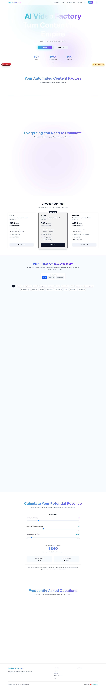
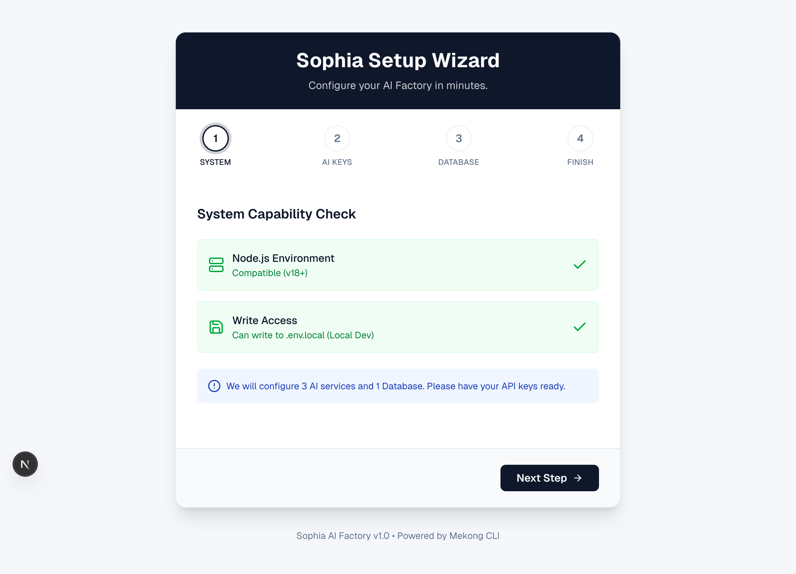
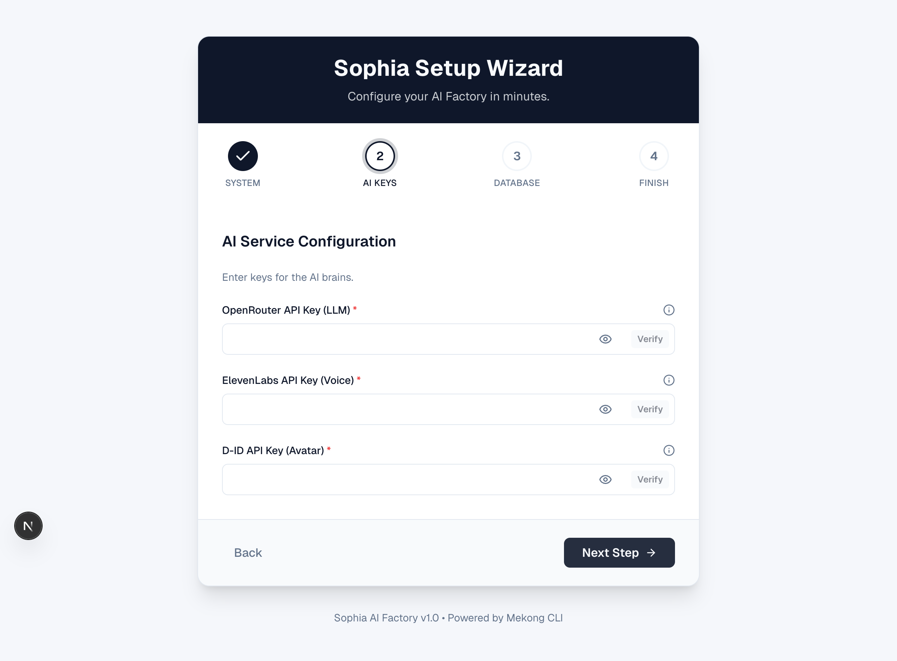
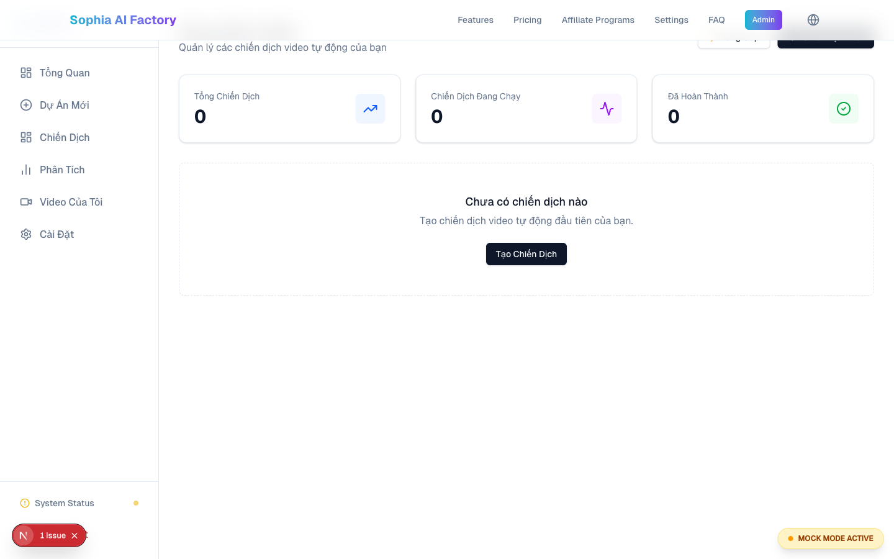
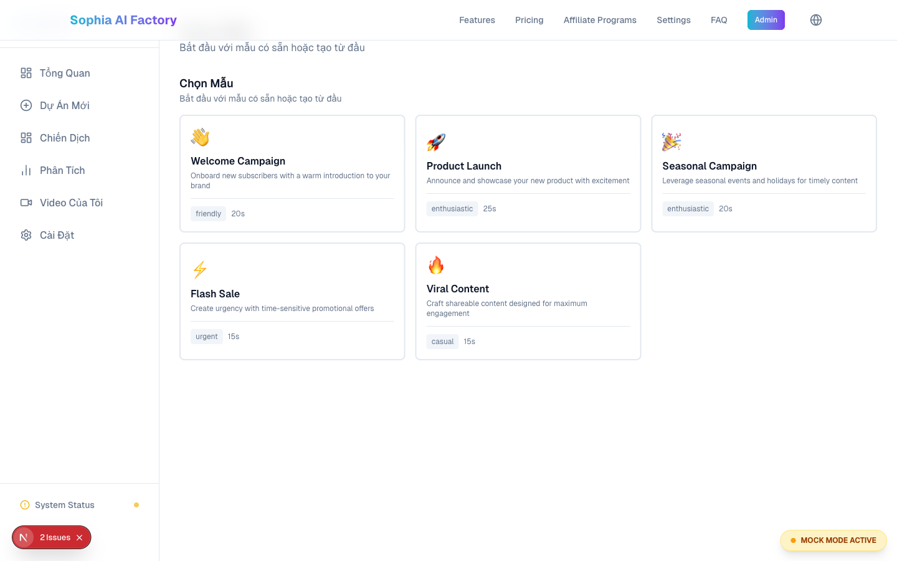
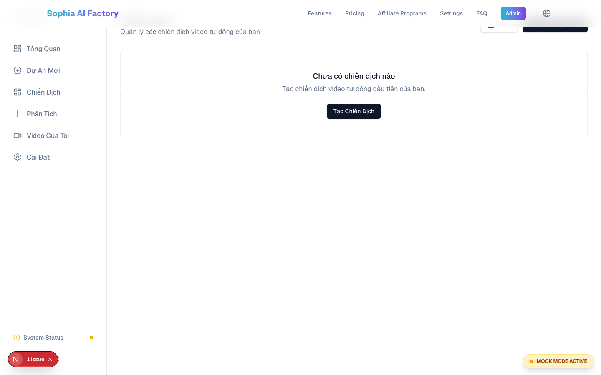
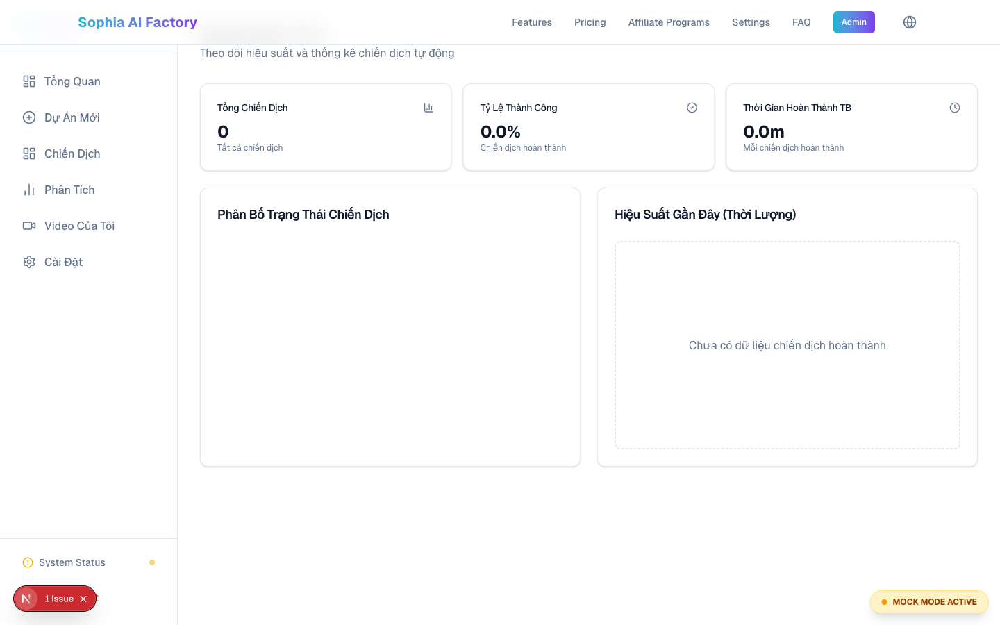
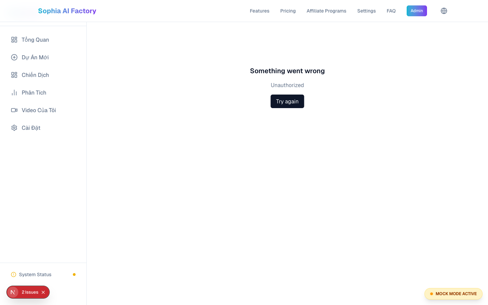
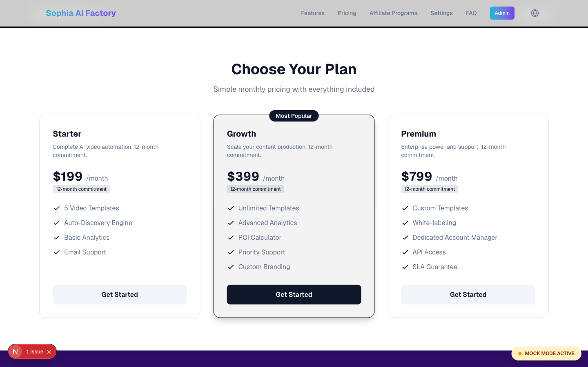

# Sophia AI Video Factory — Hanh Trinh Nguoi Dung / User Journey Guide

> Ban chi can lam theo tung buoc — Sophia se lo phan con lai.
> Just follow each step — Sophia handles the rest.

**Website:** https://sophia.agencyos.network | **Telegram Bot:** @Sophia_Bbot

---

## 1. Chao Mung / Welcome

Sophia AI Video Factory la phan mem giup ban **tu dong tao video** bang tri tue nhan tao (AI). Ban khong can biet lap trinh. Ban khong can biet dung video. Sophia lam tat ca cho ban.

Sophia AI Video Factory is software that **automatically creates videos** using artificial intelligence (AI). You do not need to know coding or video editing. Sophia does everything for you.

**Sophia giup ban / Sophia helps you:**
- Tim san pham ban chay de gioi thieu / Find trending products to promote (affiliate)
- Viet kich ban video tu dong / Write video scripts automatically
- Tao giong noi AI tu nhien / Create natural AI voiceovers
- Tao nguoi trinh bay ao (avatar) / Create virtual presenters (avatars)
- Dang video len YouTube tu dong / Publish videos to YouTube automatically

---

## 2. Ban Do Hanh Trinh / Journey Map

```
  BAN / YOU
    |
    v
+---------------------------+
|  1. TRANG CHU / LANDING   |  <-- Xem gioi thieu, bang gia
|     sophia.agencyos.network |      See intro, pricing
+---------------------------+
    |
    v
+---------------------------+
|  2. DANG KY / SIGN UP     |  <-- Tao tai khoan moi
|     Nhap email + mat khau  |      Create new account
+---------------------------+
    |
    v
+---------------------------+
|  3. THIET LAP / SETUP     |  <-- Ket noi 3 dich vu AI (1 lan duy nhat)
|     Setup Wizard (4 buoc)  |      Connect 3 AI services (one time only)
+---------------------------+
    |
    v
+---------------------------+
|  4. DASHBOARD              |  <-- Trung tam dieu khien chinh
|     Xem tong quan          |      Your main control center
+---------------------------+
    |
    +----------+----------+
    |          |          |
    v          v          v
+--------+ +--------+ +--------+
| TAO    | | THONG  | | CAI    |
| VIDEO  | | KE     | | DAT    |
| Create | | Analytics| Settings|
+--------+ +--------+ +--------+
    |
    v
+---------------------------+
|  5. TELEGRAM BOT           |  <-- Tao video tu dien thoai!
|     @Sophia_Bbot           |      Create videos from your phone!
+---------------------------+
```

| Buoc / Step | Thoi gian / Time | Chi lam / Frequency |
|---|---|---|
| Dang ky / Sign up | 2 phut / 2 min | 1 lan / Once |
| Thiet lap / Setup | 10 phut / 10 min | 1 lan / Once |
| Tao video / Create video | 2 min nhap + 3-5 min cho / 2 min input + 3-5 min wait | Moi lan / Each time |

---

## 3. Huong Dan Tung Man Hinh / Screen-by-Screen Guide

### Man Hinh 1: Trang Chu / Landing Page

**URL:** `https://sophia.agencyos.network`



Khi mo website, ban se thay / When you open the website, you will see:

| Phan / Section | Mo ta / Description |
|---|---|
| Hero (dau trang / top) | Gioi thieu Sophia + nut "Bat Dau" / Intro + "Get Started" button |
| Workflow | 4 buoc tao video / 4-step video creation flow |
| Features / Tinh nang | Danh sach kha nang / What Sophia can do |
| Pricing / Bang gia | 3 goi: BASIC, PREMIUM, ENTERPRISE |
| Affiliate Discovery | Tim san pham ban chay / Find trending products |
| ROI Calculator | Tinh loi nhuan du kien / Estimate profit |
| FAQ | Cau hoi thuong gap / Common questions |

**Ban can lam / What to do:** Nhan / Click **"Bat Dau"** or **"Get Started"** de tao tai khoan / to create account.

---

### Man Hinh 2: Thiet Lap / Setup Wizard

**URL:** `https://sophia.agencyos.network/setup-wizard`

Trinh thiet lap co **4 buoc**. Ban chi can lam **1 lan duy nhat**.
The Setup Wizard has **4 steps**. You only need to do this **once**.

#### Buoc 1/4: Kiem Tra He Thong / System Check



Man hinh tu dong kiem tra he thong / This screen automatically checks your system:
- **Node.js Environment** — Dau tich xanh = tot / Green checkmark = good
- **Write Access** — Dau tich xanh = tot / Green checkmark = good

Ban khong can lam gi. Khi thay 2 dau tich xanh, nhan **"Next Step"**.
You don't need to do anything. When you see 2 green checkmarks, click **"Next Step"**.

> Thong bao o cuoi / Notice at bottom: "We will configure 3 AI services and 1 Database. Please have your API keys ready."

#### Buoc 2/4: Nhap API Keys / Enter AI Keys



Nhap 3 "chia khoa" de ket noi Sophia voi dich vu AI / Enter 3 "keys" to connect Sophia with AI services:

| Truong / Field | Dich vu / Service | Chuc nang / Purpose |
|---|---|---|
| **OpenRouter API Key (LLM)** | openrouter.ai | Viet kich ban / Write scripts |
| **ElevenLabs API Key (Voice)** | elevenlabs.io | Tao giong noi / Create voiceover |
| **D-ID API Key (Avatar)** | d-id.com | Tao avatar / Create presenter |

**Cach lam / How to do it:**
1. Dan key vao o tuong ung / Paste key into matching field
2. Nhan **"Verify"** de kiem tra / Click **"Verify"** to check
3. Khi ca 3 hop le, nhan **"Next Step"** / When all 3 verified, click **"Next Step"**

> Nhan **(i)** de xem huong dan lay key. Nhan bieu tuong **mat** de xem/an key.
> Click **(i)** for instructions on getting each key. Click **eye** icon to show/hide key.

#### Buoc 3/4: Co So Du Lieu / Database (Airtable)

Ket noi Sophia voi Airtable de luu tru chien dich / Connect Sophia with Airtable to store campaigns:
- Nhap / Enter **Airtable Personal Access Token**
- Nhap / Enter **Base ID** (Sophia cung cap link tao tu dong / provides auto-create link)
- Nhan / Click **"Verify"**

#### Buoc 4/4: Hoan Thanh / Finish

Xac nhan tat ca da cai dat thanh cong. Nhan **"Go to Dashboard"** de bat dau.
Confirms everything is set up. Click **"Go to Dashboard"** to start.

---

### Man Hinh 3: Dashboard (Trung Tam Dieu Khien)

**URL:** `https://sophia.agencyos.network/dashboard`

Day la man hinh chinh. Moi thu bat dau tu day.
This is your main screen. Everything starts here.



| Thanh phan / Element | Mo ta / Description |
|---|---|
| **The thong ke / Stats cards** (3 o tren / at top) | Tong / Active / Hoan thanh — Total / Active / Completed |
| **Danh sach chien dich / Campaign list** | Tat ca video da tao, voi trang thai mau / All videos with status badges |
| **Nut "Tao Chien Dich" / "Create Campaign"** | Tao video moi / Create new video |
| **Nut "Nang Cap" / "Upgrade"** | Chuyen goi cao hon / Switch to higher plan |

**Mau trang thai / Status colors:** Vang/Yellow = Dang xu ly/Processing | Xanh la/Green = Hoan thanh/Completed | Do/Red = Loi/Error

---

### Man Hinh 4: Tao Chien Dich / Create Campaign

**URL:** `https://sophia.agencyos.network/dashboard/create`



1. **Chon Mau Video / Choose Template** — Nhan vao mau thich / Click a template you like
2. **Dien thong tin / Fill details:**
   - Ten chien dich / Campaign name (vd: "Video thang 3" / e.g., "March video")
   - Noi dung chinh / Main content
   - Giong noi / Voice (nam/nu - male/female)
3. Nhan / Click **"Tao Chien Dich" / "Create Campaign"**
4. Doi 3-5 phut / Wait 3-5 minutes — Sophia thong bao khi xong / notifies when done

---

### Man Hinh 5: Danh Sach Chien Dich / Campaigns List

**URL:** `https://sophia.agencyos.network/dashboard/campaigns`



Hien tat ca chien dich / Shows all your campaigns:
- Ten chien dich / Campaign name
- Trang thai mau / Colored status badge (vang/xanh/do - yellow/green/red)
- Ngay tao / Creation date
- Nhan ten de xem chi tiet / Click name for details

---

### Man Hinh 6: Chi Tiet Chien Dich / Campaign Detail

**URL:** `https://sophia.agencyos.network/dashboard/campaigns/[id]`

Khi nhan vao chien dich / When you click a campaign:
- Thong tin chi tiet / Detailed info
- **Xem truoc video / Video preview** — bam "Play" de xem / click "Play" to watch
- **Tai video / Download** — luu file MP4 / save MP4 file
- Trang thai tung buoc / Step-by-step status (kich ban/script, giong noi/voice, video)

---

### Man Hinh 7: Thong Ke / Analytics

**URL:** `https://sophia.agencyos.network/dashboard/analytics`



Bieu do va so lieu hieu suat / Charts and performance metrics:
- So video theo thoi gian / Videos over time
- Ty le hoan thanh / Completion rate
- Chi so hieu suat khac / Other performance metrics

---

### Man Hinh 8: Cai Dat / Settings

**URL:** `https://sophia.agencyos.network/dashboard/settings`



- Cap nhat tai khoan / Update account info
- Thay doi API Keys / Change API Keys
- Quan ly goi dich vu / Manage subscription
- Lich su thanh toan / Billing history

---

### Man Hinh 9: Bang Gia / Pricing

**URL:** `https://sophia.agencyos.network/pricing`



| Goi / Plan | Gia / Price | Phu hop / Best for |
|---|---|---|
| **BASIC** | $199/thang/month | Doanh nghiep nho, thu nghiem / Small biz, testing |
| **PREMIUM** | $399/thang/month | Dang phat trien, da kenh / Growing, multi-channel |
| **ENTERPRISE** | $799/thang/month | DN lon, tu dong 100% / Large biz, full automation |

Nhan **"Chon Goi" / "Choose Plan"** de dang ky hoac nang cap / to sign up or upgrade.

> Chi tiet: [Bang Gia / Pricing](./pricing-and-tiers.md)

---

### Man Hinh 10: Admin Panel

**URL:** `https://sophia.agencyos.network/admin`

Chi danh cho quan tri vien. Nguoi dung thuong khong can truy cap.
For administrators only. Regular users do not need this.

---

## 4. Telegram Bot — Dieu Khien Tu Dien Thoai / Control From Your Phone

**Bot:** @Sophia_Bbot

Tao va quan ly video **tu dien thoai** qua Telegram, khong can may tinh.
Create and manage videos **from your phone** via Telegram, no computer needed.

**Ket noi / Connect:**
1. Mo Telegram / Open Telegram
2. Tim / Search `@Sophia_Bbot`
3. Nhan / Tap **"START"**
4. Nhap / Type `/link` va xac nhan email / and verify your email

**Cac lenh / Commands:**

| Lenh / Command | Chuc nang / Function | Khi nao / When |
|---|---|---|
| `/link` | Ket noi tai khoan / Connect account | Lan dau / First time |
| `/campaign` | Tao video moi / Create video | Muon tao video / Want new video |
| `/status` | Xem trang thai / Check status | Kiem tra buoc xu ly / Check progress |
| `/results` | Xem ket qua / View results | Tai video xong / Download completed |
| `/start` | Tiep tuc / Resume campaign | Chay lai sau tam dung / Restart paused |
| `/stop` | Tam dung / Pause campaign | Dung chien dich / Stop running |
| `/help` | Tro giup / Help | Can huong dan / Need guidance |

> Chi tiet / Details: [Telegram Bot Guide](./telegram-bot-guide.md)

---

## 5. The Tham Chieu Nhanh / Quick Reference Card

### Dia chi quan trong / Important Links

| Trang / Page | URL |
|---|---|
| Trang chu / Landing | https://sophia.agencyos.network |
| Dashboard | https://sophia.agencyos.network/dashboard |
| Tao video / Create | https://sophia.agencyos.network/dashboard/create |
| Chien dich / Campaigns | https://sophia.agencyos.network/dashboard/campaigns |
| Thong ke / Analytics | https://sophia.agencyos.network/dashboard/analytics |
| Cai dat / Settings | https://sophia.agencyos.network/dashboard/settings |
| Bang gia / Pricing | https://sophia.agencyos.network/pricing |
| Telegram Bot | @Sophia_Bbot |

### Quy trinh nhanh / Quick Flow

```
[Dang nhap]  >  [Chon Mau]  >  [Nhap Noi Dung]  >  [Doi 3-5p]  >  [Tai Video]
 Sign in        Template        Content             Wait 3-5m      Download
```

### Mau trang thai / Status Colors

| Mau / Color | Y nghia / Meaning |
|---|---|
| Vang / Yellow | Dang xu ly / Processing |
| Xanh la / Green | Hoan thanh / Completed |
| Do / Red | Co loi / Error |

### Ho tro / Support

| Kenh / Channel | Lien he / Contact |
|---|---|
| Email | support@sophia.agency |
| Telegram | @Sophia_Bbot (`/help`) |
| Tu van goi / Sales | sales@sophia.agency |

---

## 6. Cau Hoi Thuong Gap / FAQ

**Toi can biet lap trinh khong? / Do I need to know coding?**
> Khong. Chi can bam va nhap. / No. Just click and type.

**Tao duoc bao nhieu video? / How many videos can I create?**
> BASIC = 20/thang, PREMIUM = 100/thang, ENTERPRISE = khong gioi han/unlimited.

**Video mat bao lau? / How long does a video take?**
> 3-5 phut sau khi nhan "Tao Chien Dich". / 3-5 minutes after clicking "Create Campaign".

**Dung tren dien thoai duoc khong? / Can I use it on my phone?**
> Co. Website tuong thich dien thoai + Telegram Bot @Sophia_Bbot. / Yes. Mobile-friendly website + Telegram Bot.

**API Key la gi? / What is an API Key?**
> "Chia khoa" de Sophia ket noi dich vu AI. Nhap 1 lan. / A "key" connecting Sophia to AI services. Enter once.

---

> Cap nhat lan cuoi / Last updated: Thang 2, 2026 / February 2026
