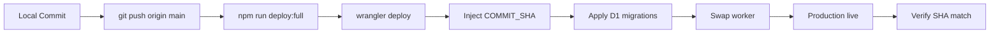

# Phase 08: Production Deploy + CEO Handover

**Priority:** P1 (Final)  
**Status:** Not Started  
**Estimated Duration:** 2 hours (Day 2)

---

## Context Links

- **Deep Research Report:** Section 4 — "Kế hoạch triển khai thực tế" Phase 3 (Deploy) + Phase 4 (CEO Handover)
- **Deploy Doctrine:** `CLAUDE.md` — "Deploy doctrine: CF-direct via `npm run deploy:full`"
- **Production URL:** `https://sophia.agencyos.network`
- **SHA Verification:** `deploy-with-sha.sh` — mandatory commit SHA check

---

## Overview

Deploy Sophia AI Factory to production using Cloudflare Workers direct deployment and hand over to CEO with 3 simple commands.

**Deploy workflow:**
1. Push to origin/main (MANDATORY before deploy)
2. Run `npm run deploy:full` (wrangler CLI + SHA injection)
3. Verify SHA match between local and production
4. Verify HTTP 200 response
5. Deliver CEO handover document (bilingual, step-by-step)

**CEO commands:**
- `npm run deploy:full` — deploy (only command to remember)
- `mekong --agent <cto|cmo|cso|coo>` — invoke C-Level agents
- `/sophia` — natural language routing to agents

---

## Key Insights

**From Deep Research Report:**
- GitHub Actions DISABLED since 2026-05-03 — no CI/CD
- Deploy is manual but scripted (`deploy-with-sha.sh`)
- SHA verification mandatory: `curl $PROD_URL/api/version | jq .shortSha` must match `git rev-parse HEAD | cut -c1-8`
- Push BEFORE deploy: script rejects if `git log origin/main..HEAD` is non-empty
- Production: Cloudflare Workers with D1 + R2 bindings

**Current state:**
- `wrangler.toml` exists with bindings (D1, R2, KV, Queues)
- `deploy-with-sha.sh` exists and is tested (assume)
- `package.json` has `deploy:full` script
- `src/app/api/version/route.ts` returns `{ shortSha: string }` (assume)

**Target state:**
- Production code deployed and running
- SHA verified match
- HTTP 200 confirmed
- CEO handover doc delivered and understood
- Rollback plan documented

---

## Requirements

### Functional
1. Push local commits to origin/main
2. Execute `npm run deploy:full` successfully
3. Verify `shortSha` matches local HEAD
4. Verify production HTTP 200
5. Create bilingual CEO handover document (Vietnamese + English)
6. Conduct 15-minute walkthrough call (optional but recommended)

### Non-Functional
1. Zero downtime — Cloudflare Workers swap atomic
2. All D1 migrations applied before worker swap
3. No secrets leaked in logs (wrangler output redacted if needed)
4. Rollback tested and documented (quick revert to previous commit)
5. Monitoring enabled (Sentry, logs) for post-deploy watch

---

## Architecture

**Deploy pipeline (CF-direct):**



**SHA verification:**
```bash
LOCAL_SHA=$(git rev-parse HEAD | cut -c1-8)
LIVE_SHA=$(curl -s https://sophia.agencyos.network/api/version | jq -r .shortSha)
[ "$LOCAL_SHA" = "$LIVE_SHA" ] && echo "✅ MATCH" || echo "❌ MISMATCH"
```

**Rollback:**
- Fast rollback: `git revert HEAD` → new commit → `npm run deploy:full`
- Or: `git checkout <previous-commit>` and deploy (but creates detached HEAD)

---

## Related Code Files

**Deploy scripts:**
- `package.json` — `scripts.deploy:full`
- `deploy-with-sha.sh` or similar (root or `scripts/`)
- `wrangler.toml` — Cloudflare configuration (bindings, routes)

**Version endpoint:**
- `src/app/api/version/route.ts` — returns `{ shortSha, fullSha, deployedAt }`

**Migrations:**
- `migrations/` — D1 schema migrations (Kysely)
- Applied automatically by `wrangler deploy` if configured

**Handover doc:**
- `docs/CEO-HANDOVER.md` (to be created)

---

## Implementation Steps

### Step 1: Pre-deploy checklist

**Code:**
- [ ] All local changes committed (`git status` clean)
- [ ] `git log origin/main..HEAD` shows expected commits
- [ ] No `.env` changes needed (wrangler uses remote secrets)
- [ ] D1 migrations tested locally (if any new ones)

**Environment:**
- [ ] `wrangler whoami` shows correct account
- [ ] `pnpm install` run with fresh lockfile (if package.json changed)
- [ ] Build passes: `npm run build` exit 0
- [ ] Tests pass: `npm run ci:test` exit 0 (already verified Phase 00)

**Documentation:**
- [ ] CEO handover draft ready (create in Step 4)
- [ ] Rollback procedure documented

### Step 2: Push to origin/main

```bash
cd /Users/macbook/projects/sophia-ai-factory/apps/sophia-ai-factory

# Ensure on main branch
git branch --show-current  # should output: main

# Pull latest from remote to avoid divergence
git pull origin main

# Push local commits
git push origin main

# Verify push succeeded
if [ $? -eq 0 ]; then
  echo "✅ Push successful"
else
  echo "❌ Push failed — resolve conflicts and retry"
  exit 1
fi
```

**Mandatory:** Deploy script will reject if origin/main..HEAD is non-empty AFTER push. This ensures all commits are on remote.

### Step 3: Deploy to production

```bash
# From project root
npm run deploy:full

# Expected output:
# • src/app/api/version/route.ts
# ✨ Deployed to https://sophia.agencyos.network (XXX ms)
# • Uploaded X files (Y KiB)
# • Migrated D1 database (if migrations pending)
```

**If deploy fails:**
- Check `wrangler` login: `wrangler whoami`
- Check `wrangler.toml` bindings exist (D1, R2)
- Check error message; common issues:
  - `E0401001: D1 database not found` → binding name mismatch
  - `E0402002: No matching route` → `wrangler.toml` route config wrong
  - Build error → fix and retry

### Step 4: Verify SHA match

```bash
# Get local SHA (first 8 chars)
LOCAL_SHA=$(git rev-parse HEAD | cut -c1-8)
echo "Local SHA: $LOCAL_SHA"

# Get production SHA (may take 10-30s after deploy)
sleep 15  # wait for worker to swap
LIVE_SHA=$(curl -s https://sophia.agencyos.network/api/version | jq -r .shortSha 2>/dev/null || echo "ERROR")
echo "Live SHA: $LIVE_SHA"

# Compare
if [ "$LOCAL_SHA" = "$LIVE_SHA" ]; then
  echo "✅ SHA MATCH — Production verified"
else
  echo "❌ SHA MISMATCH"
  echo "Local:  $LOCAL_SHA"
  echo "Live:   $LIVE_SHA"
  echo "Action: Wait 30s and retry; if still mismatch, rollback immediately"
  exit 1
fi
```

### Step 5: Verify HTTP 200

```bash
curl -sI https://sophia.agencyos.network | head -1
# Expected: HTTP/2 200

STATUS=$(curl -s -o /dev/null -w "%{http_code}" https://sophia.agencyos.network)
if [ "$STATUS" = "200" ]; then
  echo "✅ Production responding with 200"
else
  echo "❌ Production status: $STATUS"
  exit 1
fi
```

### Step 6: Quick smoke test (optional)

```bash
# Test a few critical endpoints
curl -s https://sophia.agencyos.network/api/health | jq .status  # expect "ok"
curl -s https://sophia.agencyos.network/api/version | jq .shortSha  # should match LOCAL_SHA

# Check Sentry for errors (if SENTRY_DSN set)
# wrangler tail --format json | grep -i error | head -10
```

### Step 7: Create CEO handover document

Create `docs/CEO-HANDOVER.md` (bilingual):

```markdown
# Sophia AI Factory — CEO Handover

**Production URL:** https://sophia.agencyos.network  
**Deployed:** $(date -u +%Y-%m-%d %H:%M UTC)  
**Commit:** `$(git rev-parse HEAD)` (short: `$(git rev-parse HEAD | cut -c1-8)`)

---

## 🇻🇳 Phần Tiếng Việt

### 3 Commands bạn cần nhớ

1. **Deploy** — Deploy code mới lên production:
   ```bash
   git push origin main
   npm run deploy:full
   ```

2. **Invoke Agent** — Gọi C-Level agents để làm việc:
   ```bash
   mekong --agent cto    # Gọi CTO (kỹ thuật)
   mekong --agent cmo    # Gọi CMO (marketing)
   mekong --agent cso    # Gọi CSO (customer success)
   mekong --agent coo    # Gọi COO (operations)
   mekong --agent mekong-cli  # Gọi CLI specialist
   ```

3. **Natural Language** — Dùng slash command trong Claude:
   ```
   /sophia [task description]
   ```
   Ví dụ: `/sophia review the billing module for security issues`

### Quick Actions

| Task | Command |
|------|---------|
| Check production health | `curl https://sophia.agencyos.network/api/health` |
| See current version | `curl https://sophia.agencyos.network/api/version \| jq .shortSha` |
| View logs | `wrangler tail` |
| Quick rollback | `git revert HEAD && npm run deploy:full` |

### Support

- Documentation: `docs/` folder
- Technical issues: Ask CTO agent (`/sophia cto`)
- Business questions: Ask COO agent (`/sophia coo`)

---

## 🇬🇧 English Version

### 3 Commands to Remember

1. **Deploy** — Deploy new code to production:
   ```bash
   git push origin main
   npm run deploy:full
   ```

2. **Invoke Agent** — Call C-Level agents for work:
   ```bash
   mekong --agent cto    # Call CTO (technical)
   mekong --agent cmo    # Call CMO (marketing)
   mekong --agent cso    # Call CSO (customer success)
   mekong --agent coo    # Call COO (operations)
   mekong --agent mekong-cli  # Call CLI specialist
   ```

3. **Natural Language** — Use slash command in Claude:
   ```
   /sophia [task description]
   ```
   Example: `/sophia review the billing module for security issues`

### Quick Actions

| Task | Command |
|------|---------|
| Check production health | `curl https://sophia.agencyos.network/api/health` |
| See current version | `curl https://sophia.agencyos.network/api/version \| jq .shortSha` |
| View logs | `wrangler tail` |
| Quick rollback | `git revert HEAD && npm run deploy:full` |

### Support

- Documentation: `docs/` folder
- Technical issues: Ask CTO agent (`/sophia cto`)
- Business questions: Ask COO agent (`/sophia coo`)

---

## 🚨 Emergency Rollback

If production shows errors:

```bash
# Fast rollback to previous commit
git log --oneline -5  # find previous good commit SHA
git checkout <previous-sha>
npm run deploy:full
git checkout main  # return to main branch
```

Or use revert (preserves history):
```bash
git revert HEAD
npm run deploy:full
```

---

## 📊 Post-Deploy Checklist

- [ ] SHA verified match (local == production)
- [ ] HTTP 200 confirmed
- [ ] Health endpoint returns `{"status":"ok"}`
- [ ] No errors in `wrangler tail` for 5 minutes
- [ ] CEO acknowledged handover document
- [ ] Team notified of deployment

---

**End of Handover**
```

### Step 8: Conduct CEO walkthrough (optional but recommended)

Schedule 15-minute call with CEO to:
1. Show production URL and verify version
2. Demonstrate 3 commands
3. Walk through handover document
4. Answer questions
5. Record any feedback

### Step 9: Post-deploy monitoring

```bash
# Monitor logs for 30 minutes
wrangler tail --format json | grep -i error | head -20

# Check Sentry for exceptions (if configured)
# Open Sentry dashboard and review recent errors

# Verify no unexpected spikes in D1 queries or R2 egress
# Cloudflare Analytics dashboard
```

---

## Todo List

- [ ] Verify Phase 00 complete (Node 24+, quality gates pass)
- [ ] Verify Phase 07 complete (agent teams enabled)
- [ ] Check git status clean, all commits pushed
- [ ] git pull origin main (sync)
- [ ] npm run build (final check)
- [ ] git push origin main (MANDATORY)
- [ ] npm run deploy:full
- [ ] Wait 15s, get LOCAL_SHA
- [ ] curl production /api/version, get LIVE_SHA
- [ ] Compare SHA — must match
- [ ] curl -sI production — must return 200
- [ ] Optional: smoke test critical endpoints
- [ ] Create docs/CEO-HANDOVER.md (bilingual)
- [ ] Notify CEO, schedule walkthrough
- [ ] Monitor logs for 30 min post-deploy
- [ ] Document rollback if needed
- [ ] Update `docs/project-changelog.md` with deploy info

---

## Success Criteria

**Definition of Done:**
- `npm run deploy:full` exits 0
- `LOCAL_SHA == LIVE_SHA` (verified)
- `curl -sI production` returns `HTTP/2 200`
- CEO handover document created and delivered
- CEO acknowledges understanding of 3 commands

**Validation methods:**
1. `echo "Deploy SHA: $LOCAL_SHA"` → note value
2. `curl -s https://sophia.agencyos.network/api/version | jq .shortSha` → equals above
3. `curl -sI https://sophia.agencyos.network | head -1` → `HTTP/2 200`
4. `wrangler d1 migrations list sophia-raas-db --remote` → all migrations applied
5. CEO confirmation (email/chat/signature)

---

## Risk Assessment

| Risk | Likelihood | Impact | Mitigation |
|------|------------|--------|------------|
| Deploy script fails (wrangler error) | Medium | High | Check `wrangler whoami`; ensure API token valid; retry |
| SHA mismatch after deploy | Low | High | Wait 60s; if still mismatch → rollback immediately |
| D1 migration failure | Low | High | Test migrations on staging first; backup via `wrangler d1 export` |
| Post-deploy regression | Medium | Medium | Run post-deploy E2E smoke (RUN_POSTDEPLOY_E2E=1) |
| CEO doesn't understand handover | Medium | Medium | Use plain language, screenshots, step-by-step; offer call |

---

## Security Considerations

- **Secrets injection:** `deploy-with-sha.sh` sets `COMMIT_SHA`, `DEPLOYED_AT`, `DEPLOY_BRANCH` as Worker secrets — secure transport via wrangler
- **Attestation:** Optional two-signature rule (`REQUIRE_DEPLOY_ATTESTATION=1`) for SOC 2; currently `SKIP_ATTESTATION=1` by default
- **Migrations:** Applied before worker swap to avoid schema-code drift
- **No data migration risks:** All migrations are DDL (CREATE/ALTER), not DML data transformations

---

## Next Steps

1. **Immediate:** Execute Phase 0 and Phase 7 first (they block this phase)
2. **Pre-deploy:** Freeze feature commits during deploy window
3. **Post-deploy:** Monitor `wrangler tail` for 30 minutes; check Sentry for errors
4. **CEO handover:** Schedule 15-minute walkthrough call within 24h of deploy

---

## Commands Reference

```bash
# Pre-deploy
git pull origin main
npm run build

# Push (MANDATORY)
git push origin main

# Deploy
npm run deploy:full

# Verify
LOCAL_SHA=$(git rev-parse HEAD | cut -c1-8)
sleep 15
LIVE_SHA=$(curl -s https://sophia.agencyos.network/api/version | jq -r .shortSha)
[ "$LOCAL_SHA" = "$LIVE_SHA" ] && echo "✅ DEPLOY MATCHES COMMIT" || echo "❌ MISMATCH"
curl -sI https://sophia.agencyos.network | head -1

# Rollback (if needed)
git revert HEAD
npm run deploy:full

# Logs
wrangler tail
```

---

**END OF PHASE 08**
