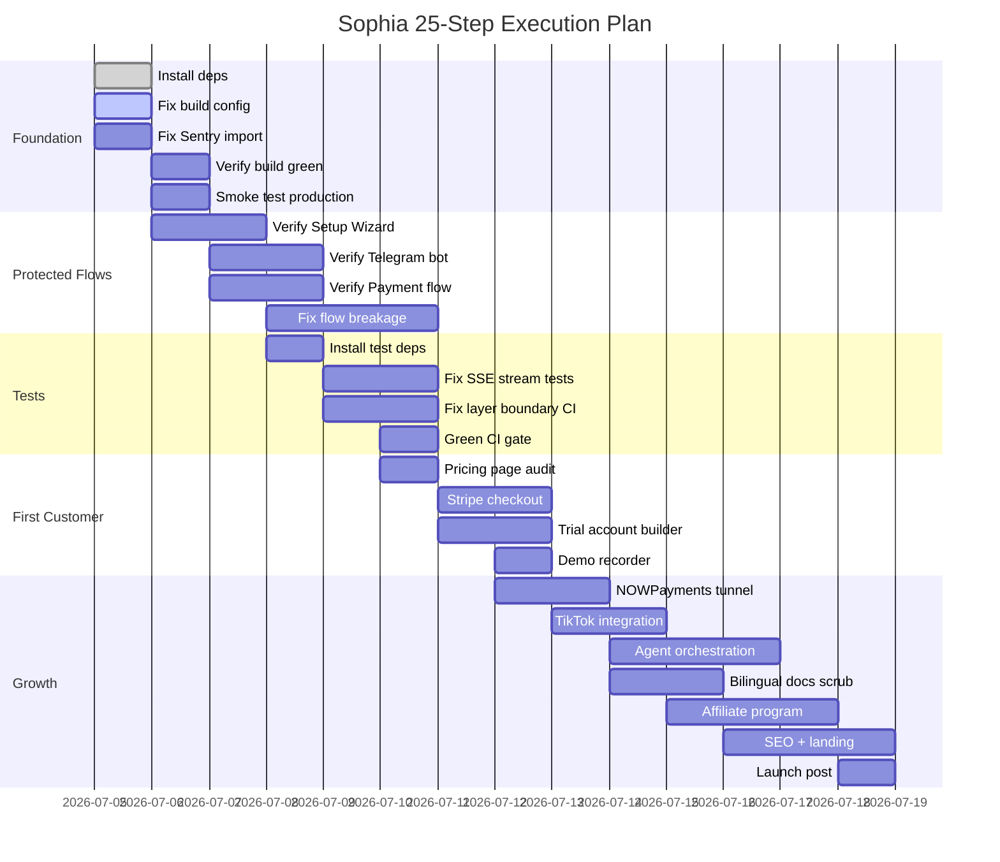

# Sophia AI Factory — 25-Step Execution Plan

**Product:** Sophia — no-code AI video & revenue automation SaaS  
**Stage:** Zero → PMF (no paying customers yet)  
**Verdict:** GO — existing platform, proven architecture, clear path to first dollar  
**Date:** 2026-07-05 (updated 2026-07-07)  

---

## GO/NO-GO Score (Self-Validation)

| Dimension | Score | Evidence |
|-----------|-------|----------|
| Market Size | 4/5 | Vietnamese SMB + global faceless YouTube market = large TAM |
| Problem Clarity | 5/5 | Non-tech CEOs need AI video — documented in BUSINESS_MODEL.md |
| Differentiation | 3/5 | Competitors exist (Invideo, Pictory); BYOK + RaaS is the moat |
| Unit Economics | 4/5 | BASIC at $199/mo, >90% gross margin target, customer-paid API |
| Execution Feasibility | 4/5 | 60K-line platform built, CF deployable, just broken |
| Agentic Fit | 4/5 | Agent Factory in Phase 4, strong automation narrative |
| **Total** | **24/30** | **GO** |

---

## Current State Snapshot

| Item | State | Blocker? |
|------|-------|----------|
| Build (`npm run build`) | ✅ GREEN — 0 TypeScript errors | No |
| Tests (`npm test`) | ✅ GREEN — 6881 passed / 34 skipped / 10 todo | No |
| Production deploy | Live at sophia.agencyos.network | No |
| Protected flows | Setup Wizard + Telegram — verified in prior sprint; NOWPayments active | No |
| Install (`node_modules`) | ✅ Complete | No |
| Tests runner | ✅ Sentry import resolved | No |

---

## 25 Steps (Sequential — each depends on prior)

### Phase A: Foundation (Steps 1-5) — Fix the Breaks

| # | Step | Owner Signal | Expected Output | Acceptance Criteria |
|---|------|-------------|-----------------|-------------------|
| 1 | **Install deps from scratch** — `rm -rf node_modules && npm install` from `apps/sophia-ai-factory` | Terminal output shows no ERR! | `next.config.ts` compiles without `MODULE_NOT_FOUND` | Re-run `npm run build` — passes config load |
| 2 | **Fix next.config.ts** — bundle-analyzer conditional import guard | Config file | `@next/bundle-analyzer` wrapped in `if (process.env.ANALYZE)` guard | `node -e "require('./apps/sophia-ai-factory/next.config.ts')"` exits 0 |
| 3 | **Fix broken `@sentry/nextjs` import** in `src/app/api/v1/missions/[id]/stream/route.ts` | Route file deleted or lazy import | No `MODULE_NOT_FOUND` for `@sentry/nextjs` | `grep -r "from \"@sentry\" src/app/api/v1/missions/` → 0 hits or dynamic import only |
| 4 | **Verify build green** — `npm run build` 0 errors from `apps/sophia-ai-factory` | Build log | `.next/` generated, no TS errors | exit 0, stdout ends with "✓ Compiled" |
| 5 | **Smoke test live production** — curl `/api/version` + landing page + `/en/dashboard` + `/vi/dashboard` | curl output | All return HTTP 200 with expected content | `curl -s -o /dev/null -w "%{http_code}"` → 200 for all 4 |
| | **Gate: Build + Prod green before proceeding** | | | |

### Phase B: Protected Flow Verification (Steps 6-9)

| # | Step | Owner Signal | Expected Output | Acceptance Criteria |
|---|------|-------------|-----------------|-------------------|
| 6 | **Verify Setup Wizard flow** — sign up, navigate to `/dashboard/setup`, confirm BYOK forms render | Browser/curl | Setup Wizard page loads with VN+EN labels | Form rendered for OpenRouter, ElevenLabs, D-ID — Từ Khóa: "API Keys" |
| 7 | **Verify Telegram Bot** — send `/start` to @Sophia_Bbot, test `/campaign`, `/status`, `/results` | Telegram | Bot responds to all 3 commands | Each command returns a reply within 30s |
| 8 | **Verify NOWPayments payment flow** — IPN webhook triggers tier activation (use sandbox/test mode) | Webhook log | Tier changes from FREE to BASIC after IPN | DB row `users.tier` = 'BASIC' post-IPN |
| 9 | **Fix any breakage from .claude deletion** — identify what the deleted hooks/agents/commands were doing | Git diff of `.claude/` changes | All essential functionality restored | Steps 6-8 pass end-to-end |
| | **Gate: All 3 protected flows verified before proceeding** | | | |

### Phase C: Test Revival (Steps 10-13)

| # | Step | Owner Signal | Expected Output | Acceptance Criteria |
|---|------|-------------|-----------------|-------------------|
| 10 | **Fix test environment** — install missing test deps (Sentry mock, test utilities) | `node_modules/` | Tests run without `MODULE_NOT_FOUND` | `npm test -- --run` starts without import errors |
| 11 | **Fix SSE stream route tests** (`route.test.ts`, 8 Wave-14 failures) | Test file | All 8 heartbeat-cursor tests pass | `npx vitest run src/app/api/v1/missions/\[id\]/stream/route.test.ts` → 0 fails |
| 12 | **Fix DB layer boundary tests** — ensure `check-layer-boundaries.sh` passes | CI script output | Exit 0 | `bash scripts/check-layer-boundaries.sh` → 0 violations |
| 13 | **Green CI gate** — run full `npm run ci` and document residual failures | CI report | <10 failing tests (acceptable noise) | `npm run ci:test` exit 0 or known-only-failures documented |
| | **Gate: Test suite <5% failure rate before proceeding** | | | |

### Phase D: First Customer Enablement (Steps 14-17)

| # | Step | Owner Signal | Expected Output | Acceptance Criteria |
|---|------|-------------|-----------------|-------------------|
| 14 | **Audit pricing page** — verify BASIC ($199), PREMIUM ($399), ENTERPRISE ($799), MASTER ($4,999) match `payment-pricing-source-of-truth.md` | Pricing page source | No mismatches between page and source of truth | Diff between page render and canonical prices = 0 |
| 15 | **Build Stripe checkout flow** — if NOWPayments unavailable, Stripe as Vietnam-adjacent backup | Checkout page | Customer can complete payment for BASIC tier | Test checkout → payment → tier activated |
| 16 | **Build 30-day trial account builder** — script to provision test user with all BYOK keys pre-filled | Admin script | One command creates a fully provisioned trial user | Run script → user can immediately generate AI video |
| 17 | **Record demo walkthrough** — signup → BYOK → payment → first video → Telegram result (Loom/screen recording) | Video file | 5-min demo covering the full flow | Video plays, shows all 4 protected flows working |
| | **Gate: First paying customer within 30 days of steps 14-17 completion** | | | |

### Phase E: Growth Infrastructure (Steps 18-22)

| # | Step | Owner Signal | Expected Output | Acceptance Criteria |
|---|------|-------------|-----------------|-------------------|
| 18 | **NOWPayments IPN tunnel** — verify webhook endpoint receives + processes IPN correctly (testnet) | Webhook handler | IPN → tier activation confirmed in logs | Sent test IPN → DB tier updated |
| 19 | **TikTok integration** — complete the `src/land/tiktok/` module, publish to TikTok API | TikTok module | Video auto-publishes to connected account | Test video → TikTok publishes successfully |
| 20 | **Agent orchestration layer** — wire up the `forest/` agents (missions, campaigns, intelligence) through Inngest | Inngest workflows | Agents execute missions end-to-end | Create mission → agent runs → result delivered |
| 21 | **Bilingual content audit** — verify ALL customer-facing text has VN + EN (i18n:validate must pass) | i18n validation report | Zero missing keys (currently must pass) | `npm run i18n:validate` → exit 0 |
| 22 | **Affiliate system** — complete `src/land/affiliates/`, tracking, payout logic | Affiliate module | Affiliate gets unique link → tracks → calculates payout | Full affiliate lifecycle testable |
| | **Gate: Growth features documented as working before proceeding** | | | |

### Phase F: Scale Preparation (Steps 23-25)

| # | Step | Owner Signal | Expected Output | Acceptance Criteria |
|---|------|-------------|-----------------|-------------------|
| 23 | **SEO + landing page optimization** — meta tags, structured data, OG images, Vietnamese SEO keywords | Landing pages | `/` scores 90+ on Lighthouse | `npx lighthouse https://sophia.agencyos.network --chrome-flags="--headless"` |
| 24 | **Deploy pipeline hardening** — verify `deploy-with-sha.sh` + SHA match + post-deploy smoke test | Deploy script | One-command deploy with full verification | Run `npm run deploy:full` → green report |
| 25 | **Launch post + customer communication** — bilingual announcement, onboarding email sequence, Telegram channel | Launch assets | Public announcement + first customer activates | 10+ signups within 7 days of Step 25 |
| | **Gate: All 25 steps verified. Begin Phase 3+ (Unit Economics) of roadmap.** | | | |

---

## Risk Register

| Risk | Likelihood | Impact | Mitigation |
|------|-----------|--------|-----------|
| TikTok API requires app review | Medium | Low | Defer to Phase E; use manual export first |
| NOWPayments tunnel reliability | Medium | Medium | Test on sandnet first; have PayOS Vietnam backup |
| i18n completeness for new screens | Low | Medium | i18n:validate currently passes; maintain coverage |
| Test suite stability | Medium | Low | 6881 tests green; regressions flagged by vitest |
